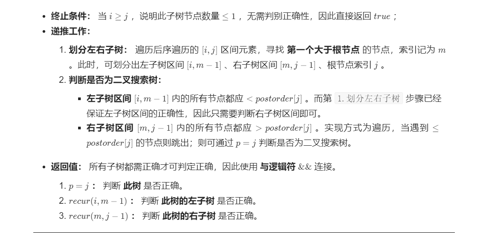

[TOC]


### [**:house:**](../../README.html)

#### [1. 二叉树的前序，中序，后序遍历](https://www.nowcoder.com/practice/a9fec6c46a684ad5a3abd4e365a9d362?tpId=196&tqId=37153&rp=1&ru=%2Factivity%2Foj&qru=%2Fta%2Fjob-code-total%2Fquestion-ranking&tab=answerKey)

分别按照二叉树先序，中序和后序打印所有的节点。

递归法  https://leetcode-cn.com/problems/binary-tree-preorder-traversal/solution/leetcodesuan-fa-xiu-lian-dong-hua-yan-shi-xbian-2/

```java
//时间复杂度:O(N)
//空间复杂度;O(N)

public List<Integer> prelist;
    public List<Integer> midlist;
    public List<Integer> postlist;
    public int[][] threeOrders (TreeNode root) {
        // write code here
        prelist=new ArrayList<>();
        midlist=new ArrayList<>();
        postlist=new ArrayList<>();
         
        perorder(root);
        midorder(root);
        postorder(root);
        int [][]res=new int[3][prelist.size()];
       
         for(int i=0;i<prelist.size();i++){
             res[0][i]=prelist.get(i);
         }
         for(int i=0;i<prelist.size();i++){
             res[1][i]=midlist.get(i);
         }
         for(int i=0;i<prelist.size();i++){
             res[2][i]=postlist.get(i);
         }
        
        return res;
    }
    //前序遍历
    public void perorder(TreeNode root){
        
        if(root==null) return;
        
        prelist.add(root.val);
        perorder(root.left);
        perorder(root.right);
       
    }
    //中序遍历
    public void midorder(TreeNode root){
        
        if(root==null)  return;
        midorder(root.left);
        midlist.add(root.val);
        midorder(root.right);
         
        
    }
    //后序遍历
    public void postorder(TreeNode root){
        
        if(root==null) return;
        postorder(root.left);
        postorder(root.right);
        postlist.add(root.val);
          
    }
  
```

非递归法

```java
//前序遍历
//时间复杂度O(N)
//空间复杂度O(lgn)
public List<Integer> preorderTraversal(TreeNode root) {


        List<Integer> res = new ArrayList<Integer>();
        Stack<TreeNode> st = new Stack<TreeNode>();
        st.push(root);
        while(!st.isEmpty()){

            TreeNode node = st.pop();
            if(node == null)  continue;//先判断一下是不是空，因此我们每次加进去的有可能是空节点
            res.add(node.val);
            st.push(node.right);//由于是栈，所以先把右节点放进去
            st.push(node.left);
        }

        return res;
        
    }

//后序遍历
//时间复杂度O(N)
//空间复杂度O(lgn)
public List<Integer> preorderTraversal(TreeNode root) {


        List<Integer> res = new ArrayList<Integer>();
        Stack<TreeNode> st = new Stack<TreeNode>();
        st.push(root);
        while(!st.isEmpty()){

            TreeNode node = st.pop();
            if(node == null)  continue;//先判断一下是不是空，因此我们每次加进去的有可能是空节点
            res.add(node.val);
            st.push(node.left);//由于是栈，所以先把左节点放进去
            st.push(node.right);
        }
        Collections.reverse(res);  //根右左---->左右根
        return  res;
        
    }


//中序遍历
public List<Integer> inorderTraversal(TreeNode root) {
    List<Integer> ret = new ArrayList<>();
    if (root == null) return ret;
    Stack<TreeNode> stack = new Stack<>();
    TreeNode cur = root;
    while (cur != null || !stack.isEmpty()) {
        while (cur != null) {//把左节点加入栈中
            stack.push(cur);
            cur = cur.left;
        }
        TreeNode node = stack.pop();//每弹出一个节点
        ret.add(node.val);
        cur = node.right;
    }
    return ret;
}
```

#### [2. 二叉树的层序遍历](https://leetcode-cn.com/problems/binary-tree-level-order-traversal/solution/er-cha-shu-de-ceng-xu-bian-li-by-leetcode-solution/)

给定一个二叉树，返回该二叉树层序遍历的结果，（从左到右，一层一层地遍历）

```java
public ArrayList<ArrayList<Integer>> levelOrder (TreeNode root) {
         // write code here
       
        
        ArrayList<ArrayList<Integer>> res=new ArrayList<ArrayList<Integer>>();
        if (root==null) return res;
        Queue<TreeNode> q=new LinkedList<TreeNode>();
        q.add(root);
        
        while(!q.isEmpty()){
            
            int size=q.size();
            ArrayList<Integer> temp=new ArrayList<>();
            for(int i=0;i<size;i++){
                
                TreeNode node=q.poll();
                temp.add(node.val);
                if(node.left!=null)  q.add(node.left);
                if(node.right!=null) q.add(node.right);
               
            }
            
            res.add(temp);
        }
        return res;
       
    }
```

#### [3.二叉树的之字型层序遍历](https://leetcode-cn.com/problems/binary-tree-zigzag-level-order-traversal/)

给定一个二叉树，返回该二叉树的之字形层序遍历，（第一层从左向右，下一层从右向左，一直这样交替）

```java
//时间复杂度O(N) 空间复杂度O(N)
public List<List<Integer>> levelOrder(TreeNode root) {

        List<List<Integer>> res = new ArrayList<>();
        if(root == null) return res;
        Queue<TreeNode> q = new LinkedList<>();
        q.add(root);
        while(!q.isEmpty()){

            int size = q.size();
            LinkedList<Integer> temp  = new LinkedList<>();
            for(int i = 0; i < size; i++){
                TreeNode node = q.remove();
                if(res.size() % 2 == 1) temp.addFirst(node.val);
                else temp.addLast(node.val);
                if(node.left!=null) q.add(node.left);
                if(node.right != null) q.add(node.right);
            }
            res.add(temp);
        }

        return res;

    }

//时间复杂度O(N) 空间复杂度O(N)
public ArrayList<ArrayList<Integer>> zigzagLevelOrder (TreeNode root) {
        // write code here
        
        ArrayList<ArrayList<Integer>> res=new ArrayList<ArrayList<Integer>>();
        if(root==null) return res;
        Stack <TreeNode> st1 =new Stack<TreeNode>();//奇数层用一个栈
        Stack <TreeNode> st2 =new Stack<TreeNode>();//偶数层再用一个栈
        
        st1.push(root);
       
        
        while(!st1.isEmpty() || !st2.isEmpty()){
            
            if(!st1.isEmpty()){
                int st1Size=st1.size();

                ArrayList<Integer> temp=new ArrayList<Integer>();

                for(int i=0;i<st1Size;i++){

                    TreeNode node=st1.pop();
                    temp.add(node.val);
                    if(node.left!=null) st2.push(node.left);//
                    if(node.right!=null)st2.push(node.right);

                }
      
                 res.add(temp);
            }
        
         if(!st2.isEmpty()){
            int st2Size=st2.size();
            ArrayList<Integer> temp=new ArrayList<Integer>();
            for(int i=0;i<st2Size;i++){
                
                TreeNode node=st2.pop();
                temp.add(node.val);
                if(node.right!=null) st1.push(node.right);//倒一下
                if(node.left!=null)st1.push(node.left);
                
            }
           res.add(temp);
            
        }
      }
        
        return res;
    }
```

#### [4.二叉树的两个节点最近公共祖先](https://leetcode-cn.com/problems/er-cha-shu-de-zui-jin-gong-gong-zu-xian-lcof/solution/er-cha-shu-de-zui-jin-gong-gong-zu-xian-6fdt7/)

给定一棵二叉树以及这棵树上的两个节点 o1 和 o2，请找到 o1 和 o2 的最近公共祖先节点。

```java
//时间复杂度O(N) 
//空间复杂度O(N) 最坏的情况下为一条链，此时高度为O(N)
public TreeNode lowestCommonAncestor(TreeNode root, TreeNode p, TreeNode q) {

        if(root == null || root.val == p.val || root.val ==q.val)  return root;
        TreeNode left = lowestCommonAncestor(root.left,p,q);//在左子树上找p和q
        TreeNode right = lowestCommonAncestor(root.right,p,q);//在右子树上找p和q

        if(left == null) return right;//如果在左子树中 p和 q都找不到，则 p和 q一定都在右子树中，右子树中先遍历到的那个就是最近公共祖先（一个节点也可以是它自己的祖先）
        if(right == null) return left;// 否则，如果 left不为空，在左子树中有找到节点（p或q），这时候要再判断一下右子树中的情况，如果在右子树中，p和q都找不到，则 p和q一定都在左子树中，左子树中先遍历到的那个就是最近公共祖先（一个节点也可以是它自己的祖先）
        return root;//否则，当 left和 right均不为空时，说明 p、q节点分别在 root异侧, 最近公共祖先即为 root
        
    }
```

#### [5.重建二叉树](https://leetcode-cn.com/problems/zhong-jian-er-cha-shu-lcof/solution/mian-shi-ti-07-zhong-jian-er-cha-shu-by-leetcode-s/)

输入某二叉树的前序遍历和中序遍历的结果，请重建出该二叉树。假设输入的前序遍历和中序遍历的结果中都不含重复的数字。例如输入前序遍历序列{1,2,4,7,3,5,6,8}和中序遍历序列{4,7,2,1,5,3,8,6}，则重建二叉树并返回。

```java
//
 	int []preorder;
    Map<Integer,Integer> map = new HashMap<>();
    public TreeNode buildTree(int[] preorder, int[] inorder) {

        this.preorder = preorder;
        for(int i = 0; i < inorder.length;i++){

            map.put(inorder[i],i);
        }

        return dfs(0,0, inorder.length - 1);
    }

 /**
     * @param root  先序遍历的索引
     * @param left 中序遍历的索引
     * @paramright中序遍历的索引
     */

    public TreeNode dfs(int root, int left, int right){

        if(left > right) return null;
        TreeNode node = new TreeNode(preorder[root]);
        int i = map.get(preorder[root]);
        node.left = dfs(root+1,left,i-1);//左子树：根节点（root+1）,中序遍历左边界（left）,中序遍历右边界（i-1）
        node.right = dfs(i-left+root+1,i+1,right);//右子树：根节点（i - left + root + 1）,中序遍历左边界（i + 1）,中序遍历右边界（right）i - left + root + 1 含义为 根节点索引 + 左子树长度 + 1
        return node;

    }

//时间复杂度O(N)
//空间复杂度O(N)

public TreeNode reConstructBinaryTree(int [] pre,int [] in) {
        
        if(pre.length==0) return null;
        
        TreeNode root=new TreeNode(pre[0]);//获取根节点
        
        for(int i=0;i<in.length;i++){//遍历中序获取根节点的位置。
            
            if(in[i]==pre[0]){//构造左右子树
                
            root.left = reConstructBinaryTree(Arrays.copyOfRange(pre,1,i+1),Arrays.copyOfRange(in,0,i));
            root.right = reConstructBinaryTree(Arrays.copyOfRange(pre,i+1,in.length),Arrays.copyOfRange(in,i+1,in.length));
                
                break;
            }
        }
        
        return root;
            
        
    }

//不使用Arrays.copyOfRange
  public TreeNode buildTree(int[] preorder, int[] inorder) {

       TreeNode node = dfs(preorder,inorder,0,preorder.length-1,0,inorder.length-1);
       return node;

    }

    public TreeNode dfs(int[] preorder, int[] inorder, int preleft, int preright, int inleft,int inright){

        if(preleft > preright)  return null;
        TreeNode node = new TreeNode(preorder[preleft]);
        if(preleft == preright)  return node;
        for(int i = inleft; i <= inright;i++){

            if(inorder[i] == node.val){

                node.left = dfs(preorder,inorder,preleft + 1,preleft - inleft + i,inleft,i-1);
                node.right = dfs(preorder,inorder,preleft - inleft + i + 1,preright,i+1,inright);
                break;
            }
        }

        return node;


    }

```

#### [6.输入二叉树的右视图](https://www.nowcoder.com/practice/c9480213597e45f4807880c763ddd5f0?tpId=196&tags=&title=&diffculty=0&judgeStatus=0&rp=1&tab=answerKey)

请根据二叉树的前序遍历，中序遍历恢复二叉树，并打印出二叉树的右视图

```java
//先构造二叉树 时间复杂度O(N) 空间复杂度O(N)
//再层序遍历 时间复杂度O(N)  空间复杂度O(N)
public int[] solve (int[] xianxu, int[] zhongxu) {
        // write code here
        
        TreeNode root=getTree(xianxu,zhongxu);
        
        ArrayList<Integer> list=new ArrayList<Integer>();
        Queue <TreeNode>q= new LinkedList<TreeNode>();
        
         q.add(root);
        while(!q.isEmpty()){
            
            int size=q.size();
            for(int i=0;i<size;i++){
                TreeNode node=q.poll();
                if(i==size-1) list.add(node.val);
                if(node.left!=null) q.add(node.left);
                if(node.right!=null) q.add(node.right);
                
            }
        }
        
        int []res=new int[list.size()];
        for(int i=0;i<list.size();i++){
            res[i]=list.get(i);
            
        }
        
        return res;        
        
        
    }
    
    public TreeNode getTree(int [] pre,int []in){
        
        if(pre.length==0)  return null;
        
        TreeNode root =new TreeNode(pre[0]);
        
        for(int i=0;i<in.length;i++){
            
            if(in[i]==pre[0]){
                
                root.left=getTree(Arrays.copyOfRange(pre,1,i+1),Arrays.copyOfRange(in,0,i));
                root.right=getTree(Arrays.copyOfRange(pre,i+1,in.length),Arrays.copyOfRange(in,i+1,in.length));
                break;
            }
        }
        return root;
    }
    
```

#### [7.二叉树的深度](https://leetcode-cn.com/problems/er-cha-shu-de-shen-du-lcof/)

输入一棵二叉树的根节点，求该树的深度。从根节点到叶节点依次经过的节点（含根、叶节点）形成树的一条路径，最长路径的长度为树的深度。

```java
//深度优先 
//以root为根的最大深度，为左子树和右子树中最大的深度加1
//时间复杂度O(N)
//空间复杂度O(h)为树的高度
public int maxDepth(TreeNode root) {

        if(root==null) return 0;

        return Math.max(maxDepth(root.left),maxDepth(root.right))+1;

    }

//也可以用广度优先层序遍历
```

#### [8.平衡二叉树](https://leetcode-cn.com/problems/ping-heng-er-cha-shu-lcof/)

输入一棵二叉树的根节点，判断该树是不是平衡二叉树。如果某二叉树中任意节点的左右子树的深度相差不超过1，那么它就是一棵平衡二叉树。

 

```java
//时间复杂度O(N)
//空间复杂度O(N)
//终止条件：当root为空时，返回高度为0  当左右子树深度为-1，也就是不是平衡二叉树，就返回-1
//返回值：当前节点左右子树深度差小于等于1,就返回当前左右子树深度最大值加1,否则说明不是平衡二叉树，就返回-1

public boolean isBalanced(TreeNode root) {

         return dfs(root)!=-1;

    
    }
    public int dfs(TreeNode root){

        if(root==null) return 0;
        int left=dfs(root.left);//计算左子树的深度（-1表示不是平衡二叉树，直接返回）
        if(left==-1) return -1;
        int right=dfs(root.right);//计算右子树的深度（-1表示不是平衡二叉树，直接返回）
        if(right==-1) return -1;

        return Math.abs(right-left)<=1 ? Math.max(left,right)+1:-1;//如果左右高度差小于2表示是平衡二叉树，就返回高度，否则不是，返回-1
        


    }
```

#### [662. 二叉树最大宽度](https://leetcode-cn.com/problems/maximum-width-of-binary-tree/)

给定一个二叉树，编写一个函数来获取这个树的最大宽度。树的宽度是所有层中的最大宽度。这个二叉树与满二叉树（full binary tree）结构相同，但一些节点为空。

每一层的宽度被定义为两个端点（该层最左和最右的非空节点，两端点间的null节点也计入长度）之间的长度。

```java
// 时间复杂度O(N) 遍历每个节点
// 空间复杂度O(N)
public int widthOfBinaryTree(TreeNode root) {
        if (root == null) return 0;
        int res = 1;
        LinkedList<TreeNode> queue = new LinkedList<>();
        LinkedList<Integer> indexQueue = new LinkedList<>();
        queue.add(root);
        indexQueue.add(1);
        while (!queue.isEmpty()) {
            int left = indexQueue.peek();
            int len = queue.size();
            for (int i = 0; i < len; i++) {
                TreeNode poll = queue.poll();//当前节点
                Integer index = indexQueue.poll();//当前该节点的索引值
                res = Math.max(res, index - left + 1);//计算当前节点与最左节点的距离
                if (poll.left != null) {
                    queue.add(poll.left);
                    indexQueue.add(index * 2);//左节点的索引值为父节点位置*2
                }
                if (poll.right != null) {
                    queue.add(poll.right);
                    indexQueue.add(index * 2 + 1);//右节点的索引值为父节点位置*2+1
                }
            }
        }
        return res;
    }
```

#### [剑指 Offer 37. 序列化二叉树](https://leetcode-cn.com/problems/xu-lie-hua-er-cha-shu-lcof/)

请实现两个函数，分别用来序列化和反序列化二叉树。

```java
//时间：O(N) 空间O(N)
public class Codec {

    // Encodes a tree to a single string.
    //使用层序遍历将元素加入string中
    public String serialize(TreeNode root) {

        Queue <TreeNode> q = new LinkedList<>();
        q.add(root);
        StringBuilder sb = new StringBuilder();
        sb.append("[");
        while(!q.isEmpty()){

            int size = q.size();
            boolean bnull = true;
            for(int i = 0 ; i < size; i++){

                TreeNode node = q.poll();
                
                if(node != null){//如果不为null，就直接加入元素

                    sb.append(node.val + ",");
                    q.add(node.left);
                    q.add(node.right);
                
                }else{//如果为null，

                    sb.append("null,");
                }
            }

        }
        sb.replace(sb.length()-1, sb.length(),"]");

        return new String(sb);
        
    }

    // Decodes your encoded data to tree.
    
    //反序列化
    public TreeNode deserialize(String data) {

        if(data.equals("[null]")) return null;

        String[] s = data.substring(1,data.length()-1).split(",");
        Queue<TreeNode> q = new LinkedList<TreeNode>();
        TreeNode root = new TreeNode(Integer.parseInt(s[0]));
        q.add(root);
        int i = 1;
        while(!q.isEmpty()){

             TreeNode node = q.poll();
             if(!s[i].equals("null")){

                 node.left = new TreeNode(Integer.parseInt(s[i]));
                 q.add(node.left);      
             }
            i++;
             if(!s[i].equals("null")){

                 node.right = new TreeNode(Integer.parseInt(s[i]));
                 q.add(node.right);      
            }
            i++;
                  
        }

        return root;

            
    }
}
```

#### [剑指 Offer 26. 树的子结构](https://leetcode-cn.com/problems/shu-de-zi-jie-gou-lcof/)

输入两棵二叉树A和B，判断B是不是A的子结构。(约定空树不是任意一个树的子结构)

B是A的子结构， 即 A中有出现和B相同的结构和节点值。

```java
/*
1.先序遍历A树的每个结点nA   对应isSubStructure函数
2.判断以nA为根的树是否包含B。对应dfs函数

isSubStructure函数
特例处理:如果A树为空或者B树为空直接返回false
返回值：
1. 以节点 A 为根节点的子树包含树 B ，对应 dfs(A, B)；
2. 树 B 是 树 A 左子树的子结构，对应 isSubStructure(A.left, B)；
3. 树 B 是 树 A 右子树的子结构，对应 isSubStructure(A.right, B)；
以上2，3实际上是在做先序遍历
以上任意一个为true就返回true
dfs函数
终止条件：
当B为空时，说明匹配完成，返回为true;
当A为空或者A结点的值不等于B结点，返回为false;
返回值：判断 A 和 B的左子节点是否相等，即dfs(A.left, B.left) ;
	   判断 A 和 B的右子节点是否相等，即dfs(A.right, B.right);
时间复杂度O(MN):M为A树的结点个数，N为B树的结点个数
空间复杂度 O(M)： 当树 A 和树 B 都退化为链表时，递归调用深度最大。当M≤N 时，遍历树 A 与递归判断的总递归深度为 M ；当 M>N 时，最差情况为遍历至树 A 叶子节点，此时总递归深度为 M。
*/
public boolean isSubStructure(TreeNode A, TreeNode B) {

        if(A == null || B == null) return false;

       return dfs(A,B) || isSubStructure(A.left,B) || isSubStructure(A.right,B);

    }
   //判断以A为根节点的树是否包含B
    public boolean dfs(TreeNode A, TreeNode B){

        if(B == null){

            return true;
        }
        if(A == null || A.val != B.val){

            return false;
        }
    
        return dfs(A.left,B.left) && dfs(A.right,B.right);

    }
```

#### [剑指 Offer 34. 二叉树中和为某一值的路径](https://leetcode-cn.com/problems/er-cha-shu-zhong-he-wei-mou-yi-zhi-de-lu-jing-lcof/)

输入一棵二叉树和一个整数，打印出二叉树中节点值的和为输入整数的所有路径。从树的根节点开始往下一直到叶节点所经过的节点形成一条路径。

```java
//时间复杂度O(N)
//空间复杂度O(N)
	List<List<Integer>> res;
    List<Integer> path;
    public List<List<Integer>> pathSum(TreeNode root, int target) {

        res = new ArrayList<>();
        path = new ArrayList<>();
        dfs(root,target,0);
        return res;
    }

    public void dfs(TreeNode root,int target,int sum){

        
        if(root == null){
            return;   
        }

        path.add(root.val);
        sum = sum + root.val;
        if(sum == target && root.left == null && root.right == null){//判断是否到叶子结点

            res.add(new ArrayList<>(path));
        }


        dfs(root.left,target,sum);
        dfs(root.right,target,sum);
        path.remove(path.size()-1);

    }
```

#### [剑指 Offer 33. 二叉搜索树的后序遍历序列](https://leetcode-cn.com/problems/er-cha-sou-suo-shu-de-hou-xu-bian-li-xu-lie-lcof/)

输入一个整数数组，判断该数组是不是某二叉搜索树的后序遍历结果。如果是则返回 `true`，否则返回 `false`。假设输入的数组的任意两个数字都互不相同。



```Java
/*时间复杂度 O(N^2) ： 每次调用recur(i,j) 减去一个根节点，因此递归占用O(N) ；最差情况下（即当树退化为链表），每轮递归都需遍历树所有节点，占用O(N) 。
空间复杂度 O(N) ： 最差情况下（即当树退化为链表），递归深度将达到 N 。*/

public boolean verifyPostorder(int[] postorder) {

        return dfs(postorder,0,postorder.length-1);

    }

    public boolean dfs(int []postorder,int i,int j){

        if(i >= j){

            return true;
        }

        int p = i;
        while(postorder[p] < postorder[j]) p++;
        int m = p;
        while(postorder[m] > postorder[j]) m++;

        return m == j && dfs(postorder,i,p-1) && dfs(postorder,p,j-1);
    }
```

#### [剑指 Offer 32 - I. 从上到下打印二叉树](https://leetcode-cn.com/problems/cong-shang-dao-xia-da-yin-er-cha-shu-lcof/)

从上到下打印出二叉树的每个节点，同一层的节点按照从左到右的顺序打印。

```java
//广度优先搜索
//时间复杂度O(N)
//空间复杂度O(N)
public int[] levelOrder(TreeNode root) {

        if (root == null)  return new int[0];
        Queue<TreeNode> q = new LinkedList<>();
        ArrayList<Integer> res = new ArrayList<>();
        q.add(root);

        while(!q.isEmpty()){

            int size = q.size();
            for(int i = 0; i < size; i++){

                TreeNode node = q.poll();
                res.add(node.val);
                if(node.left != null) q.add(node.left);
                if(node.right != null) q.add(node.right);
           
            }
        }

        int [] arr = new int[res.size()];
        for(int i = 0; i< res.size();i++){

            arr[i] = res.get(i);
        }

        return arr;

    }
```

#### [剑指 Offer 32 - III. 从上到下打印二叉树 III](https://leetcode-cn.com/problems/cong-shang-dao-xia-da-yin-er-cha-shu-iii-lcof/)

请实现一个函数按照之字形顺序打印二叉树，即第一行按照从左到右的顺序打印，第二层按照从右到左的顺序打印，第三行再按照从左到右的顺序打印，其他行以此类推。

```java
//使用一个双端队列存储每一层的数据
//根节点那一层是奇数层，对于奇数层，直接从尾部添加，对于偶数层，直接从头部添加
public List<List<Integer>> levelOrder(TreeNode root) {

        List<List<Integer>> res = new ArrayList<>();
        if(root == null) return res;
        Queue<TreeNode> q = new LinkedList<>();
        q.add(root);
        int depth = 1;
        while(!q.isEmpty()){

            int size = q.size();
            LinkedList<Integer> temp = new LinkedList<>();
            for(int i = 0; i < size; i++){

               TreeNode node = q.poll();
               if((depth & 1) == 0){//偶数层,相反顺序，从头部加

                    temp.addFirst(node.val);

               }else{//奇数层,正常顺序，从尾部加

                    temp.addLast(node.val);

               }
               if(node.left != null) q.add(node.left);
               if(node.right != null) q.add(node.right);

            }
            res.add(temp);
            depth++;
        }

        return res;
    }
```

#### [剑指 Offer 36. 二叉搜索树与双向链表](https://leetcode-cn.com/problems/er-cha-sou-suo-shu-yu-shuang-xiang-lian-biao-lcof/)

输入一棵二叉搜索树，将该二叉搜索树转换成一个排序的循环双向链表。要求不能创建任何新的节点，只能调整树中节点指针的指向。

 ```java
  Node pre,head;
     public Node treeToDoublyList(Node root) {
 
         if(root == null) return null;
         dfs(root);
         pre.right = head;
         head.left = pre;
         return head;    
     }
 
     public void dfs(Node cur){
 
         if(cur == null) return;
 
         dfs(cur.left);
 
         if(pre == null) head = cur;//表示链表刚刚开始形成
         else pre.right = cur;//否则将前一个结点指向当前结点
         cur.left = pre;//将当前结点指向前一个结点
         pre = cur;//更新前一个结点为当前结点
         
         dfs(cur.right);
 
     }
 ```

#### [剑指 Offer 27. 二叉树的镜像](https://leetcode-cn.com/problems/er-cha-shu-de-jing-xiang-lcof/)

请完成一个函数，输入一个二叉树，该函数输出它的镜像。

```Java
/*递归解析：
终止条件： 当节点 root 为空时（即越过叶节点），则返回 null ；
递推工作：
初始化节点 tmp ，用于暂存 root 的左子节点；
开启递归 右子节点 mirrorTree(root.right)，并将返回值作为 root的左子节点 。
开启递归 左子节点 mirrorTree(tmp)，并将返回值作为 root 的右子节点 。
返回值： 返回当前节点 root ；
时间复杂度O(N)
空间复杂度O(N)
*/

public TreeNode mirrorTree(TreeNode root) {


        if(root == null) return null;

        TreeNode temp = root.right;
        root.right = mirrorTree(root.left);//root的右子树等于左子树的镜像
        root.left = mirrorTree(temp);//root的左子树等于右子树的镜像

        return root;
    }
```

#### [剑指 Offer 28. 对称的二叉树](https://leetcode-cn.com/problems/dui-cheng-de-er-cha-shu-lcof/)

请实现一个函数，用来判断一棵二叉树是不是对称的。如果一棵二叉树和它的镜像一样，那么它是对称的。

```java
/*终止条件：
1. 当 L和 R同时越过叶节点： 此树从顶至底的节点都对称，因此返回 true；
2. 当 L 或 R 中只有一个越过叶节点： 此树不对称，因此返回 false；
当节点 L 值 != 节点 R 值： 此树不对称，因此返回 false ；
递归
判断两节点 L.left 和 R.right 是否对称；
判断两节点 L.right 和 R.left 是否对称；
返回
两对节点都对称时，才是对称树，因此用与逻辑符 && 连接。
时间复杂度O(N)
空间复杂度O(N)
*/
public boolean isSymmetric(TreeNode root) {

        if(root == null) return true;
        return dfs(root.left,root.right);
    }

    public boolean dfs(TreeNode L,TreeNode R){

        if(L == null && R == null)  return true;
        if(L == null || R == null || L.val != R.val) return false;
        return dfs(L.left, R.right) &&  dfs(L.right,R.left);
    }
```

#### [剑指 Offer 54. 二叉搜索树的第k大节点](https://leetcode-cn.com/problems/er-cha-sou-suo-shu-de-di-kda-jie-dian-lcof/)

给定一棵二叉搜索树，请找出其中第k大的节点。

```java
 //按照右中左的顺序进行遍历
//时间复杂度O(N)
//空间复杂度O(N)

public int res,count;
 public int kthLargest(TreeNode root, int k) {

        count = 0;
        dfs(root,k);
        return res;

    }

    public void dfs(TreeNode root, int k){

        if(root == null)  return;
        dfs(root.right,k);//
        count ++;
        if(count == k){

            res = root.val;
            return;
        }
        
        dfs(root.left,k);
   
    }
```

#### [面试题 04.02. 最小高度树](https://leetcode-cn.com/problems/minimum-height-tree-lcci/)

给定一个有序整数数组，元素各不相同且按升序排列，编写一个算法，创建一棵高度最小的二叉搜索树。

```java
//对于每次递归，选取中间节点作为根节点，数组左侧数据进行递归获取左子树，数据右侧数据进行递归获取右子树
//时间复杂度O(N) 对于每个节点都要进行遍历
//空间复杂度O(logN)
public TreeNode sortedArrayToBST(int[] nums) {

        return dfs(nums,0,nums.length - 1);

    
    }

    public TreeNode dfs(int[] nums,int l,int r){

        if(l > r)  return null;
        int mid = (l + r)/2;
        TreeNode root = new TreeNode(nums[mid]);
        root.left = dfs(nums,l,mid - 1);
        root.right = dfs(nums,mid + 1,r);

        return root;

    }
```

#### [面试题 17.12. 二叉搜索树转链表](https://leetcode-cn.com/problems/binode-lcci/)

二叉树数据结构TreeNode可用来表示单向链表（其中left置空，right为下一个链表节点）。实现一个方法，把二叉搜索树转换为单向链表，要求依然符合二叉搜索树的性质，转换操作应是原址的，也就是在原始的二叉搜索树上直接修改。

返回转换后的单向链表的头节点。

```java
 TreeNode pre;
    public TreeNode convertBiNode(TreeNode root) {


        pre = new TreeNode(0);
        TreeNode head = pre;
        if(root == null) return null;
        dfs(root);
        return head.right;
    }

    public void dfs(TreeNode cur){

        if(cur == null)  return;

        dfs(cur.left);

        pre.right = cur;
        pre = cur;
        pre.left = null;
        
        dfs(cur.right);

    }
```

#### [面试题 04.05. 合法二叉搜索树](https://leetcode-cn.com/problems/legal-binary-search-tree-lcci/)

实现一个函数，检查一棵二叉树是否为二叉搜索树。

```java
//中序遍历，判断前一个结点是否小于当前结点
//时间复杂度O(N)
//空间复杂度O(N)
	int pre;
    boolean start;
    public boolean isValidBST(TreeNode root) {
        
        start = false;
        return dfs(root);


    }

    public boolean dfs(TreeNode root){

        if(root == null) return true;

        boolean left = dfs(root.left);
        
        if(start && root.val <= pre) {
            return false;
        }
        start = true;
        pre = root.val;
        boolean right = dfs(root.right);

        return left && right;
    }
```

#### [面试题 04.12. 求和路径](https://leetcode-cn.com/problems/paths-with-sum-lcci/)

给定一棵二叉树，其中每个节点都含有一个整数数值(该值或正或负)。设计一个算法，打印节点数值总和等于某个给定值的所有路径的数量。注意，路径不一定非得从二叉树的根节点或叶节点开始或结束，但是其方向必须向下(只能从父节点指向子节点方向)。

```java
int count = 0;
    public int pathSum(TreeNode root, int sum) {

        if(root == null)  return 0;
        dfs(root,0,sum);//
        pathSum(root.left,sum);//以左子树为起点
        pathSum(root.right,sum);//以右子树为起点
        
        return count;

    }

    public void dfs(TreeNode root,int sum,int target){

        if(root == null) return;
        sum = sum + root.val;//加上当前结点
        if(sum == target){//满足条件了就加1

            count++;
        }
        dfs(root.left,sum,target);
        dfs(root.right,sum,target);


    }
```

#### [208. 实现 Trie (前缀树)](https://leetcode-cn.com/problems/implement-trie-prefix-tree/)

Trie（发音类似 "try"）或者说 前缀树 是一种树形数据结构，用于高效地存储和检索字符串数据集中的键。这一数据结构有相当多的应用情景，例如自动补完和拼写检查。

请你实现 Trie 类：

Trie() 初始化前缀树对象。
void insert(String word) 向前缀树中插入字符串 word 。
boolean search(String word) 如果字符串 word 在前缀树中，返回 true（即，在检索之前已经插入）；否则，返回 false 。
boolean startsWith(String prefix) 如果之前已经插入的字符串 word 的前缀之一为 prefix ，返回 true ；否则，返回 false 。

```java
class TreeNode{

    char val;
    TreeNode [] children = new TreeNode[26];
    boolean isEnd;

    public TreeNode(){

        
    }
    public TreeNode(char val){

        this.val = val;
    }


}
class Trie {

   TreeNode root;

    /** Initialize your data structure here. */
    public Trie() {
        
        root = new TreeNode();
    }
    
    /** Inserts a word into the trie. */
    public void insert(String word) {
        TreeNode cur = root;
        for(int i = 0; i < word.length();i++){
            char c = word.charAt(i);
            if(cur.children[c - 'a'] == null){//如果包好当前结点的node为null，需要创建一个

                cur.children[c - 'a'] = new TreeNode(c);
             }
            cur = cur.children[c - 'a'];

        }
        cur.isEnd = true;
        

    }
    
    /** Returns if the word is in the trie. */
    public boolean search(String word) {
        
        TreeNode node = prefixWith(word);
        return node != null && node.isEnd;//如果找到了,返回的node 不为bull同时当前结点为最后的结点

    }
    
    /** Returns if there is any word in the trie that starts with the given prefix. */
    public boolean startsWith(String prefix) {

       
        return prefixWith(prefix) != null;//如果找到了,返回的node 不为bull

    }

    public TreeNode prefixWith(String prefix) {//找到包含前缀的最后一个结点

        TreeNode cur = root;
        for(int i = 0; i < prefix.length();i++){

            char c = prefix.charAt(i);
            if(cur.children[c - 'a'] == null){//为null表示该前缀不存在,返回null

                return null;
            }
            cur = cur.children[c - 'a'];
        }

        return cur;

    }
}
```

#### [剑指 Offer 68 - I. 二叉搜索树的最近公共祖先](https://leetcode-cn.com/problems/er-cha-sou-suo-shu-de-zui-jin-gong-gong-zu-xian-lcof/)

给定一个二叉搜索树, 找到该树中两个指定节点的最近公共祖先。

百度百科中最近公共祖先的定义为：“对于有根树 T 的两个结点 p、q，最近公共祖先表示为一个结点 x，满足 x 是 p、q 的祖先且 x 的深度尽可能大（一个节点也可以是它自己的祖先）。

```java
//时间复杂度O(N) 其中N为二叉树节点树，每循环一轮排除一层，二叉搜索树的层数最小为logN(满二叉树)，最大为N（退化为链表）
//空间复杂度O(N): 最差情况下，即树退化为链表时，递归深度达到树的层数 N 。
public TreeNode lowestCommonAncestor(TreeNode root, TreeNode p, TreeNode q) {

        if(p.val < root.val && q.val < root.val) {
            return lowestCommonAncestor(root.left,p,q);
        }
        if(p.val > root.val && q.val > root.val){
             return lowestCommonAncestor(root.right,p,q);
        }
       return root;
         
    }
```

