[Spring](https://snailclimb.gitee.io/javaguide/#/docs/system-design/framework/spring/Spring%E5%B8%B8%E8%A7%81%E9%97%AE%E9%A2%98%E6%80%BB%E7%BB%93?id=%e4%bb%80%e4%b9%88%e6%98%af-spring-%e6%a1%86%e6%9e%b6)

### 工厂

---

#### 第一章 引言

##### 1. EJB存在的问题

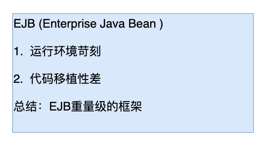

##### 2. 什么是Spring

~~~markdown
Spring是一个轻量级的JavaEE解决方案，整合众多优秀的设计模式
~~~

- 轻量级

  ~~~markdown
  1. 对于运行环境是没有额外要求的，可以运行在：
     开源 tomcat resion jetty 
     收费 weblogic  websphere 
  2. 代码移植性高
     不需要实现额外接口
  ~~~

- JavaEE的解决方案

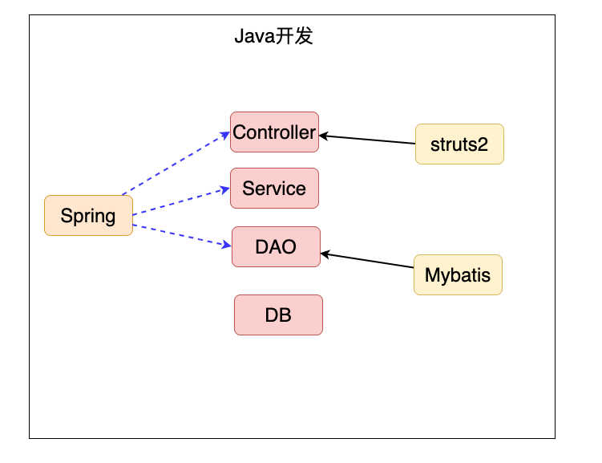

- 整合设计模式

~~~markdown
1. 工厂
2. 代理
3. 模板
4. 策略
~~~

##### 3. 设计模式

~~~markdown
1. 广义概念
面向对象设计中，解决特定问题的经典代码
2. 狭义概念
GOF4人帮定义的23种设计模式：工厂、适配器、装饰器、门面、代理、模板...
~~~

##### 4. 工厂设计模式

###### 4.1 什么是工厂设计模式

~~~markdown
1. 概念：通过工厂类，创建对象
        User user = new User();
        UserDAO userDAO = new UserDAOImpl();
2. 好处：解耦合
   耦合：指定是代码间的强关联关系，一方的改变会影响到另一方
   问题：不利于代码维护
   简单：把接口的实现类，硬编码在程序中
        UserService userService = new UserServiceImpl();
~~~

###### 4.2 简单工厂的设计

~~~java
package com.baizhiedu.basic;

import java.io.IOException;
import java.io.InputStream;
import java.util.Properties;

public class BeanFactory {
    private static Properties env = new Properties();

    static{
        try {
            //第一步 获得IO输入流
            InputStream inputStream = BeanFactory.class.getResourceAsStream("/applicationContext.properties");
            //第二步 文件内容 封装 Properties集合中 key = userService value = com.baizhixx.UserServiceImpl
            env.load(inputStream);

            inputStream.close();
        } catch (IOException e) {
            e.printStackTrace();
        }

    }


    /*
        对象的创建方式：
           1. 直接调用构造方法 创建对象  UserService userService = new UserServiceImpl();
           2. 通过反射的形式 创建对象 解耦合
               Class clazz = Class.forName("com.baizhiedu.basic.UserServiceImpl");
               UserService userService = (UserService)clazz.newInstance();
     */
    public static UserService getUserService() {

        UserService userService = null;
        try {
                                         //com.baizhiedu.basic.UserServiceImpl
            Class clazz = Class.forName(env.getProperty("userService"));
            userService = (UserService) clazz.newInstance();
        } catch (ClassNotFoundException e) {
            e.printStackTrace();
        } catch (InstantiationException e) {
            e.printStackTrace();
        } catch (IllegalAccessException e) {
            e.printStackTrace();
        }

        return userService;

    }


    public static UserDAO getUserDAO(){

        UserDAO userDAO = null;
        try {
            Class clazz = Class.forName(env.getProperty("userDAO"));
            userDAO = (UserDAO) clazz.newInstance();
        } catch (ClassNotFoundException e) {
            e.printStackTrace();
        } catch (InstantiationException e) {
            e.printStackTrace();
        } catch (IllegalAccessException e) {
            e.printStackTrace();
        }

        return userDAO;

    }
}
~~~

###### 4.3 通用工厂的设计

- 问题

  ~~~markdown
  简单工厂会存在大量的代码冗余
  ~~~

  

- 通用工厂的代码

  ~~~java
  //创建一切想要的对象
  public class BeanFactory{
    
      public static Object getBean(String key){
           Object ret = null;
           try {
               Class clazz = Class.forName(env.getProperty(key));
               ret = clazz.newInstance();
           } catch (Exception e) {
              e.printStackTrace();
           }
           return ret;
       }
  
  }
  ~~~

###### 4.4 通用工厂的使用方式

~~~markdown
1. 定义类型 (类)
2. 通过配置文件的配置告知工厂(applicationContext.properties)   
    key = value
3. 通过工厂获得类的对象   
    Object ret = BeanFactory.getBean("key")
~~~

##### 5.总结

~~~markdown
Spring本质：工厂 ApplicationContext (applicationContext.xml)
~~~

#### 第二章、第一个Spring程序

##### 1. 软件版本

~~~markdown
1. JDK1.8+
2. Maven3.5+
3. IDEA2018+
4. SpringFramework 5.1.4    
    官方网站 www.spring.io
~~~

##### 2. 环境搭建

- Spring的jar包

  ~~~markdown
  #设置pom 依赖
  <!-- https://mvnrepository.com/artifact/org.springframework/spring-context -->
  <dependency>  
  	<groupId>org.springframework</groupId>  
  	<artifactId>spring-context</artifactId> 
      <version>5.1.4.RELEASE</version>
  </dependency>
  ~~~

- Spring的配置文件

  ~~~markdown
  1. 配置文件的放置位置：任意位置 没有硬性要求
  2. 配置文件的命名：没有硬性要求 建议：applicationContext.xml
  
  	思考：日后应用Spring框架时，需要进行配置文件路径的设置。
  ~~~
  
  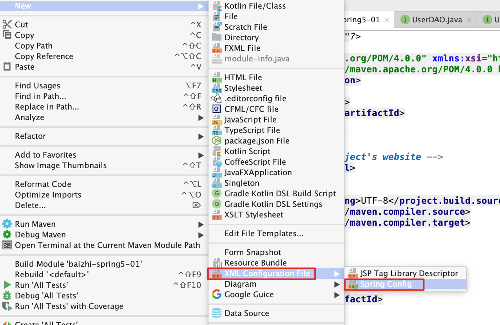

##### 3. Spring的核心API

- ApplicationContext

  ~~~markdown
  作用：Spring提供的ApplicationContext这个工厂，用于对象的创建
  好处：解耦合
  ~~~
  
  - ApplicationContext接口类型
  
    ~~~markdown
    接口：屏蔽实现的差异
    非web环境： ClassPathXmlApplicationContext (main junit)
    web环境：  XmlWebApplicationContext
    ~~~
  
    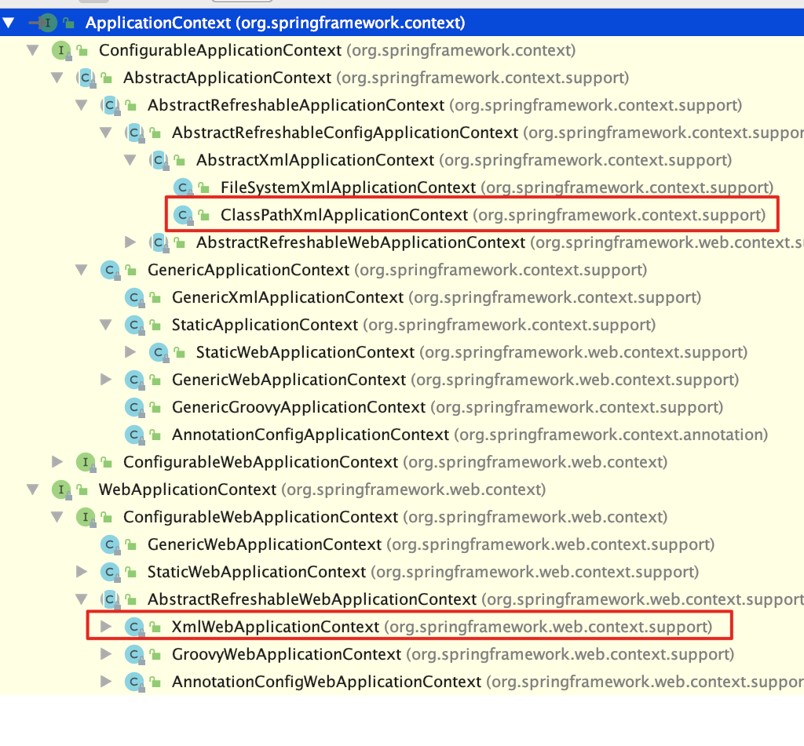
  
  - 重量级资源
  
    ~~~markdown
    ApplicationContext工厂的对象占用大量内存。
    不会频繁的创建对象 ： 一个应用只会创建一个工厂对象。
    ApplicationContext工厂：一定是线程安全的(多线程并发访问)
    ~~~
    
    

##### 4. 程序开发

~~~markdown
1. 创建类型
2. 配置文件的配置 applicationContext.xml  
<bean id="person" class="com.baizhiedu.basic.Person"/>
3. 通过工厂类，获得对象   
ApplicationContext         
	|- ClassPathXmlApplicationContext    
		ApplicationContext ctx = new ClassPathXmlApplicationContext("/applicationContext.xml");   
		Person person = (Person)ctx.getBean("person");
~~~

##### 5. 细节分析

- 名词解释

  ~~~markdown
  Spring工厂创建的对象，叫做bean或者组件(componet)
  ~~~

- Spring工厂的相关的方法

  ~~~java
  	//通过这种方式获得对象，就不需要强制类型转换
      Person person = ctx.getBean("person", Person.class);
      System.out.println("person = " + person);       
  	//当前Spring的配置文件中 只能有一个<bean class是Person类型
      Person person = ctx.getBean(Person.class);
      System.out.println("person = " + person);       
      //获取的是 Spring工厂配置文件中所有bean标签的id值  
      person person1String[] beanDefinitionNames = ctx.getBeanDefinitionNames();
      for (String beanDefinitionName : beanDefinitionNames)
      { 
          System.out.println("beanDefinitionName = " + beanDefinitionName);
      }        
  	//根据类型获得Spring配置文件中对应的id值
      String[] beanNamesForType = ctx.getBeanNamesForType(Person.class);
      for (String id : beanNamesForType){  
          System.out.println("id = " + id);
      }      
  	//用于判断是否存在指定id值得bean
      if (ctx.containsBeanDefinition("a")) {  
          System.out.println("true = " + true);
      }else{ 
          System.out.println("false = " + false);
      }      
  	//用于判断是否存在指定id值得bean
      if (ctx.containsBean("person")) { 
          System.out.println("true = " + true);
      }else{  
          System.out.println("false = " + false);
      }
  ~~~

- 配置文件中需要注意的细节

  ~~~markdown
  1. 只配置class属性
  <bean  class="com.baizhiedu.basic.Person"/>
  a) 上述这种配置 有没有id值 com.baizhiedu.basic.Person#0
  b) 应用场景： 如果这个bean只需要使用一次，那么就可以省略id值            
  如果这个bean会使用多次，或者被其他bean引用则需要设置id值
  2. name属性
  作用：用于在Spring的配置文件中，为bean对象定义别名(小名)
  相同：   
  	1. ctx.getBean("id|name")-->object   
  	2. <bean id="" class=""      
  		等效     
         <bean name="" class=""
  区别：   
  1. 别名可以定义多个,但是id属性只能有一个值   
  2. 过去：XML的id属性的值，命名要求：必须以字母开头，后面可以跟字母 数字 下划线 连字符 不能以特殊字符开头 /person         	  		 name属性的值，命名没有要求 /person      
  	      name属性会应用在特殊命名的场景下：/person (spring+struts1)            
         XML发展到了今天：ID属性的限制，不存在 /person  
  3. 代码        
          //用于判断是否存在指定id值的bean,不能判断name值        
          if (ctx.containsBeanDefinition("person")) {  
          System.out.println("true = " + true);        
          }else{            
          System.out.println("false = " + false);       
          }        
          //用于判断是否存在指定id值的bean,也可以判断name值        
          if (ctx.containsBean("p")) {            
          System.out.println("true = " + true);        
          }else{            
          System.out.println("false = " + false);       
          }
  ~~~

##### 6. Spring工厂的底层实现原理(简易版)

**Spring工厂是可以调用对象私有的构造方法创建对象**


##### 7. 思考

~~~markdown
问题：未来在开发过程中，是不是所有的对象，都会交给Spring工厂来创建呢？
回答：理论上 是的，但是有特例 ：实体对象(entity)是不会交给Spring创建，它是由持久层框架进行创建。
~~~


#### 第三章、Spring5.x与日志框架的整合

~~~1.markdown
Spring与日志框架进行整合，日志框架就可以在控制台中，输出Spring框架运行过程中的一些重要的信息。
好处：便于了解Spring框架的运行过程，利于程序的调试
~~~

- Spring如何整合日志框架

  ~~~markdown
  默认  Spring1.2.3早期都是于commons-logging.jar  
  Spring5.x默认整合的日志框架 logback log4j2 
  Spring5.x整合log4j   
  1. 引入log4j jar包  
  2. 引入log4.properties配置文件
  ~~~
  
  - pom

    ~~~xml
    <dependency>  
        <groupId>org.slf4j</groupId>  
        <artifactId>slf4j-log4j12</artifactId>  
        <version>1.7.25</version>
    </dependency>
    
    <dependency>  
        <groupId>log4j</groupId>  
        <artifactId>log4j</artifactId>  
        <version>1.2.17</version>
    </dependency>
    ~~~
  
  - log4j.properties
  
    ~~~markdown
    # resources文件夹根目录下
    ### 配置根
    log4j.rootLogger = debug,console
    ### 日志输出到控制台显示
    log4j.appender.console=org.apache.log4j.ConsoleAppender
    log4j.appender.console.Target=System.out
    log4j.appender.console.layout=org.apache.log4j.PatternLayout
    log4j.appender.console.layout.ConversionPattern=%d{yyyy-MM-dd HH:mm:ss} %-5p %c{1}:%L - %m%n
    ~~~
    
    

#### 第四章、注入(Injection)

##### 1. 什么是注入

~~~markdown
通过Spring工厂及配置文件，为所创建对象的成员变量赋值
~~~

###### 1.1 为什么需要注入

**通过编码的方式，为成员变量进行赋值，存在耦合**


###### 1.2 如何进行注入[开发步骤]

- 类的成员变量提供set get方法

- 配置spring的配置文件

  ~~~xml
   <bean id="person" class="com.baizhiedu.basic.Person">   
       <property name="id">     
           <value>10</value>   
       </property>   
       <property name="name">     
           <value>xiaojr</value>   
       </property>
  </bean>
  ~~~

###### 1.3 注入好处

~~~markdown
解耦合
~~~

##### 2. Spring注入的原理分析(简易版)

**Spring通过底层调用对象属性对应的set方法，完成成员变量的赋值，这种方式我们也称之为set注入**

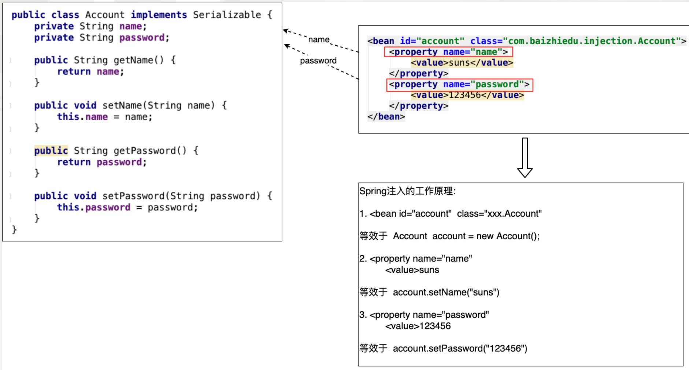


#### 第五章、Set注入详解

~~~markdown
针对于不同类型的成员变量，在<property>标签，需要嵌套其他标签<property>    xxxxx</property>
~~~

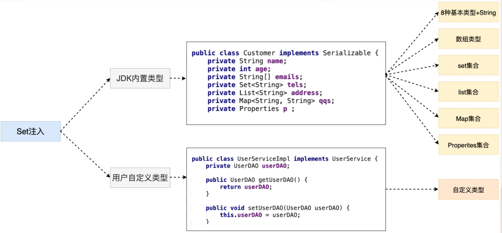


##### 1. JDK内置类型

###### 1.1 String+8种基本类型

~~~markdown
<value>suns</value>
~~~

###### 1.2 数组

~~~markdown
<list>  
<value>suns@zparkhr.com.cn</value>  
<value>liucy@zparkhr.com.cn</value>  
<value>chenyn@zparkhr.com.cn</value>
</list>
~~~

###### 1.3 Set集合

~~~xml
<set>
   <value>11111</value>
   <value>112222</value>
</set>

<set>
   <ref bean
   <set 
</set>
~~~

###### 1.4 List集合

~~~xml
<list>   
    <value>11111</value>   
    <value>2222</value>
</list>

<list>    
<ref bean   
<set 
</list>
~~~

###### 1.5 Map集合

~~~xml
注意： map -- entry  -- key有特定的标签  <key></key>
                       值根据对应类型选择对应类型的标签
<map>
  <entry>
    <key><value>suns</value></key>
    <value>3434334343</value>
  </entry>
  <entry>
    <key><value>chenyn</value></key>
    <ref bean
  </entry>
</map>
~~~

###### 1.6 Properites

~~~markdown
Properties类型 特殊的Map key=String value=String 
~~~

~~~xml
<props>
  <prop key="key1">value1</prop>
  <prop key="key2">value2</prop>
</props>
~~~

###### 1.7 复杂的JDK类型 (Date)

~~~markdown
需要程序员自定义类型转换器来进行处理。
~~~

##### 2. 用户自定义类型

###### 2.1 第一种方式

- 为成员变量提供set get方法

- 配置文件中进行注入(赋值)

  ~~~xml
  <bean id="userService" class="xxxx.UserServiceImpl">
     <property name="userDAO">
         <bean class="xxx.UserDAOImpl"/>
    </property>
  </bean>
  ~~~

###### 2.2 第二种方式

- 第一种赋值方式存在的问题

  ~~~markdown
  1. 配置文件代码冗余
  2. 被注入的对象(UserDAO),多次创建，浪费（JVM)内存资源
  ~~~

- 为成员变量提供set get方法

- 配置文件中进行配置

  ~~~xml
  <bean id="userDAO" class="xxx.UserDAOImpl"/>
  
  <bean id="userService" class="xxx.UserServiceImpl">
     <property name="userDAO">
          <ref bean="userDAO"/>
    </property>
  </bean>
  
  #Spring4.x 废除了 <ref local=""/> 基本等效 <ref bean=""/>
  ~~~

  ##### 3. Set注入的简化写法

  ###### 3.1 基于属性简化
  
  ~~~xml
  JDK类型注入 
  <property name="name">
     <value>suns</value>
  </property>
  简化后：
  <property name="name" value="suns"/>
  注意：value属性 只能简化 8种基本类型+String 注入标签
  
  用户自定义类型
  <property name="userDAO">
     <ref bean="userDAO"/>
  </property>
  简化后：
  <property name="userDAO" ref="userDAO"/>
  ~~~
  
  ###### 3.2 基于p命名空间简化
  
  ~~~xml
  JDK类型注入 
  <bean id="person" class="xxxx.Person">
    <property name="name">
       <value>suns</value>
    </property>
  </bean>
  简化后：
  <bean id="person" class="xxx.Person" p:name="suns"/>
  注意：value属性 只能简化 8种基本类型+String 注入标签
  
  用户自定义类型
  <bean id="userService" class="xx.UserServiceImpl">
    <property name="userDAO"> 
      <ref bean="userDAO"/>
     </property>
  </bean>
  简化后:
  <bean id="userService" class="xxx.UserServiceImpl" p:userDAO-ref="userDAO"/>
  ~~~

#### 第六章、构造注入

~~~markdown
注入：通过Spring的配置文件，为成员变量赋值
Set注入：Spring调用Set方法 通过配置文件 为成员变量赋值
构造注入：Spring调用构造方法 通过配置文件 为成员变量赋值
~~~

##### 1. 开发步骤

- 提供有参构造方法

  ~~~java
  public class Customer implements Serializable {
      private String name;
      private int age;
  
      public Customer(String name, int age) {
          this.name = name;
          this.age = age;
      }
  }
  ~~~

- Spring的配置文件

  ~~~xml
  <bean id="customer" class="com.baizhiedu.basic.constructer.Customer">
    <constructor-arg>
      <value>suns</value>
    </constructor-arg>
    <constructor-arg>
      <value>102</value>
    </constructor-arg>
  </bean>
  ~~~

##### 2. 构造方法重载

###### 2.1 参数个数不同时

~~~markdown
通过控制<constructor-arg>标签的数量进行区分 
~~~

###### 2.1 构造参数个数相同时

~~~markdown
通过在标签引入 type属性 进行类型的区分 
<constructor-arg type="int">
~~~

##### 3. 注入的总结

~~~markdown
未来的实战中，应用set注入还是构造注入？
答案：set注入更多       
1. 构造注入麻烦 (重载)      
2. Spring框架底层 大量应用了 set注入
~~~

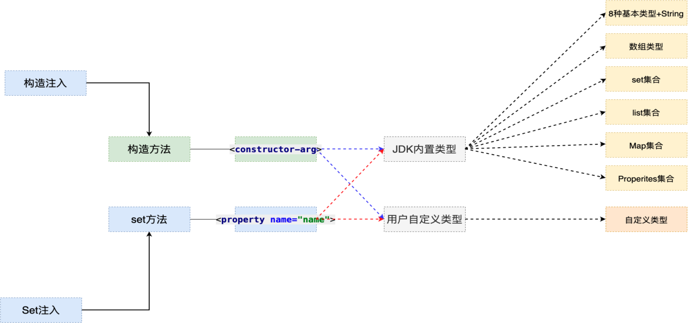


#### 第七章、反转控制 与 依赖注入

##### 1. 反转(转移)控制(IOC Inverse of Control)

~~~markdown
控制：对于成员变量赋值的控制权
反转控制：把对于成员变量赋值的控制权，从代码中反转(转移)到Spring工厂和配置文件中完成   
好处：解耦合
底层实现：工厂设计模式
~~~

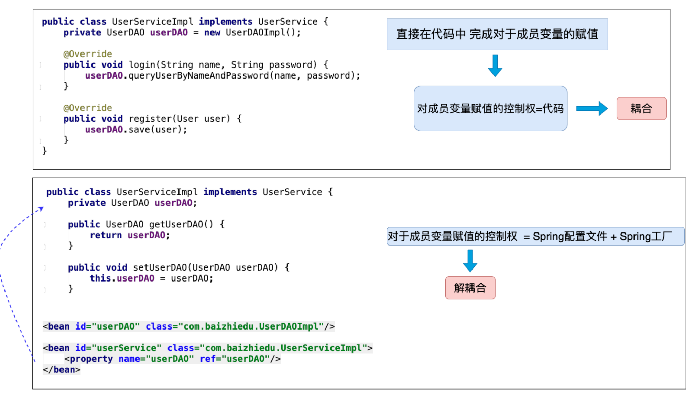


##### 2. 依赖注入 (Dependency Injection  DI)

~~~markdown
注入：
通过Spring的工厂及配置文件，为对象（bean，组件）的成员变量赋值
依赖注入：当一个类需要另一个类时，就意味着依赖，一旦出现依赖，就可以把另一个类作为本类的成员变量，最终通过Spring配置文件进行注入(赋值)。   
好处：解耦合
~~~


#### 第八章、Spring工厂创建复杂对象


##### 1. 什么是复杂对象

~~~markdown
复杂对象：指的就是不能直接通过new构造方法创建的对象  
Connection 
SqlSessionFactory
~~~

##### 2. Spring工厂创建复杂对象的3种方式

###### 2.1 FactoryBean接口

- 开发步骤

  - 实现FactoryBean接口
    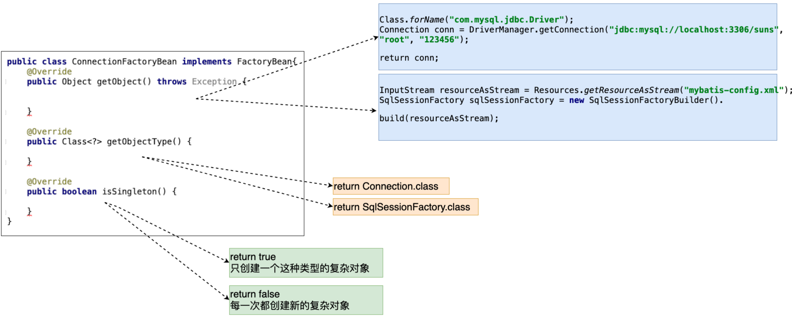

  - Spring配置文件的配置

    ~~~xml
    # 如果Class中指定的类型 是FactoryBean接口的实现类，那么通过id值获得的是这个类所创建的复杂对象  Connection
    <bean id="conn" class="com.baizhiedu.factorybean.ConnectionFactoryBean"/>
    ~~~

- 细节

  - 如果就想获得FactoryBean类型的对象   ctx.getBean("&conn")
    获得就是ConnectionFactoryBean对象

  - isSingleton方法
    返回  true 只会创建一个复杂对象

    返回 false 每一次都会创建新的对象
    问题：根据这个对象的特点 ，决定是返回true (SqlSessionFactory) 还是 false  (Connection)

  - mysql高版本连接创建时，需要制定SSL证书，解决问题的方式

    ~~~markdown
    url = "jdbc:mysql://localhost:3306/suns?useSSL=false"
    ~~~

  - 依赖注入的体会(DI)

    ~~~markdown
    把ConnectionFactoryBean中依赖的4个字符串信息 ，进行配置文件的注入 
    好处：解耦合
    <bean id="conn" class="com.baizhiedu.factorybean.ConnectionFactoryBean">
      <property name="driverClassName" value="com.mysql.jdbc.Driver"/>
      <property name="url" value="jdbc:mysql://localhost:3306/suns?useSSL=false"/>
      <property name="username" value="root"/>
      <property name="password" value="123456"/>
    </bean>
    ~~~

- FactoryBean的实现原理[简易版]

  ~~~xml
  接口回调
  1. 为什么Spring规定FactoryBean接口 实现 并且 getObject()?
  2. ctx.getBean("conn") 获得是复杂对象 Connection 而没有 获得 ConnectionFactoryBean(&)
  
  Spring内部运行流程
  1. 通过conn获得 ConnectionFactoryBean类的对象 ，进而通过instanceof 判断出是FactoryBean接口的实现类
  2. Spring按照规定 getObject() ---> Connection
  3. 返回Connection 
  ~~~

  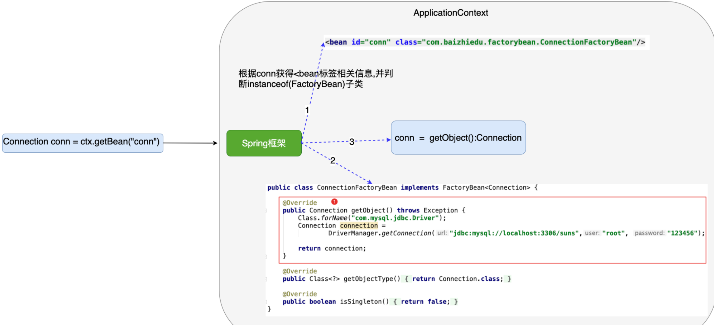

  

  

  

- FactoryBean总结

  ~~~markdown
  Spring中用于创建复杂对象的一种方式，也是Spring原生提供的，后续讲解Spring整合其他框架，大量应用FactoryBean
  ~~~

###### 2.2 实例工厂

~~~markdown
1. 避免Spring框架的侵入:使用FactoryBean需要实现Spring中的FactoryBean
2. 整合遗留系统：在公司中一般会有复杂对象的实现Factory,但是一般是.class文件
~~~

- 开发步骤

已知遗留的系统

```java
public class ConnectionFactory{
    public Connection getConnection(){
        Connection conn = null;
        try{
            Class.forName("com.mysql.jdbc.Driver");
            conn = DriverManager.getConnection("jdbc:mysql://localhost:3306/suns?useSSL=false","root","123456");
        }catch(CLassNotFoundException e){
            e.printStackTrace();
        }catch(SQLException e){
             e.printStackTrace();
        }
        return conn;
    }
}
```


~~~xml
 <bean id="connFactory" class="com.baizhiedu.factorybean.ConnectionFactory"></bean>

 <bean id="conn"  factory-bean="connFactory" factory-method="getConnection"/>
~~~

###### 2.3 静态工厂

- 开发步骤

  ```java
  public class ConnectionFactory{
      public static Connection getConnection(){
          Connection conn = null;
          try{
              Class.forName("com.mysql.jdbc.Driver");
              conn = DriverManager.getConnection("jdbc:mysql://localhost:3306/suns?useSSL=false","root","123456");
          }catch(CLassNotFoundException e){
              e.printStackTrace();
          }catch(SQLException e){
               e.printStackTrace();
          }
          return conn;
      }
  }
  ```
  
  
  
  ~~~xml
  <bean id="conn" class="com.baizhiedu.factorybean.StaticConnectionFactory" factory-method="getConnection"/>
  ~~~

##### 3. Spring工厂创建对象的总结 


#### 第九章、控制Spring工厂创建对象的次数

##### 1. 如何控制简单对象的创建次数 

~~~xml
<bean id="account" scope="singleton|prototype" class="xxxx.Account"/>
sigleton:只会创建一次简单对象 默认值
prototype:每一次都会创建新的对象
~~~

##### 2. 如何控制复杂对象的创建次数

~~~markdown
FactoryBean{
   isSingleton(){
      return true  只会创建一次
      return false 每一次都会创建新的
   }

}
如没有isSingleton方法 还是通过scope属性 进行对象创建次数的控制
~~~

##### 3. 为什么要控制对象的创建次数？

~~~markdown
好处：节省不必要的内存浪费 
~~~

- 什么样的对象只创建一次？

  能共用，线程安全

  ~~~markdown
  1. SqlSessionFactory
  2. DAO
  3. Service
  ~~~

- 什么样的对象 每一次都要创建新的？

  不能被共用，线程不安全
  
  ~~~markdown
  1. Connection
  2. SqlSession | Session
  3. Struts2 Action
  ~~~


### 工厂高级特性

----

#### 第十章、对象的生命周期


##### 1. 什么是对象的生命周期

~~~markdown
指的是一个对象创建、存活、消亡的一个完整过程
~~~

##### 2. 为什么要学习对象的生命周期

~~~markdown
由Spring负责对象的创建、存活、销毁，了解生命周期，有利于我们使用好Spring为我们创建的对象
~~~

##### 3. 生命周期的3个阶段

- 创建阶段

  ~~~markdown
  Spring工厂何时创建对象
  ~~~

  - scope="singleton"

    ~~~markdown
    Spring工厂创建的同时，对象的创建
    
    注意：设置scope=singleton 这种情况下 也需要在获取对象的同时，创建对象 
    <bean lazy-init="true"/>
    ~~~

  - scope="prototype"

    ~~~markdown
    Spring工厂会在获取对象的同时，创建对象
    ctx.getBean("")
    ~~~

- 初始化阶段

  ~~~markdown
  Spring工厂在创建完对象后，调用对象的初始化方法，完成对应的初始化操作
  
  1. 初始化方法提供：程序员根据需求，提供初始化方法，最终完成初始化操作
  2. 初始化方法调用：Spring工厂进行调用
  ~~~

  - 实现InitializingBean接口

    ~~~java
    //程序员根据需求，实现的方法，完成初始化操作
    public void afterProperitesSet(){
      
    }
    ~~~

  - 对象中提供一个普通的方法

    ~~~java
    public void myInit(){
      
    }
    
    <bean id="product" class="xxx.Product" init-method="myInit"/>
    ~~~

  - 细节分析

    1. 如果一个对象即实现InitializingBean 同时又提供的 普通的初始化方法  顺序

       ~~~markdown
       1. InitializingBean 
       2. 普通初始化方法
       ~~~

    2. 注入一定发生在初始化操作的前面

    3. 什么叫做初始化操作 

       ~~~markdown
       资源的初始化：数据库 IO 网络 .....
       ~~~

- 销毁阶段

  ~~~markdown
  Spring销毁对象前，会调用对象的销毁方法，完成销毁操作
  
  1. Spring什么时候销毁所创建的对象？
     ctx.close();
  2. 销毁方法：程序员根据自己的需求，定义销毁方法，完成销毁操作
        调用：Spring工厂完成调用
  ~~~

  - 实现DisposableBean接口

    ~~~java
    public void destroy()throws Exception{
      
    }
    ~~~

  - 定义一个普通的销毁方法

    ~~~java
    public void myDestroy()throws Exception{
    
    }
    <bean id="" class="" init-method="" destroy-method="myDestroy"/>
    ~~~

  - 细节分析

    1. 销毁方法的操作只适用于 scope="singleton"

    2. 什么叫做销毁操作

       ~~~markdown
       主要指的就是 资源的释放操作  io.close() connection.close();
       ~~~

       

#### 第十一章、配置文件参数化

~~~markdown
把Spring配置文件中需要经常修改的字符串信息，转移到一个更小的配置文件中

1. Spring的配置文件中存在需要经常修改的字符串？
   存在 以数据库连接相关的参数 代表
2. 经常变化字符串，在Spring的配置文件中，直接修改
   不利于项目维护(修改)
3. 转移到一个小的配置文件(.properties)
   利于维护(修改)
   
配置文件参数化：利于Spring配置文件的维护(修改)
~~~

##### 1. 配置文件参数的开发步骤

- 提供一个小的配置文件(.properities)

  ~~~properties
  名字：随便
  放置位置：随便
  
  jdbc.driverClassName = com.mysql.jdbc.Driver
  jdbc.url = jdbc:mysql://localhost:3306/suns?useSSL=false
  jdbc.username = root
  jdbc.password = 123456
  ~~~

- Spring的配置文件与小配置文件进行整合

  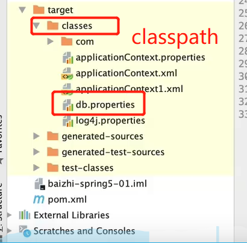

  ~~~xml
  applicationContext.xml
  <context:property-placeholder location="classpath:/db.properties"/>
  ~~~

- 在Spring配置文件中通过${key}获取小配置文件中对应的值
  


#### 第十二章、自定义类型转换器

##### 1. 类型转换器

~~~markdown
作用：Spring通过类型转换器把配置文件中字符串类型的数据，转换成了对象中成员变量对应类型的数据，进而完成了注入
~~~


##### 2. 自定义类型转换器

~~~markdown
原因：当Spring内部没有提供特定类型转换器时，而程序员在应用的过程中还需要使用，那么就需要程序员自己定义类型转换器
~~~

- 类 implements Converter接口

  ~~~java
  public class MyDateConverter implements Converter<String, Date> {
     /*
         convert方法作用：String --->  Date
                        SimpleDateFormat sdf = new SimpleDateFormat();
                        sdf.parset(String) ---> Date
         param:source 代表的是配置文件中 日期字符串 <value>2020-10-11</value>
  
         return : 当把转换好的Date作为convert方法的返回值后，Spring自动的为birthday属性进行注入（赋值）
  
       */
  
    @Override
    public Date convert(String source) {
  
      Date date = null;
      try {
        SimpleDateFormat sdf = new SimpleDateFormat("yyyy-MM-dd");
        date = sdf.parse(source);
      } catch (ParseException e) {
        e.printStackTrace();
      }
      return date;
    }
  }
  ~~~

- 在Spring的配置文件中进行配置

  - MyDateConverter对象创建出来

    ~~~xml
    <bean id="myDateConverter" class="xxxx.MyDateConverter"/>
    ~~~

  - 类型转换器的注册

    ~~~xml
    目的：告知Spring框架，我们所创建的MyDateConverter是一个类型转换器
    <!--用于注册类型转换器-->
    <bean id="conversionService" class="org.springframework.context.support.ConversionServiceFactoryBean">
      <property name="converters">
        <set>
          <ref bean="myDateConverter"/>
        </set>
      </property>
    </bean>
    ~~~

##### 3. 细节

- MyDateConverter中的日期的格式，通过依赖注入的方式，由配置文件完成赋值。

  ~~~java
  public class MyDateConverter implements Converter<String, Date> {
      private String pattern;
  
      public String getPattern() {
          return pattern;
      }
  
      public void setPattern(String pattern) {
          this.pattern = pattern;
      }
  
      /*
         convert方法作用：String --->  Date
                        SimpleDateFormat sdf = new SimpleDateFormat();
                        sdf.parse(String) ---> Date
         param:source 代表的是配置文件中 日期字符串 <value>2020-10-11</value>
  
         return : 当把转换好的Date作为convert方法的返回值后，Spring自动的为birthday属性进行注入（赋值）
  
       */
  
      @Override
      public Date convert(String source) {
  
          Date date = null;
          try {
              SimpleDateFormat sdf = new SimpleDateFormat(pattern);
              date = sdf.parse(source);
          } catch (ParseException e) {
              e.printStackTrace();
          }
          return date;
      }
  }
  ~~~

  ~~~xml
  <!--Spring创建MyDateConverter类型对象-->
  <bean id="myDateConverter" class="com.baizhiedu.converter.MyDateConverter">
    <property name="pattern" value="yyyy-MM-dd"/>
  </bean>
  ~~~

- ConversionSeviceFactoryBean 定义 id属性 值必须 conversionService 

- Spring框架内置日期类型的转换器

  ~~~markdown
  日期格式：2020/05/01 (不支持 ：2020-05-01)
  ~~~


#### 第十三章、后置处理Bean

~~~markdown
BeanPostProcessor作用：对Spring工厂所创建的对象，进行再加工。

AOP底层实现：

注意：BeanPostProcessor接口
          xxxx(){
             
          
          }
~~~

- 后置处理Bean的运行原理分析
  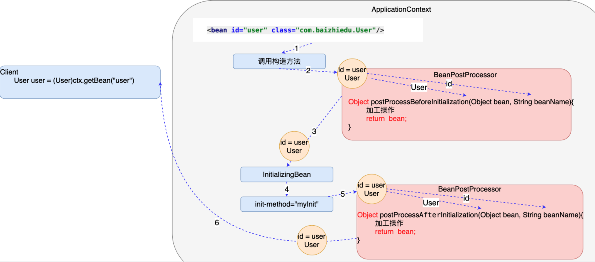

~~~markdown
程序员实现BeanPostProcessor规定接口中的方法：

Object postProcessBeforeInitiallization(Object bean String beanName)
作用：Spring创建完对象，并进行注入后，可以运行Before方法进行加工
获得Spring创建好的对象 ：通过方法的参数
最终通过返回值交给Spring框架 

Object postProcessAfterInitiallization(Object bean String beanName)
作用：Spring执行完对象的初始化操作后，可以运行After方法进行加工
获得Spring创建好的对象 ：通过方法的参数
最终通过返回值交给Spring框架 

实战中：
很少处理Spring的初始化操作：没有必要区分Before After。只需要实现其中的一个After方法即可
注意：
    postProcessBeforeInitiallization
    return bean对象
~~~


- BeanPostProcessor的开发步骤

  1. 类 实现 BeanPostProcessor接口

     ~~~java
     public class MyBeanPostProcessor implements BeanPostProcessor {
     
         @Override
         public Object postProcessBeforeInitialization(Object bean, String beanName) throws BeansException {
             return bean;
         }
     
         @Override
         public Object postProcessAfterInitialization(Object bean, String beanName) throws BeansException {
     
             Categroy categroy = (Categroy) bean;
             categroy.setName("xiaowb");
     
     
             return categroy;
         }
     }
     ~~~

     

  2. Spring的配置文件中进行配置

     ~~~xml
     <bean id="myBeanPostProcessor" class="xxx.MyBeanPostProcessor"/>
     ~~~

  3. BeanPostProcessor细节

     ~~~markdown
     BeanPostProcessor会对Spring工厂中所有创建的对象进行加工。
     ~~~


### AOP编程

---

#### 第一章、静态代理设计模式

##### 1. 为什么需要代理设计模式

###### 1.1 问题

- 在JavaEE分层开发开发中，那个层次对于我们来讲最重要

  ~~~markdown
  DAO ---> Service --> Controller 
  
  JavaEE分层开发中，最为重要的是Service层
  ~~~

- Service层中包含了哪些代码？

  ~~~markdown
  Service层中 = 核心功能(几十行 上百代码) + 额外功能(附加功能)
  1. 核心功能
     业务运算
     DAO调用
  2. 额外功能 
     1. 不属于业务
     2. 可有可无
     3. 代码量很小 
     
     事务、日志、性能监控...
     
  ~~~

- 额外功能书写在Service层中好不好？

  ~~~markdown
  Service层的调用者的角度（Controller):需要在Service层书写额外功能。
                           软件设计者：Service层不需要额外功能
                           
  ~~~

- 现实生活中的解决方式
  

##### 2. 代理设计模式

###### 1.1 概念

~~~markdown
通过代理类，为原始类（目标）增加额外的功能
好处：利于原始类(目标)的维护
~~~

###### 1.2名词解释

~~~markdown
1. 目标类 原始类 
   指的是 业务类 (核心功能 --> 业务运算 DAO调用)
2. 目标方法，原始方法
   目标类(原始类)中的方法 就是目标方法(原始方法)
3. 额外功能 (附加功能)
   日志，事务，性能
~~~

###### 1.3 代理开发的核心要素

~~~markdown
代理类 = 目标类(原始类) + 额外功能 + 原始类(目标类)实现相同的接口

房东 ---> 
		public interface UserService{
               m1
               m2
          }
目标类--->          
          UserServiceImpl implements UserService{
               m1 ---> 业务运算 DAO调用
               m2 
          }
代理类--->
          UserServiceProxy implements UserService
               m1
               m2
~~~

###### 1.4 编码

**静态代理**：为每一个原始类，手工编写一个代理类 (.java .class)


###### 1.5 静态代理存在的问题

~~~markdown
1. 静态类文件数量过多，不利于项目管理
   UserServiceImpl  UserServiceProxy
   OrderServiceImpl OrderServiceProxy
2. 额外功能维护性差
   代理类中 额外功能修改复杂(麻烦)
~~~


#### 第二章、Spring的动态代理开发

##### 1. Spring动态代理的概念

~~~markdown
概念：通过代理类为原始类(目标类)增加额外功能
好处：利于原始类(目标类)的维护
~~~

##### 2. 搭建开发环境

~~~xml
<dependency>  
    <groupId>org.springframework</groupId>  
    <artifactId>spring-aop</artifactId>  
    <version>5.1.14.RELEASE</version>
</dependency>

<dependency>  
    <groupId>org.aspectj</groupId>  
    <artifactId>aspectjrt</artifactId>  
    <version>1.8.8</version>
</dependency>

<dependency>  
    <groupId>org.aspectj</groupId>  
    <artifactId>aspectjweaver</artifactId>  
    <version>1.8.3</version>
</dependency>
~~~

##### 3. Spring动态代理的开发步骤

1. 创建原始对象(目标对象)

   ~~~java
   public class UserServiceImpl implements UserService {
       @Override
       public void register(User user) {
           System.out.println("UserServiceImpl.register 业务运算 + DAO ");
       }
   
       @Override
       public boolean login(String name, String password) {
           System.out.println("UserServiceImpl.login");
           return true;
       }
   }
   
   ~~~

   ~~~xml
   <bean id="userService" class="com.baizhiedu.proxy.UserServiceImpl"/>
   ~~~

2. 额外功能
   MethodBeforeAdvice接口

   ~~~xml
   额外的功能书写在接口的实现中，运行在原始方法执行之前运行额外功能。
   ~~~

   ~~~java
   public class Before implements MethodBeforeAdvice {
       /*
         作用：需要把运行在原始方法执行之前运行的额外功能，书写在before方法中
        */
       @Override
       public void before(Method method, Object[] args, Object target) throws Throwable {
           System.out.println("-----method before advice log------");
       }
   }
   ~~~

   ~~~xml
   <bean id="before" class="com.baizhiedu.dynamic.Before"/>
   ~~~

3. 定义切入点

   ~~~xml
   切入点：额外功能加入的位置
   
   目的：由程序员根据自己的需要，决定额外功能加入给那个原始方法
   register
   login
   
   简单的测试：所有方法都做为切入点，都加入额外的功能。
   ~~~

   ~~~xml
   <aop:config>
      <aop:pointcut id="pc" expression="execution(* *(..) )"/>
   </aop:config>
   ~~~

4. 组装 (2 3整合)

   ~~~xml
   表达的含义：所有的方法 都加入 before的额外功能
   <aop:advisor advice-ref="before" pointcut-ref="pc"/>
   ~~~

5. 调用

   ~~~java
   目的：获得Spring工厂创建的动态代理对象，并进行调用
   ApplicationContext ctx = new ClassPathXmlApplicationContext("/applicationContext.xml");
   注意：
      1. Spring的工厂通过原始对象的id值获得的是代理对象
      2. 获得代理对象后，可以通过声明接口类型，进行对象的存储
      
   UserService userService=(UserService)ctx.getBean("userService");
   
   userService.login("")
   userService.register()
   
   ~~~

##### 4. 动态代理细节分析

1. Spring创建的动态代理类在哪里？

   ~~~markdown
   Spring框架在运行时，通过动态字节码技术，在JVM创建的，运行在JVM内部，等程序结束后，会和JVM一起消失
   
   什么叫动态字节码技术:通过第三方动态字节码框架，在JVM中创建对应类的字节码，进而创建对象，当虚拟机结束，动态字节码跟着消失。
   
   结论：动态代理不需要定义类文件，都是JVM运行过程中动态创建的，所以不会造成静态代理，类文件数量过多，影响项目管理的问题。
   ~~~

   

   

   2. 动态代理编程简化代理的开发

      ~~~markdown
      在额外功能不改变的前提下，创建其他目标类（原始类）的代理对象时，只需要指定原始(目标)对象即可。
      ~~~

   3. 动态代理额外功能的维护性大大增强

#### 第三章、Spring动态代理详解

##### 1. 额外功能的详解

- MethodBeforeAdvice分析

  ~~~java
  1. MethodBeforeAdvice接口作用：额外功能运行在原始方法执行之前，进行额外功能操作。
  
  public class Before1 implements MethodBeforeAdvice {
      /*
        作用：需要把运行在原始方法执行之前运行的额外功能，书写在before方法中
  
        Method: 额外功能所增加给的那个原始方法
                login方法
  
                register方法
  
                showOrder方法
  
        Object[]: 额外功能所增加给的那个原始方法的参数。String name,String password
                                                 User
  
         Object: 额外功能所增加给的那个原始对象  UserServiceImpl
                                            OrderServiceImpl
       */
      @Override
      public void before(Method method, Object[] args, Object target) throws Throwable {
          System.out.println("-----new method before advice log------");
      }
  }
     
  2. before方法的3个参数在实战中，该如何使用。
     before方法的参数，在实战中，会根据需要进行使用，不一定都会用到，也有可能都不用。
  
     Servlet{
         service(HttpRequest request,HttpResponse response){
              request.getParameter("name") -->
              
              response.getWriter() ---> 
         
         }
     
     }
  
  ~~~

- MethodInterceptor(方法拦截器)

  ~~~markdown
  methodinterceptor接口：额外功能可以根据需要运行在原始方法执行 前、后、前后。
  ~~~

  ~~~java
  public class Arround implements MethodInterceptor {
      /*
           invoke方法的作用:额外功能书写在invoke
                          额外功能  原始方法之前
                                   原始方法之后
                                   原始方法执行之前 之后
           确定：原始方法怎么运行
  
           参数：MethodInvocation （Method):额外功能所增加给的那个原始方法
                      login
                      register
                invocation.proceed() ---> login运行
                                          register运行
  
            返回值：Object: 原始方法的返回值
  
           Date convert(String name)
       */
  
  
  
      @Override
      public Object invoke(MethodInvocation invocation) throws Throwable {
            System.out.println("-----额外功能 log----");
            Object ret = invocation.proceed();
  
            return ret;
      }
  }
  
  
  ~~~

  额外功能运行在原始方法执行之后

  ~~~java
  @Override
  public Object invoke(MethodInvocation invocation) throws Throwable {
    Object ret = invocation.proceed();
    System.out.println("-----额外功能运行在原始方法执行之后----");
  
    return ret;
  }
  ~~~

  额外功能运行在原始方法执行之前，之后

  ~~~java
  什么样的额外功能 运行在原始方法执行之前，之后都要添加？
  事务
  
  @Override
  public Object invoke(MethodInvocation invocation) throws Throwable {
    System.out.println("-----额外功能运行在原始方法执行之前----");
    Object ret = invocation.proceed();
    System.out.println("-----额外功能运行在原始方法执行之后----");
  
    return ret;
  }
  ~~~

  额外功能运行在原始方法抛出异常的时候

  ~~~java
  @Override
  public Object invoke(MethodInvocation invocation) throws Throwable {
  
    Object ret = null;
    try {
      ret = invocation.proceed();
    } catch (Throwable throwable) {
  
      System.out.println("-----原始方法抛出异常 执行的额外功能 ---- ");
      throwable.printStackTrace();
    }
  
  
    return ret;
  }
  ~~~

  MethodInterceptor影响原始方法的返回值

  ~~~java
  原始方法的返回值，直接作为invoke方法的返回值返回，MethodInterceptor不会影响原始方法的返回值
  
  MethodInterceptor影响原始方法的返回值
  Invoke方法的返回值，不要直接返回原始方法的运行结果即可。
  
  @Override
  public Object invoke(MethodInvocation invocation) throws Throwable {
     System.out.println("------log-----");
     Object ret = invocation.proceed();
     return false;
  }
  ~~~

##### 2. 切入点详解

~~~xml
切入点决定额外功能加入位置(方法)

<aop:pointcut id="pc" expression="execution(* *(..))"/>
exection(* *(..)) ---> 匹配了所有方法    a  b  c 

1. execution()  切入点函数
2. * *(..)      切入点表达式  
~~~

###### 2.1 切入点表达式

1. 方法切入点表达式
   

   ```markdown
   *  *(..)  --> 所有方法
   
   * ---> 修饰符 返回值
   * ---> 方法名
   ()---> 参数表
   ..---> 对于参数没有要求 (参数有没有，参数有几个都行，参数是什么类型的都行)
   ```

   - 定义login方法作为切入点

     ~~~markdown
     * login(..)
     
     # 定义register作为切入点
     * register(..)
     ~~~

   - 定义login方法且login方法有两个字符串类型的参数 作为切入点

     ~~~markdown
     * login(String,String)
     
     #注意：非java.lang包中的类型，必须要写全限定名
     * register(com.baizhiedu.proxy.User)
     
     # ..可以和具体的参数类型连用
     * login(String,..)  --> login(String),login(String,String),login(String,com.baizhiedu.proxy.User)
     ~~~

   - 精准方法切入点限定

     ~~~markdown
     修饰符 返回值         包.类.方法(参数)
     
         *               com.baizhiedu.proxy.UserServiceImpl.login(..)
         *               com.baizhiedu.proxy.UserServiceImpl.login(String,String)
     ~~~

2. 类切入点

   ~~~markdown
   指定特定类作为切入点(额外功能加入的位置)，自然这个类中的所有方法，都会加上对应的额外功能
   ~~~

   - 语法1

     ~~~markdown
     #类中的所有方法加入了额外功能 
     * com.baizhiedu.proxy.UserServiceImpl.*(..)   
     ~~~

   - 语法2 

     ~~~markdown
     #忽略包
     1. 类只存在一级包  com.UserServiceImpl
     * *.UserServiceImpl.*(..)
     
     2. 类存在多级包    com.baizhiedu.proxy.UserServiceImpl
     * *..UserServiceImpl.*(..)
     ~~~

3. **包切入点表达式 实战**

   ~~~markdown
   指定包作为额外功能加入的位置，自然包中的所有类及其方法都会加入额外的功能
   ~~~

   - 语法1

     ~~~markdown
     #切入点包中的所有类，必须在proxy中，不能在proxy包的子包中
     * com.baizhiedu.proxy.*.*(..)
     ~~~

   - 语法2

     ~~~markdown
     #切入点当前包及其子包都生效 
     * com.baizhiedu.proxy..*.*(..) 
     ~~~

###### 2.2 切入点函数

~~~markdown
切入点函数：用于执行切入点表达式
~~~

1. execution

   ~~~markdown
   最为重要的切入点函数，功能最全。
   执行 方法切入点表达式 类切入点表达式 包切入点表达式 
   
   弊端：execution执行切入点表达式 ，书写麻烦
        execution(* com.baizhiedu.proxy..*.*(..))
        
   注意：其他的切入点函数 简化是execution书写复杂度，功能上完全一致
   ~~~

2. args

   ~~~markdown
   作用：主要用于函数(方法) 参数的匹配
   
   切入点：方法参数必须得是2个字符串类型的参数
   
   execution(* *(String,String))
   
   args(String,String)
   ~~~

3. within

   ~~~markdown
   作用：主要用于进行类、包切入点表达式的匹配
   
   切入点：UserServiceImpl这个类
   
   execution(* *..UserServiceImpl.*(..))
   
   within(*..UserServiceImpl)
   
   execution(* com.baizhiedu.proxy..*.*(..))
   
   within(com.baizhiedu.proxy..*)
   
   ~~~

4.@annotation

~~~xml
作用：为具有特殊注解的方法加入额外功能

<aop:pointcut id="" expression="@annotation(com.baizhiedu.Log)"/>
~~~

5. 切入点函数的逻辑运算

   ~~~markdown
   指的是 整合多个切入点函数一起配合工作，进而完成更为复杂的需求
   ~~~

   - and与操作

     ~~~markdown
     案例：login 同时 参数 2个字符串 
     
     1. execution(* login(String,String))
     
     2. execution(* login(..)) and args(String,String)
     
     注意：与操作不能用于同种类型的切入点函数 
     
     案例：register方法 和 login方法作为切入点 
     
     execution(* login(..)) or  execution(* register(..))
     
     ~~~

   - or或操作

     ~~~markdown
     案例：register方法 和 login方法作为切入点 
     
     execution(* login(..)) or  execution(* register(..))
     ~~~


#### 第四章、AOP编程

##### 1. AOP概念

~~~markdown
AOP (Aspect Oriented Programing)   面向切面编程 = Spring动态代理开发
以切面为基本单位的程序开发，通过切面间的彼此协同，相互调用，完成程序的构建
切面 = 切入点 + 额外功能

OOP (Object Oritened Programing)   面向对象编程 Java
以对象为基本单位的程序开发，通过对象间的彼此协同，相互调用，完成程序的构建

POP (Producer Oriented Programing) 面向过程(方法、函数)编程 C 
以过程为基本单位的程序开发，通过过程间的彼此协同，相互调用，完成程序的构建
~~~

~~~markdown
AOP的概念：
     本质就是Spring的动态代理开发，通过代理类为原始类增加额外功能。
     好处：利于原始类的维护

注意：AOP编程不可能取代OOP，OOP编程有意补充。
~~~

##### 2. AOP编程的开发步骤

~~~markdown
1. 原始对象
2. 额外功能 (MethodInterceptor)
3. 切入点
4. 组装切面 (额外功能+切入点)
~~~

##### 3. 切面的名词解释

~~~markdown
切面 = 切入点 + 额外功能 

几何学
   面 = 点 + 相同的性质
~~~


#### 第五章、AOP的底层实现原理

##### 1. 核心问题

~~~markdown
1. AOP如何创建动态代理类(动态字节码技术)
2. Spring工厂如何加工创建代理对象   
   通过原始对象的id值，获得的是代理对象
~~~

##### 2. 动态代理类的创建

###### 2.1 JDK的动态代理

- Proxy.newProxyInstance方法参数详解


- 编码

  ~~~java
  public class TestJDKProxy {
  
      /*
          1. 借用类加载器  TestJDKProxy
                         或UserServiceImpl
                         或 其他
          2. JDK8.x前
  
              final UserService userService = new UserServiceImpl();
       */
      public static void main(String[] args) {
          //1 创建原始对象
          UserService userService = new UserServiceImpl();
  
          //2 JDK创建动态代理
          /*
  
           */
  
          InvocationHandler handler = new InvocationHandler(){
              @Override
              public Object invoke(Object proxy, Method method, Object[] args) throws Throwable {
                  System.out.println("------proxy  log --------");
                  //原始方法运行
                  Object ret = method.invoke(userService, args);
                  return ret;
              }
          };
  
          UserService userServiceProxy = (UserService)Proxy.newProxyInstance(UserServiceImpl.class.getClassLoader(),userService.getClass().getInterfaces(),handler);
  
          userServiceProxy.login("suns", "123456");
          userServiceProxy.register(new User());
      }
  }
  
  ~~~


###### 2.2 CGlib的动态代理

~~~markdown
CGlib创建动态代理的原理：父子继承关系创建代理对象，原始类作为父类，代理类作为子类，这样既可以保证2者方法一致，同时在代理类中提供新的实现(额外功能+原始方法)
~~~


- CGlib编码 

  ~~~java
  package com.baizhiedu.cglib;
  
  import com.baizhiedu.proxy.User;
  import org.springframework.cglib.proxy.Enhancer;
  import org.springframework.cglib.proxy.MethodInterceptor;
  import org.springframework.cglib.proxy.MethodProxy;
  
  import java.lang.reflect.Method;
  
  public class TestCglib {
      public static void main(String[] args) {
          //1 创建原始对象
          UserService userService = new UserService();
  
          /*
            2 通过cglib方式创建动态代理对象
              Proxy.newProxyInstance(classloader,interface,invocationhandler)
  
              Enhancer.setClassLoader()
              Enhancer.setSuperClass()
              Enhancer.setCallback();  ---> MethodInterceptor(cglib)
              Enhancer.create() ---> 代理
           */
  
          Enhancer enhancer = new Enhancer();
  
          enhancer.setClassLoader(TestCglib.class.getClassLoader());
          enhancer.setSuperclass(userService.getClass());
  
  
          MethodInterceptor interceptor = new MethodInterceptor() {
              //等同于 InvocationHandler --- invoke
              @Override
              public Object intercept(Object o, Method method, Object[] args, MethodProxy methodProxy) throws Throwable {
                  System.out.println("---cglib log----");
                  Object ret = method.invoke(userService, args);
  
                  return ret;
              }
          };
  
          enhancer.setCallback(interceptor);
  
          UserService userServiceProxy = (UserService) enhancer.create();
  
          userServiceProxy.login("suns", "123345");
          userServiceProxy.register(new User());
      }
  }
  
  ~~~

- 总结

  ~~~markdown
  1. JDK动态代理   Proxy.newProxyInstance()  通过接口创建代理的实现类 
  2. Cglib动态代理 Enhancer                  通过继承父类创建的代理类 
  ~~~

  

##### 3. Spring工厂如何加工原始对象 

- 思路分析
  

- 编码

  ~~~java
  public class ProxyBeanPostProcessor implements BeanPostProcessor {
      @Override
      public Object postProcessBeforeInitialization(Object bean, String beanName) throws BeansException {
          return bean;
      }
  
      @Override
      /*
           Proxy.newProxyInstance();
       */
      public Object postProcessAfterInitialization(Object bean, String beanName) throws BeansException {
  
          InvocationHandler handler = new InvocationHandler() {
              @Override
              public Object invoke(Object proxy, Method method, Object[] args) throws Throwable {
                  System.out.println("----- new Log-----");
                  Object ret = method.invoke(bean, args);
  
                  return ret;
              }
          };
        return Proxy.newProxyInstance(ProxyBeanPostProcessor.class.getClassLoader(),bean.getClass().getInterfaces(),handler);
      }
  }
  ~~~

  ~~~xml
  <bean id="userService" class="com.baizhiedu.factory.UserServiceImpl"/>
  
  
  <!--1. 实现BeanPostProcessor 进行加工
          2. 配置文件中对BeanPostProcessor进行配置
      -->
  
  <bean id="proxyBeanPostProcessor" class="com.baizhiedu.factory.ProxyBeanPostProcessor"/>
  
  ~~~

#### 第六章、基于注解的AOP编程

##### 1. 基于注解的AOP编程的开发步骤

1. 原始对象

2. 额外功能

3. 切入点

4. 组装切面

   ~~~java
   # 通过切面类 定义了 额外功能 @Around
              定义了 切入点   @Around("execution(* login(..))")
              @Aspect 切面类 
              
   package com.baizhiedu.aspect;
   
   import org.aspectj.lang.ProceedingJoinPoint;
   import org.aspectj.lang.annotation.Around;
   import org.aspectj.lang.annotation.Aspect;
   
   
   /*
          1. 额外功能
                    public class MyArround implements MethodInterceptor{
   
                         public Object invoke(MethodInvocation invocation){
   
                                 Object ret = invocation.proceed();
   
                                 return ret;
   
                         }
   
                    }
   
          2. 切入点
                <aop:config
                    <aop:pointcut id=""  expression="execution(* login(..))"/>
    */
   @Aspect
   public class MyAspect {
   
       @Around("execution(* login(..))")
       public Object arround(ProceedingJoinPoint joinPoint) throws Throwable {
   
           System.out.println("----aspect log ------");
   
           Object ret = joinPoint.proceed();
   
   
           return ret;
       }
   }
      
   ~~~

   ~~~xml
    <bean id="userService" class="com.baizhiedu.aspect.UserServiceImpl"/>
   
       <!--
          切面
            1. 额外功能
            2. 切入点
            3. 组装切面
   
   
       -->
   <bean id="arround" class="com.baizhiedu.aspect.MyAspect"/>
   
   <!--告知Spring基于注解进行AOP编程-->
   <aop:aspectj-autoproxy /> 
   ~~~

##### 2. 细节

1. 切入点复用

   ~~~java
   切入点复用：在切面类中定义一个函数 上面@Pointcut注解 通过这种方式，定义切入点表达式，后续更加有利于切入点复用。
   
   @Aspect
   public class MyAspect {
       @Pointcut("execution(* login(..))")
       public void myPointcut(){}
   
       @Around(value="myPointcut()")
       public Object arround(ProceedingJoinPoint joinPoint) throws Throwable {
   
           System.out.println("----aspect log ------");
   
           Object ret = joinPoint.proceed();
   
   
           return ret;
       }
   
   
       @Around(value="myPointcut()")
       public Object arround1(ProceedingJoinPoint joinPoint) throws Throwable {
   
           System.out.println("----aspect tx ------");
   
           Object ret = joinPoint.proceed();
   
   
           return ret;
       }
   
   }
   ~~~

2. 动态代理的创建方式 

  ~~~markdown
AOP底层实现  2种代理创建方式
  1.  JDK  通过实现接口 做新的实现类方式 创建代理对象
  2.  Cglib通过继承父类 做新的子类      创建代理对象
  
  默认情况 AOP编程 底层应用JDK动态代理创建方式 
  如果切换Cglib
       1. 基于注解AOP开发
          <aop:aspectj-autoproxy proxy-target-class="true" />
       2. 传统的AOP开发
          <aop:config proxy-target-class="true">
          </aop>
  ~~~

  

#### 第七章、AOP开发中的一个坑 

~~~java
坑：在同一个业务类中，进行业务方法间的相互调用，只有最外层的方法,才是加入了额外功能(内部的方法，通过普通的方式调用，都调用的是原始方法)。如果想让内层的方法也调用代理对象的方法，就要AppicationContextAware获得工厂，进而获得代理对象。
public class UserServiceImpl implements UserService, ApplicationContextAware {
    private ApplicationContext ctx;


    @Override
    public void setApplicationContext(ApplicationContext applicationContext) throws BeansException {
              this.ctx = applicationContext;
    }

    @Log
    @Override
    public void register(User user) {
        System.out.println("UserServiceImpl.register 业务运算 + DAO ");
        //throw new RuntimeException("测试异常");

        //调用的是原始对象的login方法 ---> 核心功能
        /*
            设计目的：代理对象的login方法 --->  额外功能+核心功能
            ApplicationContext ctx = new ClassPathXmlApplicationContext("/applicationContext2.xml");
            UserService userService = (UserService) ctx.getBean("userService");
            userService.login();

            Spring工厂重量级资源 一个应用中 应该只创建一个工厂
         */
        //this.login("suns", "123456");//调用的是原始对象
        UserService userService = (UserService) ctx.getBean("userService");
        userService.login("suns", "123456");
    }

    @Override
    public boolean login(String name, String password) {
        System.out.println("UserServiceImpl.login");
        return true;
    }
}

~~~

#### 第八章、AOP阶段知识总结


###  持久层整合

----

#### 第一章、持久层整合

##### 1.Spring框架为什么要与持久层技术进行整合

~~~markdown
1. JavaEE开发需要持久层进行数据库的访问操作。
2. JDBC Hibernate MyBatis进行持久开发过程存在大量的代码冗余
3. Spring基于模板设计模式对于上述的持久层技术进行了封装
~~~

##### 2. Spring可以与那些持久层技术进行整合？

~~~markdown
1. JDBC
     |-  JDBCTemplate 
2. Hibernate (JPA)
     |-  HibernateTemplate
3. MyBatis
     |-  SqlSessionFactoryBean MapperScannerConfigure 
~~~

#### 第二章、Spring与MyBatis整合

##### 1. MyBatis开发步骤的回顾

~~~markdown
1. 实体
2. 实体别名  
3. 表
4. 创建DAO接口
5. 实现Mapper文件
6. 注册Mapper文件
7. MybatisAPI调用
~~~

##### 2. Mybatis在开发过程中存在问题

~~~markdown
配置繁琐  代码冗余 

1. 实体
2. 实体别名         配置繁琐 
3. 表
4. 创建DAO接口
5. 实现Mapper文件
6. 注册Mapper文件   配置繁琐 
7. MybatisAPI调用  代码冗余 
~~~

##### 3. Spring与Mybatis整合思路分析

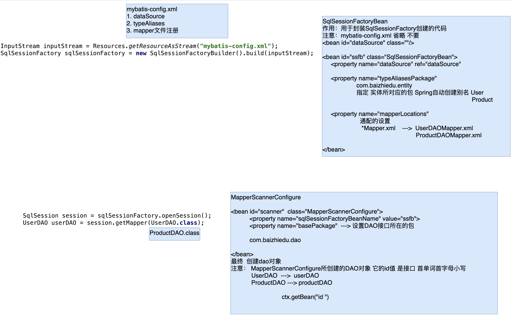

##### 4. Spring与Mybatis整合的开发步骤

- 配置文件（ApplicationContext.xml) 进行相关配置

  ~~~xml
  #配置 是需要配置一次 
  <bean id="dataSource" class=""/> 
  
  <!--创建SqlSessionFactory-->
  <bean id="ssfb" class="SqlSessionFactoryBean">
      <property name="dataSource" ref=""/>
      <property name="typeAliasesPackage">
           指定 实体类所在的包  com.baizhiedu.entity  User
                                                   Product
      </property>
      <property name="mapperLocations">
            指定 配置文件(映射文件)的路径 还有通用配置 
            com.baizhiedu.mapper/*Mapper.xml 
      </property>
  </bean>
  
  <!--DAO接口的实现类
      session ---> session.getMapper() --- xxxDAO实现类对象 
      XXXDAO  ---> xXXDAO
  -->
  <bean id="scanner" class="MapperScannerConfigure">
      <property name="sqlSessionFactoryBeanName" value="ssfb"/>
      <property name="basePacakge">
          指定 DAO接口放置的包  com.baizhiedu.dao 
      </property>
  </bean>
  ~~~

- 编码

  ~~~markdown
  # 实战经常根据需求 写的代码
  1. 实体
  2. 表
  3. 创建DAO接口
  4. 实现Mapper文件
  ~~~

##### 5. Spring与Mybatis整合编码

- 搭建开发环境(jar)

  ~~~xml
  <dependency>
    <groupId>org.springframework</groupId>
    <artifactId>spring-jdbc</artifactId>
    <version>5.1.14.RELEASE</version>
  </dependency>
  
  <dependency>
    <groupId>org.mybatis</groupId>
    <artifactId>mybatis-spring</artifactId>
    <version>2.0.2</version>
  </dependency>
  
  <dependency>
    <groupId>com.alibaba</groupId>
    <artifactId>druid</artifactId>
    <version>1.1.18</version>
  </dependency>
  
  <dependency>
    <groupId>mysql</groupId>
    <artifactId>mysql-connector-java</artifactId>
    <version>5.1.48</version>
  </dependency>
  
  <dependency>
    <groupId>org.mybatis</groupId>
    <artifactId>mybatis</artifactId>
    <version>3.4.6</version>
  </dependency>
  ~~~

- Spring配置文件的配置

  ~~~xml
  <!--连接池-->
  <bean id="dataSource" class="com.alibaba.druid.pool.DruidDataSource">
    <property name="driverClassName" value="com.mysql.jdbc.Driver"></property>
    <property name="url" value="jdbc:mysql://localhost:3306/suns?useSSL=false"></property>
    <property name="username" value="root"></property>
    <property name="password" value="123456"></property>
  </bean>
  
  <!--创建SqlSessionFactory SqlSessionFactoryBean-->
  <bean id="sqlSessionFactoryBean" class="org.mybatis.spring.SqlSessionFactoryBean">
    <property name="dataSource" ref="dataSource"></property>
    <property name="typeAliasesPackage" value="com.baizhiedu.entity"></property>
    <property name="mapperLocations">
      <list>
        <value>classpath:com.baizhiedu.mapper/*Mapper.xml</value>
      </list>
    </property>
  </bean>
  
  <!--创建DAO对象 MapperScannerConfigure-->
  
  <bean id="scanner" class="org.mybatis.spring.mapper.MapperScannerConfigurer">
    <property name="sqlSessionFactoryBeanName" value="sqlSessionFactoryBean"></property>
    <property name="basePackage" value="com.baizhiedu.dao"></property>
  </bean>
  ~~~

- 编码

  ~~~markdown
  1. 实体
  2. 表
  3. DAO接口
  4. Mapper文件配置
  ~~~


##### 6. Spring与Mybatis整合细节

- 问题：Spring与Mybatis整合后，为什么DAO不提交事务，但是数据能够插入数据库中？

  ~~~markdown
  连接对象控制事务
  Connection --> tx
  Mybatis(Connection)
  
  本质上控制连接对象(Connection) ---> 连接池(DataSource)
  1. Mybatis提供的连接池对象 ---> 创建Connection
       Connection.setAutoCommit(false) 手工的控制了事务 ， 操作完成后，手工提交
  2. Druid（C3P0 DBCP）作为连接池        ---> 创建Connection
       Connection.setAutoCommit(true) true默认值 保持自动控制事务，一条sql 自动提交 
  答案：因为Spring与Mybatis整合时，引入了外部连接池对象，保持自动的事务提交这个机制(Connection.setAutoCommit(true)),不需要手工进行事务的操作，也能进行事务的提交 
  
  注意：未来实战中，还会手工控制事务(多条sql一起成功，一起失败)，后续Spring通过事务控制解决这个问题。
  ~~~


#### 第三章、Spring的事务处理

##### 1. 什么是事务？

~~~markdown
保证业务操作完整性的一种数据库机制

事务的4特点： A C I D
1. A 原子性
2. C 一致性
3. I 隔离性
4. D 持久性
~~~

##### 2. 如何控制事务

~~~markdown
JDBC:
    Connection.setAutoCommit(false);
    Connection.commit();
    Connection.rollback();
Mybatis：
    Mybatis自动开启事务
    
    sqlSession(Connection).commit();
    sqlSession(Connection).rollback();

结论：控制事务的底层 都是Connection对象完成的。
~~~

##### 3.Spring控制事务的开发

~~~markdown
Spring是通过AOP的方式进行事务开发
~~~

###### 1. 原始对象

~~~markdown
public class XXXUserServiceImpl{
   private xxxDAO xxxDAO
   set get

   1. 原始对象 ---》 原始方法 ---》核心功能 (业务处理+DAO调用)
   2. DAO作为Service的成员变量，依赖注入的方式进行赋值
}
~~~

###### 2. 额外功能

~~~markdown
1. org.springframework.jdbc.datasource.DataSourceTransactionManager
2. 注入DataSource 
1. MethodInterceptor
   public Object invoke(MethodInvocation invocation){
      try{
        Connection.setAutoCommit(false);
        Object ret = invocation.proceed();
        Connection.commit();
      }catch(Exception e){
        Connection.rollback();
      }
        return ret;
   }
2. @Aspect
   @Around 
~~~

###### 3. 切入点

~~~mariadb
@Transactional 
事务的额外功能加入给那些业务方法。

1. 类上：类中所有的方法都会加入事务
2. 方法上：这个方法会加入事务
~~~

###### 4 组装切面

~~~markdown
1. 切入点
2. 额外功能

<tx:annotation-driven transaction-manager=""/>
~~~

##### 4. Spring控制事务的编码

- 搭建开发环境 (jar)

  ~~~xml
  <dependency>
    <groupId>org.springframework</groupId>
    <artifactId>spring-tx</artifactId>
    <version>5.1.14.RELEASE</version>
  </dependency>
  ~~~

- 编码

  ~~~xml
  <bean id="userService" class="com.baizhiedu.service.UserServiceImpl">
    <property name="userDAO" ref="userDAO"/>
  </bean>
  
  <!--DataSourceTransactionManager-->
  <bean id="dataSourceTransactionManager" class="org.springframework.jdbc.datasource.DataSourceTransactionManager">
    <property name="dataSource" ref="dataSource"/>
  </bean>
  
  @Transactional
  public class UserServiceImpl implements UserService {
      private UserDAO userDAO;
  
  <tx:annotation-driven transaction-manager="dataSourceTransactionManager"/>
  ~~~

- 细节

  ~~~markdown
  <tx:annotation-driven transaction-manager="dataSourceTransactionManager" proxy-target-class="true"/>
  进行动态代理底层实现的切换   proxy-target-class
      默认 false JDK
          true  Cglib 
  ~~~

#### 第四章、 Spring中的事务属性(Transaction Attribute)

##### 1. 什么是事务属性

~~~markdown
属性：描述物体特征的一系列值
     性别 身高 体重 ...
事务属性：描述事务特征的一系列值 
1. 隔离属性
2. 传播属性
3. 只读属性
4. 超时属性
5. 异常属性 
~~~

##### 2. 如何添加事务属性

~~~markdown
@Transactional(isloation=,propagation=,readOnly=,timeout=,rollbackFor=,noRollbackFor=,)
~~~

##### 3. 事务属性详解

###### 1. 隔离属性 (ISOLATION)

- 隔离属性的概念

  ~~~markdown
  概念：他描述了事务解决并发问题的特征
  1. 什么是并发
         多个事务(用户)在同一时间，访问操作了相同的数据
         
         同一时间：0.000几秒 微小前 微小后
  2. 并发会产生那些问题
         1. 脏读
         2. 不可重复读
         3. 幻影读
  3. 并发问题如何解决
         通过隔离属性解决，隔离属性中设置不同的值，解决并发处理过程中的问题。
  ~~~

- 事务并发产生的问题

  - 脏读

    ~~~markdown
    一个事务，读取了另一个事务中没有提交的数据。会在本事务中产生数据不一致的问题
    解决方案  @Transactional(isolation=Isolation.READ_COMMITTED)
    ~~~

  - 不可重复读

    ~~~markdown
    一个事务中，多次读取相同的数据，但是读取结果不一样。会在本事务中产生数据不一致的问题
    注意：1 不是脏读 2 一个事务中
    解决方案 @Transactional(isolation=Isolation.REPEATABLE_READ)
    本质： 一把行锁
    ~~~

  - 幻影读

    ~~~markdown
    一个事务中，多次对整表进行查询统计，但是结果不一样，会在本事务中产生数据不一致的问题
    解决方案 @Transactional(isolation=Isolation.SERIALIZABLE)
    本质：表锁 
    ~~~

  - 总结

    ~~~markdown
    并发安全： SERIALIZABLE>REPEATABLE_READ>READ_COMMITTED
    运行效率： READ_COMMITTED>REPEATABLE_READ>SERIALIZABLE
    ~~~

- 数据库对于隔离属性的支持

  | 隔离属性的值              | MySQL | Oracle |
  | ------------------------- | ----- | ------ |
  | ISOLATION_READ_COMMITTED  | ✅     | ✅      |
  | IOSLATION_REPEATABLE_READ | ✅     | ❎      |
  | ISOLATION_SERIALIZABLE    | ✅     | ✅      |

  ~~~markdown
  Oracle不支持REPEATABLE_READ值 如何解决不可重复读
  采用的是多版本比对的方式 解决不可重复读的问题
  ~~~

- 默认隔离属性

  ~~~markdown
  ISOLATION_DEFAULT：会调用不同数据库所设置的默认隔离属性
  
  MySQL : REPEATABLE_READ 
  Oracle: READ_COMMITTED  
  ~~~

  - 查看数据库默认隔离属性

    - MySQL

      ~~~markdown
      select @@tx_isolation;
      ~~~

    - Oracle

      ~~~markdown
      SELECT s.sid, s.serial#,
         CASE BITAND(t.flag, POWER(2, 28))
            WHEN 0 THEN 'READ COMMITTED'
            ELSE 'SERIALIZABLE'
         END AS isolation_level
      FROM v$transaction t 
      JOIN v$session s ON t.addr = s.taddr
      AND s.sid = sys_context('USERENV', 'SID');
      ~~~

- 隔离属性在实战中的建议

  ~~~markdown
  推荐使用Spring指定的ISOLATION_DEFAULT
   1. MySQL   repeatable_read
   2. Oracle  read_commited 
  
  未来实战中，并发访问情况 很低 
  
  如果真遇到并发问题，乐观锁 
     Hibernate(JPA)  Version 
     MyBatis         通过拦截器自定义开发
   
  ~~~

###### 2. 传播属性(PROPAGATION)

- 传播属性的概念

  ~~~markdown
  概念：他描述了事务解决嵌套问题的特征
  
  什么叫做事务的嵌套：他指的是一个大的事务中，包含了若干个小的事务
  
  问题：大事务中融入了很多小的事务，他们彼此影响，最终就会导致外部大的事务，丧失了事务的原子性
  比如：
  TA-----
    TB----
    TB----
    TC----
    TC----
  TA-----
   TC 回滚，但是TB已经提交，TA无法完全回滚
  ~~~

- 传播属性的值及其用法

  | 传播属性的值  | 外部不存在事务 | 外部存在事务                       | 用法                                                    | 备注                                 |
  | ------------- | -------------- | ---------------------------------- | ------------------------------------------------------- | ------------------------------------ |
  | REQUIRED      | 开启新的事务   | 融合到外部事务中                   | @Transactional(propagation = Propagation.REQUIRED)      | 增删改方法                           |
  | SUPPORTS      | 不开启事务     | 融合到外部事务中                   | @Transactional(propagation = Propagation.SUPPORTS)      | 查询方法                             |
  | REQUIRES_NEW  | 开启新的事务   | 挂起（暂停）外部事务，创建新的事务 | @Transactional(propagation = Propagation.REQUIRES_NEW)  | 日志记录方法中（插日志在内部事务中） |
  | NOT_SUPPORTED | 不开启事务     | 挂起外部事务                       | @Transactional(propagation = Propagation.NOT_SUPPORTED) | 及其不常用                           |
  | NEVER         | 不开启事务     | 抛出异常                           | @Transactional(propagation = Propagation.NEVER)         | 及其不常用                           |
  | MANDATORY     | 抛出异常       | 融合到外部事务中                   | @Transactional(propagation = Propagation.MANDATORY)     | 及其不常用                           |

- 默认的传播属性

  ~~~markdown
  REQUIRED是传播属性的默认值
  ~~~

- 推荐传播属性的使用方式

  ~~~markdown
  增删改 方法：直接使用默认值REQUIRED 
  查询   操作：显示指定传播属性的值为SUPPORTS  
  ~~~

###### 3. 只读属性(readOnly)

~~~markdown
针对于只进行查询操作的业务方法，可以加入只读属性，提供运行效率

默认值：false 
~~~

###### 4. 超时属性(timeout)

~~~markdown
指定了事务等待的最长时间

1. 为什么事务进行等待？
   当前事务访问数据时，有可能访问的数据被别的事务进行加锁的处理，那么此时本事务就必须进行等待。
2. 等待时间 秒
3. 如何应用 @Transactional(timeout=2)
4. 超时属性的默认值 -1 
   最终由对应的数据库来指定
~~~

###### 5. 异常属性

~~~markdown
Spring事务处理过程中
默认 对于RuntimeException及其子类 采用的是回滚的策略
默认 对于Exception及其子类 采用的是提交的策略

rollbackFor = {java.lang.Exception,xxx,xxx} 
noRollbackFor = {java.lang.RuntimeException,xxx,xx}

@Transactional(rollbackFor = {java.lang.Exception.class},noRollbackFor = {java.lang.RuntimeException.class})

建议：实战中使用RuntimeExceptin及其子类 使用事务异常属性的默认值
~~~

##### 4. 事务属性常见配置总结

~~~markdown
1. 隔离属性   默认值 
2. 传播属性   Required(默认值) 增删改   Supports 查询操作
3. 只读属性   readOnly false  增删改   true 查询操作
4. 超时属性   默认值 -1
5. 异常属性   默认值 

增删改操作   @Transactional
查询操作     @Transactional(propagation=Propagation.SUPPORTS,readOnly=true)
~~~

##### 5. 基于标签的事务配置方式(事务开发的第二种形式)

~~~xml
基于注解 @Transaction的事务配置回顾
<bean id="userService" class="com.baizhiedu.service.UserServiceImpl">
  <property name="userDAO" ref="userDAO"/>
</bean>

<!--DataSourceTransactionManager-->
<bean id="dataSourceTransactionManager" class="org.springframework.jdbc.datasource.DataSourceTransactionManager">
  <property name="dataSource" ref="dataSource"/>
</bean>

@Transactional(isolation=,propagation=,...)
public class UserServiceImpl implements UserService {
    private UserDAO userDAO;

<tx:annotation-driven transaction-manager="dataSourceTransactionManager"/>

基于标签的事务配置
<bean id="userService" class="com.baizhiedu.service.UserServiceImpl">
  <property name="userDAO" ref="userDAO"/>
</bean>

<!--DataSourceTransactionManager-->
<bean id="dataSourceTransactionManager" class="org.springframework.jdbc.datasource.DataSourceTransactionManager">
  <property name="dataSource" ref="dataSource"/>
</bean>

事务属性 
<tx:advice id="txAdvice" transacation-manager="dataSourceTransactionManager">
    <tx:attributes>
          <tx:method name="register" isoloation="",propagation=""></tx:method>
          <tx:method name="login" .....></tx:method>
          等效于 
          @Transactional(isolation=,propagation=,)
          public void register(){
        
          }
      
    </tx:attributes>
</tx:advice>

<aop:config>
     <aop:pointcut id="pc" expression="execution(* com.baizhiedu.service.UserServiceImpl.register(..))"></aop:pointcut>
     <aop:advisor advice-ref="txAdvice" pointcut-ref="pc"></aop:advisor>
</aop:config>
~~~

- 基于标签的事务配置在实战中的应用方式

  ~~~xml
  <bean id="userService" class="com.baizhiedu.service.UserServiceImpl">
    <property name="userDAO" ref="userDAO"/>
  </bean>
  
  <!--DataSourceTransactionManager-->
  <bean id="dataSourceTransactionManager" class="org.springframework.jdbc.datasource.DataSourceTransactionManager">
    <property name="dataSource" ref="dataSource"/>
  </bean>
  
  编程时候 service中负责进行增删改操作的方法 都以modify开头
                         查询操作 命名无所谓 
  <tx:advice id="txAdvice" transacation-manager="dataSourceTransactionManager">
      <tx:attributes>
            <tx:method name="register"></tx:method>
            <tx:method name="modify*"></tx:method>
            <tx:method name="*" propagation="SUPPORTS"  read-only="true"></tx:method>
      </tx:attributes>
  </tx:advice>
  
  应用的过程中，service放置到service包中
  <aop:config>
       <aop:pointcut id="pc" expression="execution(* com.baizhiedu.service..*.*(..))"></aop:pointcut>
       <aop:advisor advice-ref="txAdvice" pointcut-ref="pc"></aop:advisor>
  </aop:config>
  ~~~

  

### 注解编程

-----

#### 第一章、注解基础概念

##### 1. 什么是注解编程

```java
指的是在类或者方法上加入特定的注解（@XXX),完成特定功能的开发。
  
	@Component
public class XXX{}
```

##### 2. 为什么要讲解注解编程

```markdown
1. 注解开发方便
     代码简洁 开发速度大大提高
2. Spring开发潮流
     Spring2.x引入注解  Spring3.x完善注解 SpringBoot普及 推广注解编程 
```

##### 3. 注解的作用

- 替换XML这种配置形式，简化配置

  

- 替换接口，实现调用双方的契约性 

  ~~~markdown
  通过注解的方式，在功能调用者和功能提供者之间达成约定，进而进行功能的调用。因为注解应用更为方便灵活，所以在现在的开发中，更推荐通过注解的形式，完成
  ~~~

  

##### 4. Spring注解的发展历程

```markdown
1. Spring2.x开始支持注解编程 @Component @Service @Scope..
     目的：提供的这些注解只是为了在某些情况下简化XML的配置,作为XML开发的有益补充。
2. Spring3.x @Configuration @Bean..
     目的：彻底替换XML，基于纯注解编程
3. Spring4.x SpringBoot 
     提倡使用注解常见开发
```

##### 5. Spring注解开发的一个问题

~~~markdown
Spring基于注解进行配置后，还能否解耦合呢？在Spring框架应用注解时，如果对注解配置的内容不满意，可以通过Spring配置文件进行覆盖的。
~~~

#### 第二章、Spring的基础注解（Spring2.x）

~~~xml
这个阶段的注解，仅仅是简化XML的配置，并不能完全替代XML
~~~

##### 1. 对象创建相关注解

- 搭建开发环境

  ```xml
  <context:component-scan base-package="com.baizhiedu"/>
  
  作用：让Spring框架在设置包及其子包中扫描对应的注解，使其生效。
  ```

- 对象创建相关注解

  - @Component

    ~~~markdown
    作用：替换原有spring配置文件中的<bean标签 
    注意：
        id属性 component注解 提供了默认的设置方式  首单词首字母小写
        class属性 通过反射获得class内容 
    ~~~

    

  - @Component 细节

    - 如何显示指定工厂创建对象的id值

      ```java
      @Component("u")
      ```

    - Spring配置文件覆盖注解配置内容

      ```xml
      applicationContext.xml
      
      <bean id="u" class="com.baizhiedu.bean.User"/>
      
      id值 class的值 要和 注解中的设置保持一致
      ```

  - @Component的衍生注解

    ```markdown
    @Repository  --->  XXXDAO
      @Repository
      public class UserDAO{
      
      }
    @Service
      @Service
      public class UserService{
      
      }
    @Controller 
      @Controller 
      public class RegAction{
      
      }
    注意：本质上这些衍生注解就是@Component 
         作用 <bean  
         细节 @Service("s")
    
    目的：更加准确的表达一个类型的作用
    
    注意：Spring整合Mybatis开发过程中 不使用@Repository @Component
          
    ```

- @Scope注解

  ```markdown
  作用：控制简单对象创建次数
  注意：不添加@Scope Spring提供默认值 singleton
  <bean id="" class="" scope="singleton|prototype"/>
  ```

- @Lazy注解

  ~~~markdown
  作用：延迟创建单实例对象
  注意：一旦使用了@Lazy注解后，Spring会在使用这个对象时候，进行这个对象的创建
  <bean id="" class="" lazy="false"/>
  ~~~

- 生命周期方法相关注解

  ~~~markdown
  1. 初始化相关方法 @PostConstruct
     InitializingBean
     <bean init-method=""/>
  2. 销毁方法 @PreDestroy
     DisposableBean
     <bean destory-method=""/>
  注意：1. 上述的2个注解并不是Spring提供的，JSR(JavaEE规范)520
       2. 再一次的验证，通过注解实现了接口的契约性
  ~~~

##### 2. 注入相关注解

- 用户自定义类型 @Autowired

  

  

  ```markdown
  @Autowired细节
  1. Autowired注解基于类型进行注入 [推荐]
     基于类型的注入：注入对象的类型，必须与目标成员变量类型相同或者是其子类（实现类）
  
  2. Autowired Qualifier 基于名字进行注入 [了解]
     基于名字的注入：注入对象的id值，必须与Qualifier注解中设置的名字相同
  
  3. Autowired注解放置位置 
      a) 放置在对应成员变量的set方法上 
      b) 直接把这个注解放置在成员变量之上，Spring通过反射直接对成员变量进行注入（赋值）[推荐]
  
  4. JavaEE规范中类似功能的注解
      JSR250 @Resouce(name="userDAOImpl") 基于名字进行注入
             @Autowired()
             @Qualifier("userDAOImpl")
             注意：如果在应用Resource注解时，名字没有配对成功，那么他会继续按照类型进行注入。
      JSR330 @Inject 作用 @Autowired完全一致 基于类型进行注入 ---》 EJB3.0
            <dependency>
              <groupId>javax.inject</groupId>
              <artifactId>javax.inject</artifactId>
              <version>1</version>
            </dependency>
  ```

- JDK类型 

  ~~~markdown
  @Value注解完成
  1. 设置xxx.properties 
     id = 10
     name = suns
  2. Spring的工厂读取这个配置文件 
     <context:property-placeholder location=""/>
  3. 代码 
     属性 @Value("${key}")
  ~~~

  - @PropertySource

    ~~~markdown
    1. 作用：用于替换Spring配置文件中的<context:property-placeholder location=""/>标签
    2. 开发步骤 
        1. 设置xxx.properties 
           id = 10
           name = suns
        2. 应用@PropertySource
        3. 代码
           属性 @Value()
    ~~~

  - @Value注解使用细节

    - @Value注解不能应用在静态成员变量上

      ~~~markdown
      如果应用，赋值（注入）失败
      ~~~

    - @Value注解+Properties这种方式，不能注入集合类型

      ~~~markdown
      Spring提供新的配置形式 YAML YML (SpringBoot)
      ~~~

##### 3. 注解扫描详解

~~~markdown
<context:component-scan base-package="com.baizhiedu"/>当前包 及其 子包 
~~~

###### 1. 排除方式

~~~markdown
<context:component-scan base-package="com.baizhiedu">
   <context:exclude-filter type="" expression=""/>
   type:assignable:排除特定的类型 不进行扫描
        annotation:排除特定的注解 不进行扫描
        aspectj:切入点表达式
                包切入点： com.baizhiedu.bean..*
                类切入点： *..User
        regex:正则表达式 
        custom：自定义排除策略框架底层开发
</context:component-scan>

排除策略可以叠加使用 
<context:component-scan base-package="com.baizhiedu">
  <context:exclude-filter type="assignable" expression="com.baizhiedu.bean.User"/>

  <context:exclude-filter type="aspectj" expression="com.baizhiedu.injection..*"/>
</context:component-scan>
~~~

###### 2. 包含方式 

~~~xml
<context:component-scan base-package="com.baizhiedu" use-default-filters="false">
   <context:include-filter type="" expression=""/>
</context:component-scan>

1. use-default-filters="false"
   作用：让Spring默认的注解扫描方式 失效。
2. <context:include-filter type="" expression=""/>
   作用：指定扫描那些注解 
   type:assignable:排除特定的类型 不进行扫描
        annotation:排除特定的注解 不进行扫描
        aspectj:切入点表达式
                包切入点： com.baizhiedu.bean..*
                类切入点： *..User
        regex:正则表达式 
        custom：自定义排除策略框架底层开发

包含的方式支持叠加
 <context:component-scan base-package="com.baizhiedu" use-default-filters="false">
        <context:include-filter type="annotation" expression="org.springframework.stereotype.Repository"/>
        <context:include-filter type="annotation" expression="org.springframework.stereotype.Service"/>
 </context:component-scan>
~~~

##### 4. 对于注解开发的思考

- 配置互通

  ~~~markdown
  Spring注解配置 配置文件的配置 互通@Repositorypublic class UserDAOImpl{}public class UserServiceImpl{   private UserDAO userDAO;   set get}<bean id="userService" class="com.baizhiedu.UserServiceImpl">   <property name="userDAO" ref="userDAOImpl"/></bean>
  ~~~

- 什么情况下使用注解 什么情况下使用配置文件

  ~~~markdown
  @Component 替换 <bean 基础注解（@Component @Autowired @Value) 程序员开发类型的配置1. 在程序员开发的类型上 可以加入对应注解 进行对象的创建    User  UserService  UserDAO  UserAction 2. 应用其他非程序员开发的类型时，还是需要使用<bean 进行配置的   SqlSessionFactoryBean  MapperScannerConfigure 
  ~~~

##### 5.  SSM整合开发（半注解开发）

- 搭建开发环境

  - 引入相关jar 【SSM POM】
  - 引入相关配置文件
    - applicationContext.xml
    - struts.xml
    - log4.properties
    - XXXMapper.xml
  - 初始化配置
    - Web.xml Spring  (ContextLoaderListener)
    - Web.xml Struts Filter 

- 编码

  ~~~markdown
  <context:component-scan base-package=""/>
  ~~~

  - DAO (Spring+Mybatis)

    ~~~markdown
    1. 配置文件的配置   1. DataSource   2. SqlSessionFactory ----> SqlSessionFactoryBean      1. dataSource      2. typeAliasesPackage      3. mapperLocations    3. MapperScannerConfigur ---> DAO接口实现类2. 编码   1. entity    2. table   3. DAO接口   4. 实现Mapper文件
    ~~~

  - Service

    ~~~markdown
    1. 原始对象 ---》 注入DAO   @Service ---> @Autowired2. 额外功能 ---》 DataSourceTransactionManager ---> dataSource3. 切入点 + 事务属性   @Transactional(propagation,readOnly...)4. 组装切面   <tx:annotation-driven 
    ~~~

  - Controller (Spring+Struts2)

    ~~~markdown
    1. @Controller   @Scope("prototype")   public class RegAction implements Action{      @Autowired      private UserService userServiceImpl;      }2. struts.xml    <action class="spring配置文件中action对应的id值"/>
    ~~~

#### 第三章、Spring的高级注解（Spring3.x 及以上)

##### 1. 配置Bean

~~~java
Spring在3.x提供的新的注解，用于替换XML配置文件。    @Configurationpublic class AppConfig{  }
~~~

1. 配置Bean在应用的过程中 替换了XML具体什么内容呢？

   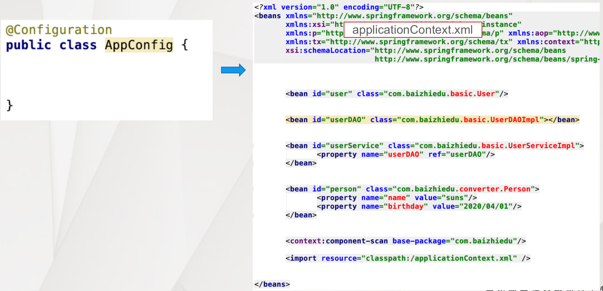

2. AnnotationConfigApplicationContext

   ~~~markdown
   1. 创建工厂代码   ApplicationContext ctx = new AnnotationConfigApplicationContext();2. 指定配置文件    1. 指定配置bean的Class       ApplicationContext ctx = new AnnotationConfigApplicationContext(AppConfig.class);   2. 指定配置bean所在的路径        ApplicationContext ctx = new AnnotationConfigApplicationContext("com.baizhiedu");
   ~~~

- 配置Bean开发的细节分析

  - 基于注解开发使用日志

    ~~~markdown
    不能集成Log4j集成logback 
    ~~~

    - 引入相关jar

      ~~~xml
       <dependency>      <groupId>org.slf4j</groupId>      <artifactId>slf4j-api</artifactId>      <version>1.7.25</version>    </dependency>    <dependency>      <groupId>org.slf4j</groupId>      <artifactId>jcl-over-slf4j</artifactId>      <version>1.7.25</version>    </dependency>    <dependency>      <groupId>ch.qos.logback</groupId>      <artifactId>logback-classic</artifactId>      <version>1.2.3</version>    </dependency>    <dependency>      <groupId>ch.qos.logback</groupId>      <artifactId>logback-core</artifactId>      <version>1.2.3</version>    </dependency>    <dependency>      <groupId>org.logback-extensions</groupId>      <artifactId>logback-ext-spring</artifactId>      <version>0.1.4</version>    </dependency>
      ~~~

    - 引入logback配置文件 (logback.xml)

      ~~~xml
      <?xml version="1.0" encoding="UTF-8"?><configuration>    <!-- 控制台输出 -->    <appender name="STDOUT" class="ch.qos.logback.core.ConsoleAppender">        <encoder>            <!--格式化输出：%d表示日期，%thread表示线程名，%-5level：级别从左显示5个字符宽度%msg：日志消息，%n是换行符-->            <pattern>%d{yyyy-MM-dd HH:mm:ss.SSS} [%thread] %-5level %logger{50} - %msg%n</pattern>        </encoder>    </appender>    <root level="DEBUG">        <appender-ref ref="STDOUT" />    </root></configuration>
      ~~~

  - @Configuration注解的本质

    ~~~markdown
    本质：也是@Component注解的衍生注解可以应用<context:component-scan进行扫描
    ~~~

##### 2. @Bean注解

~~~markdown
@Bean注解在配置bean中进行使用，等同于XML配置文件中的<bean标签
~~~

###### 1. @Bean注解的基本使用

- 对象的创建

  

  ~~~markdown
  1. 简单对象   直接能够通过new方式创建的对象    User  UserService   UserDAO 2. 复杂对象   不能通过new的方式直接创建的对象   Connection SqlSessionFactory
  ~~~

  - @Bean注解创建复杂对象的注意事项

    ~~~java
    遗留系统整合 @Beanpublic Connection conn1() {  Connection conn = null;  try {    ConnectionFactoryBean factoryBean = new ConnectionFactoryBean();    conn = factoryBean.getObject();  } catch (Exception e) {    e.printStackTrace();  }  return conn;}
    ~~~

- 自定义id值

  ~~~markdown
  @Bean("id")
  ~~~

- 控制对象创建次数

  ~~~java
  @Bean@Scope("singleton|prototype") 默认值 singleton
  ~~~

###### 2. @Bean注解的注入

- 用户自定义类型

  ~~~java
  @Beanpublic UserDAO userDAO() {  return new UserDAOImpl();}@Beanpublic UserService userService(UserDAO userDAO) {  UserServiceImpl userService = new UserServiceImpl();  userService.setUserDAO(userDAO);  return userService;}//简化写法@Beanpublic UserService userService() {  UserServiceImpl userService = new UserServiceImpl();  userService.setUserDAO(userDAO());  return userService;}
  ~~~

- JDK类型的注入

  ~~~java
  @Beanpublic Customer customer() {  Customer customer = new Customer();  customer.setId(1);  customer.setName("xiaohei");  return customer;}
  ~~~

  - JDK类型注入的细节分析

    ~~~java
    如果直接在代码中进行set方法的调用，会存在耦合的问题 @Configuration@PropertySource("classpath:/init.properties")public class AppConfig1 {    @Value("${id}")    private Integer id;    @Value("${name}")    private String name;     @Bean    public Customer customer() {        Customer customer = new Customer();        customer.setId(id);        customer.setName(name);        return customer;    }}
    ~~~

##### 3. @ComponentScan注解

~~~markdown
@ComponentScan注解在配置bean中进行使用，等同于XML配置文件中的<context:component-scan>标签目的：进行相关注解的扫描 （@Component @Value ...@Autowired)
~~~

###### 1. 基本使用

~~~java
@Configuration@ComponentScan(basePackages = "com.baizhiedu.scan")public class AppConfig2 {}<context:component-scan base-package=""/>
~~~

###### 2. 排除、包含的使用

- 排除

  ~~~xml
  <context:component-scan base-package="com.baizhiedu">  <context:exclude-filter type="assignable" expression="com.baizhiedu.bean.User"/></context:component-scan>@ComponentScan(basePackages = "com.baizhiedu.scan",               excludeFilters = {@ComponentScan.Filter(type= FilterType.ANNOTATION,value={Service.class}),                                 @ComponentScan.Filter(type= FilterType.ASPECTJ,pattern = "*..User1")})type = FilterType.ANNOTATION          value                 .ASSIGNABLE_TYPE     value                 .ASPECTJ             pattern                    .REGEX               pattern                 .CUSTOM              value
  ~~~

- 包含

  ~~~xml
  <context:component-scan base-package="com.baizhiedu" use-default-filters="false">   <context:include-filter type="" expression=""/></context:component-scan>@ComponentScan(basePackages = "com.baizhiedu.scan",               useDefaultFilters = false,               includeFilters = {@ComponentScan.Filter(type= FilterType.ANNOTATION,value={Service.class})})type = FilterType.ANNOTATION          value                 .ASSIGNABLE_TYPE     value                 .ASPECTJ             pattern                    .REGEX               pattern                 .CUSTOM              value
  ~~~

##### 4. Spring工厂创建对象的多种配置方式  

###### 1. 多种配置方式的应用场景


###### 2. 配置优先级

~~~markdown
@Component及其衍生注解 < @Bean < 配置文件bean标签优先级高的配置 覆盖优先级低配置 @Componentpublic class User{}@Beanpublic User user(){  return new User();}<bean id="user" class="xxx.User"/>配置覆盖：id值 保持一致
~~~

- 解决基于注解进行配置的耦合问题

  ~~~java
  @Configuration//@ImportResource("applicationContext.xml")public class AppConfig4 {    @Bean    public UserDAO userDAO() {        return new UserDAOImpl();    }}@Configuration@ImportResource("applicationContext.xml")public class AppConfig5{  }applicationContext.xml<bean id="userDAO" class="com.baizhiedu.injection.UserDAOImplNew"/>
  ~~~

##### 5. 整合多个配置信息

- 为什么会有多个配置信息

~~~markdown
拆分多个配置bean的开发，是一种模块化开发的形式，也体现了面向对象各司其职的设计思想
~~~

- 多配置信息整合的方式
  - 多个配置Bean的整合
  - 配置Bean与@Component相关注解的整合
  - 配置Bean与SpringXML配置文件的整合
- 整合多种配置需要关注那些要点
  - 如何使多配置的信息 汇总成一个整体
  - 如何实现跨配置的注入

###### 1. 多个配置Bean的整合

- 多配置的信息汇总

  - base-package进行多个配置Bean的整合

    

  - @Import

    ~~~markdown
    1. 可以创建对象2. 多配置bean的整合
    ~~~

    

  - 在工厂创建时，指定多个配置Bean的Class对象 【了解】

    ~~~java
    ApplicationContext ctx = new AnnotationConfigApplicationContext(AppConfig1.class,AppConfig2.class);
    ~~~

- 跨配置进行注入

  ~~~java
  在应用配置Bean的过程中，不管使用哪种方式进行配置信息的汇总，其操作方式都是通过成员变量加入@Autowired注解完成。@Configuration@Import(AppConfig2.class)public class AppConfig1 {    @Autowired    private UserDAO userDAO;    @Bean    public UserService userService() {        UserServiceImpl userService = new UserServiceImpl();        userService.setUserDAO(userDAO);        return userService;    }}@Configurationpublic class AppConfig2 {    @Bean    public UserDAO userDAO() {        return new UserDAOImpl();    }}
  ~~~

###### 2. 配置Bean与@Component相关注解的整合

~~~java
@Component(@Repository)public class UserDAOImpl implements UserDAO{  }@Configuration@ComponentScan("")public class AppConfig3 {       @Autowired    private UserDAO userDAO;    @Bean    public UserService userService() {        UserServiceImpl userService = new UserServiceImpl();        userService.setUserDAO(userDAO);        return userService;    }}ApplicationContext ctx = new AnnotationConfigApplicationContext(AppConfig3.class);
~~~

###### 3. 配置Bean与配置文件整合

~~~java
1. 遗留系统的整合 2. 配置覆盖  public class UserDAOImpl implements UserDAO{  }<bean id="userDAO" class="com.baizhiedu.injection.UserDAOImpl"/>@Configuration@ImportResource("applicationContext.xml")public class AppConfig4 {      @Autowired    private UserDAO userDAO;    @Bean    public UserService userService() {        UserServiceImpl userService = new UserServiceImpl();        userService.setUserDAO(userDAO);        return userService;    }}ApplicationContext ctx = new AnnotationConfigApplicationContext(AppConfig4.class);
~~~

##### 6. 配置Bean底层实现原理

```markdown
Spring在配置Bean中加入了@Configuration注解后，底层就会通过Cglib的代理方式，来进行对象相关的配置、处理
```


##### 7. 四维一体的开发思想

###### 1. 什么是四维一体

~~~markdown
Spring开发一个功能的4种形式，虽然开发方式不同，但是最终效果是一样的。1. 基于schema2. 基于特定功能注解3. 基于原始<bean4. 基于@Bean注解
~~~

###### 2. 四维一体的开发案例 

~~~java
1. <context:property-placehoder2. @PropertySource  【推荐】3. <bean id="" class="PropertySourcePlaceholderConfigure"/>4. @Bean            【推荐】
~~~

##### 8. 纯注解版AOP编程

###### 1. 搭建环境

~~~markdown
1. 应用配置Bean 2. 注解扫描
~~~

###### 2. 开发步骤

~~~java
1. 原始对象   @Service(@Component)   public class UserServiceImpl implements UserService{        }2. 创建切面类 （额外功能 切入点 组装切面）    @Aspect    @Component    public class MyAspect {        @Around("execution(* login(..))")        public Object arround(ProceedingJoinPoint joinPoint) throws Throwable {            System.out.println("----aspect log ------");            Object ret = joinPoint.proceed();            return ret;        }    }3. Spring的配置文件中   <aop:aspectj-autoproxy />   @EnableAspectjAutoProxy ---> 配置Bean 
~~~

###### 3. 注解AOP细节分析

~~~java
1. 代理创建方式的切换 JDK Cglib    <aop:aspectj-autoproxy proxy-target-class=true|false />   @EnableAspectjAutoProxy(proxyTargetClass)2. SpringBoot AOP的开发方式     @EnableAspectjAutoProxy 已经设置好了          1. 原始对象     @Service(@Component)     public class UserServiceImpl implements UserService{     }    2. 创建切面类 （额外功能 切入点 组装切面）      @Aspect      @Component      public class MyAspect {        @Around("execution(* login(..))")        public Object arround(ProceedingJoinPoint joinPoint) throws Throwable {          System.out.println("----aspect log ------");          Object ret = joinPoint.proceed();          return ret;        }      }    Spring AOP 代理默认实现 JDK  SpringBOOT AOP 代理默认实现 Cglib 
~~~

##### 9. 纯注解版Spring+MyBatis整合

- 基础配置 （配置Bean）

  ~~~xml
  1. 连接池  <!--连接池-->  <bean id="dataSource" class="com.alibaba.druid.pool.DruidDataSource">    <property name="driverClassName" value="com.mysql.jdbc.Driver"></property>    <property name="url" value="jdbc:mysql://localhost:3306/suns?useSSL=false"></property>    <property name="username" value="root"></property>    <property name="password" value="123456"></property>  </bean>      @Bean   public DataSource dataSource(){      DruidDataSource dataSource = new DruidDataSource();      dataSource.setDriverClassName("");      dataSource.setUrl();      ...      return dataSource;   }2. SqlSessionFactoryBean    <!--创建SqlSessionFactory SqlSessionFactoryBean-->    <bean id="sqlSessionFactoryBean" class="org.mybatis.spring.SqlSessionFactoryBean">      <property name="dataSource" ref="dataSource"></property>      <property name="typeAliasesPackage" value="com.baizhiedu.entity"></property>      <property name="mapperLocations">        <list>          <value>classpath:com.baizhiedu.mapper/*Mapper.xml</value>        </list>      </property>    </bean>    @Bean    public SqlSessionFactoryBean sqlSessionFactoryBean(DataSource dataSource){         SqlSessionFactoryBean sqlSessionFactoryBean = new SqlSessionFactoryBean();         sqlSessionFactoryBean.setDataSource(dataSource);         sqlSessionFactoryBean.setTypeAliasesPackage("");         ...         return sqlSessionFactoryBean;    }3. MapperScannerConfigure    <!--创建DAO对象 MapperScannerConfigure-->  <bean id="scanner" class="org.mybatis.spring.mapper.MapperScannerConfigurer">    <property name="sqlSessionFactoryBeanName" value="sqlSessionFactoryBean"></property>    <property name="basePackage" value="com.baizhiedu.dao"></property>  </bean>    @MapperScan(basePackages={"com.baizhiedu.dao"}) ---> 配置bean完成  
  ~~~

- 编码

  ~~~markdown
  1. 实体2. 表3. DAO接口4. Mapper文件 
  ~~~

  ###### 1. MapperLocations编码时通配的写法

  ~~~java
  //设置Mapper文件的路径sqlSessionFactoryBean.setMapperLocations(Resource..);Resource resouce = new ClassPathResouce("UserDAOMapper.xml")  sqlSessionFactoryBean.setMapperLocations(new ClassPathResource("UserDAOMapper.xml"));<property name="mapperLocations">   <list>     <value>classpath:com.baizhiedu.mapper/*Mapper.xml</value>   </list></property>一组Mapper文件 ResourcePatternResolver resolver = new PathMatchingResourcePatternResolver();Resource[] resources = resolver.getResources("com.baizhi.mapper/*Mapper.xml");sqlSessionFactoryBean.setMapperLocations(resources)
  ~~~

  ###### 2. 配置Bean数据耦合的问题

  ~~~java
  mybatis.driverClassName = com.mysql.jdbc.Drivermybatis.url = jdbc:mysql://localhost:3306/suns?useSSL=falsemybatis.username = rootmybatis.password = 123456mybatis.typeAliasesPackages = com.baizhiedu.mybatismybatis.mapperLocations = com.baizhiedu.mapper/*Mapper.xml@Component@PropertySource("classpath:mybatis.properties")public class MybatisProperties {    @Value("${mybatis.driverClassName}")    private String driverClassName;    @Value("${mybatis.url}")    private String url;    @Value("${mybatis.username}")    private String username;    @Value("${mybatis.password}")    private String password;    @Value("${mybatis.typeAliasesPackages}")    private String typeAliasesPackages;    @Value("${mybatis.mapperLocations}")    private String mapperLocations;}public class MyBatisAutoConfiguration {    @Autowired    private MybatisProperties mybatisProperties;    @Bean    public DataSource dataSource() {        DruidDataSource dataSource = new DruidDataSource();        dataSource.setDriverClassName(mybatisProperties.getDriverClassName());        dataSource.setUrl(mybatisProperties.getUrl());        dataSource.setUsername(mybatisProperties.getUsername());        dataSource.setPassword(mybatisProperties.getPassword());        return dataSource;    }    @Bean    public SqlSessionFactoryBean sqlSessionFactoryBean(DataSource dataSource) {        SqlSessionFactoryBean sqlSessionFactoryBean = new SqlSessionFactoryBean();        sqlSessionFactoryBean.setDataSource(dataSource);        sqlSessionFactoryBean.setTypeAliasesPackage(mybatisProperties.getTypeAliasesPackages());        //sqlSessionFactoryBean.setMapperLocations(new ClassPathResource("UserDAOMapper.xml"));        try {            ResourcePatternResolver resolver = new PathMatchingResourcePatternResolver();            Resource[] resources = resolver.getResources(mybatisProperties.getMapperLocations());            sqlSessionFactoryBean.setMapperLocations(resources);        } catch (IOException e) {            e.printStackTrace();        }        return sqlSessionFactoryBean;    }}
  ~~~

##### 10. 纯注解版事务编程

~~~xml
1. 原始对象 XXXService   <bean id="userService" class="com.baizhiedu.service.UserServiceImpl">     <property name="userDAO" ref="userDAO"/>   </bean>   @Service   public class UserServiceImpl implements UserService{         @Autowired         private UserDAO userDAO;   }2. 额外功能   <!--DataSourceTransactionManager-->    <bean id="dataSourceTransactionManager" class="org.springframework.jdbc.datasource.DataSourceTransactionManager">      <property name="dataSource" ref="dataSource"/>    </bean>        @Bean    public DataSourceTransactionManager dataSourceTransactionManager(DataSource dataSource){          DataSourceTransactionManager dstm = new DataSourceTransactionManager();          dstm.setDataSource(dataSource);          return dstm     }3. 事务属性    @Transactional    @Service    public class UserServiceImpl implements UserService {        @Autowired        private UserDAO userDAO;4. 基于Schema的事务配置    <tx:annotation-driven transaction-manager="dataSourceTransactionManager"/>   @EnableTransactionManager ---> 配置Bean
~~~

~~~markdown
1. ApplicationContext ctx = new AnnotationConfigApplicationContext("com.baizhiedu.mybatis");   SpringBoot 实现思想2. 注解版MVC整合，SpringMVC中进行详细讲解   SpringMyBatis --->DAO  事务基于注解 --> Service   Controller    org.springframework.web.context.ContextLoaderListener ---> XML工厂 无法提供 new AnnotationConfigApplicationContext
~~~

##### 11. Spring框架中YML的使用

###### 1. 什么是YML 

~~~markdown
YML(YAML)是一种新形式的配置文件，比XML更简单，比Properties更强大。YAML is a nice human-readable format for configuration, and it has some useful hierarchical properties. It's more or less a superset of JSON, so it has a lot of similar features.
~~~

###### 2. Properties进行配置问题  

~~~markdown
1. Properties表达过于繁琐,无法表达数据的内在联系. 2. Properties无法表达对象 集合类型
~~~

###### 3. YML语法简介

~~~yaml
1. 定义yml文件    xxx.yml xxx.yaml2. 语法   1. 基本语法      name: suns      password: 123456   2. 对象概念       account:          id: 1         password: 123456   3. 定义集合       service:          - 11111         - 22222
~~~

###### 4. Spring与YML集成思路的分析 

~~~markdown
1. 准备yml配置文件    init.yml   name: suns   password: 1234562. 读取yml 转换成 Properties   YamlPropertiesFactoryBean.setResources( yml配置文件的路径 ) new ClassPathResource();   YamlPropertiesFactoryBean.getObject() ---> Properties 3. 应用PropertySourcesPlaceholderConfigurer   PropertySourcesPlaceholderConfigurer.setProperties();4. 类中 @Value注解 注入 
~~~

###### 5. Spring与YML集成编码

- 环境搭建

  ~~~xml
  <dependency>  <groupId>org.yaml</groupId>  <artifactId>snakeyaml</artifactId>  <version>1.23</version></dependency>最低版本 1.18 
  ~~~

- 编码

  ~~~java
  1. 准备yml配置文件2. 配置Bean中操作 完成YAML读取 与 PropertySourcePlaceholderConfigure的创建     @Bean    public PropertySourcesPlaceholderConfigurer configurer() {        YamlPropertiesFactoryBean yamlPropertiesFactoryBean = new YamlPropertiesFactoryBean();        yamlPropertiesFactoryBean.setResources(new ClassPathResource("init.yml"));        Properties properties = yamlPropertiesFactoryBean.getObject();        PropertySourcesPlaceholderConfigurer configurer = new PropertySourcesPlaceholderConfigurer();        configurer.setProperties(properties);        return configurer;    }3. 类 加入 @Value注解 
  ~~~

###### 6. Spring与YML集成的问题

```markdown
1. 集合处理的问题   SpringEL表达式解决   @Value("#{'${list}'.split(',')}")2. 对象类型的YAML进行配置时 过于繁琐    @Value("${account.name}")   SpringBoot  @ConfigurationProperties
```


 

 

 

 

 

 

 

 

 


​      


##### 


​    


