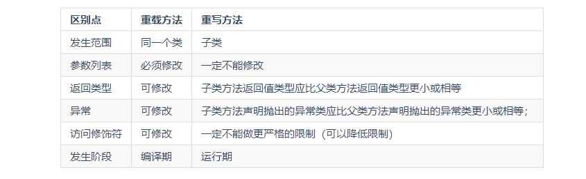
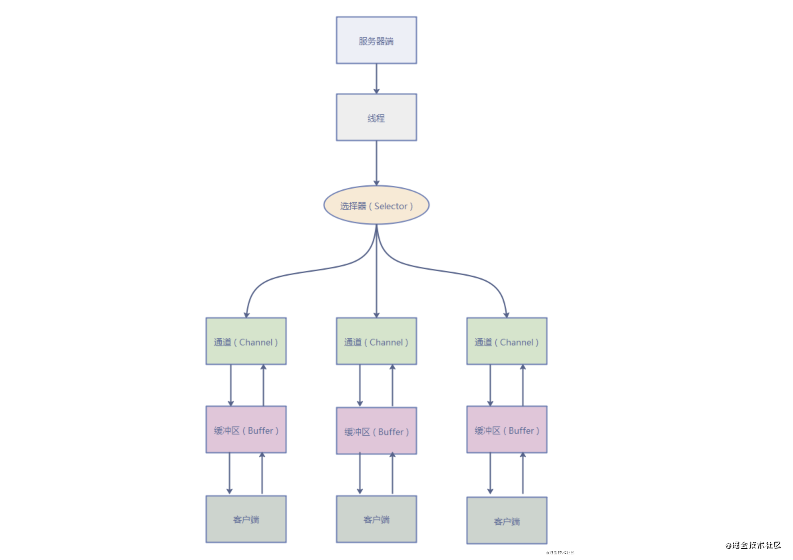

[TOC]


# [**:house:**](../../README.html)

# 一、java语法
## 字符型常量和字符串常量的区别

1. 形式上：字符串常量是单引号引用的一个字符；字符串常量是双引号引起的0个或者若干个字符。
2. 含义上：字符串常量相当于一个整型值（ASCII值），可以参加表达式运算，字符串常量代表一个地址值。
3. 占内存大小:字符常量只占2个字符，字符串常量占若干个字符。


## 标识符和关键字
- 标识符：编程时需要大量的为程序，类，变量，方法等取名字，于是就有了标识符。
- 关键字：关键字是被赋予特殊含义的标识符。
## continue,break和return的区别
1. 提前终止循环
- continue:跳出当前的一次循环，继续下次循环；
- break:跳出循环体，继续执行循环之后的语句。
2. 跳出当前方法，结束该方法的运行
- return；没有返回值函数的方法
- return value:有返回值函数的方法

## ==和equals的区别
1. == 判断两个对象的地址是否相同（基于数据类型比较的是值，引用数据类型比较的是内存地址）。
>因为java只有值传递，所以对于==说，无论是比较基本数据类型还是引用数据类型的变量，其本质都是值，只是引用类型变量存的值是对象的地址。
2. equals()方法存在两种使用情况：
- 情况1:类没有覆盖equals()方法，等价于==
- 情况2：类覆盖了equals()方法，若内容相等，就返回true.
## hashCode()与equals()
>- hashCode的作用是获取哈希码，这个哈希码的作用是确定该对象在哈希表中的索引位置。
>- 当把一个对象加入hashset时，hashset会先计算对象的hashcode并与其他已经加入的对象的hashcode值做比较，如果没有相符的，就假设对象没有重复出现，如果有，就会调用equal()来确定两个对象是否真的相等。
>- hashCode()的默认行为是对堆上的对象产生独特值。如果没有重写 hashCode()，则该 class 的两个对象无论如何都不会相等（即使这两个对象指向相同的数据）

**为什么重写equals时必须重写hashcode方法？**

为了保证当两个对象通过equal()方法比较相等时，那么他们的hashcode值也一定要保持相等。如果不重写hashcode则会出现两个对象equal()相等，但是hashcode不相等的情况。

# 二、基本数据类型
## java的几种数据类型
- 6种数字类型：byte(8),short(16),int(32),float(32),long(64),double(64)
- 1种字符类型：char(16)
- 1种布尔类型：boolean

- 这八种基本类型都有对应的包装类分别为：Byte、Short、Integer、Float、Long、Double、Character、Boolean
## 自动装箱和拆箱
- 装箱：将基本类型用他们的引用类型包装起来；
- 拆箱：将包装类型转化为基本数据类型

# 三、方法
## java只有值传递
>https://snailclimb.gitee.io/javaguide/#/docs/java/basis/Java%E5%9F%BA%E7%A1%80%E7%9F%A5%E8%AF%86?id=_142-%e4%b8%ba%e4%bb%80%e4%b9%88-java-%e4%b8%ad%e5%8f%aa%e6%9c%89%e5%80%bc%e4%bc%a0%e9%80%92%ef%bc%9f
- 一个方法不能修改一个基本数据类型的参数。
- 一个方法可以改变一个对象参数的状态。
- 一个方法不能让对象参数引用一个新的对象。
## 深拷贝与浅拷贝
- **浅拷贝：对于基本数据类型进行值传递，对引用数据类型进行引用传递般的拷贝。** 基本数据类型时值传递，所以修改值后不会影响另外一个对象的该属性值，引用数据类型时地址传递，所以修改后另一个对象的该属性值会被同步修改。
- **深拷贝**: **对基本数据类型进行值传递，对于引用数据类型，创建一个新的对象，并复制其内容。**

## 重载与重写
- **重载:** 一个类的方法拥有两个相同的名字，但是有不同的参数列表。
- **重写：** 是子类对父类允许访问的方法的实现过程进行重写编写，形参都不能改变。如果方法的返回类型是void和基本数据类型，则返回值重写时不可修改。但是如果方法的返回值是引用类型，重写时是可以返回该引用类型的子类的。
- **构造器不能被重写，但是可以重载。**



# 四、java面向对象
>https://www.runoob.com/java/java-interfaces.html
## 面向对象与面向过程
**面向过程（步骤化）**

- 面向过程就是分析出实现需求所需要的步骤，通过函数（方法）一步一步实现这些步骤，接着依次调用即可.
- 优点：性能上优于面向对象，因为类在调用的过程中需要实例化，开销过大。
- 缺点：不易维护，复用和扩展。
- 应用：单片机，嵌入式开发等对性能要求较高的地方。

**面向对象(行为化)**

- 面向对象是把整个需求按照特点功能划分，然后把这些存在共性的部分封装成类（类实例化之后才是对象），创建对象不是为了完成某一个步骤，而是描述某个事物在解决问题步骤中的行为。
- 优点： 由于面向对象具有封装，继承多态等特性，可以使系统更加灵活，更容易维护。
- 缺点：一般来说性能比面向过程低。


>面向对象的三大特征：封装，继承，多态。
## 继承
>继承的关键字
>- **extends:** 只能继承一个类
>- **implements:** 可以变相的使java具有多继承的特性，使用范围为类继承接口的情况，可以同时继承多个接口，接口之间采用逗号分割。
>- **final：** 把类定义成不能继承的，也就是最终类。
- **子类拥有父类非private的属性，方法；**
- **子类可以对父类进行扩展，拥有自己的属性和方法。**
- **重写：** 子类可以用自己的方式实现父类的方法。(重写)
- **继承方式：** java支持单继承，多重继承和不同类继承同一个类，但是不能多继承。
- **构造器：** 子类是不能继承父类的构造器（构造方法或者构造函数）的，它只是调用（显式或者隐式），如果父类的构造器带有参数，则必须在子类的构造器中显式地通过 super 关键字调用父类的构造器并配以适当的参数列表。
- **优缺点：** 继承提高了类之间的耦合性，缺点是代码的独立性差。

## 多态

- **多态性是指允许不同的对象对同一消息作出的不同响应。**

- **多态存在的三个必要条件**继承，重写，父类引用指向子类对象。
- **多态的实现方式:** 重写，接口，抽象类和抽象方法
- 如果子类重写了父类的方法，真正执行的是子类覆盖的方法，如果子类没有覆盖父类的方法，执行的是父类的方法。
- 优点：可以使程序有良好的扩展，并可以对所有类的对象进行通用处理。

## 封装
1. 修改属性的可见性来限制对属性的访问(一般为private).
2. 对每个值属性提供对外的公共方法访问，也就是创建一对赋值取值方法，对于私有属性访问。

## 抽象类与抽象方法
**抽象类**

- 抽象类除了**不能实例化对象**之外，类的其他功能依然存在，成员变量，成员方法和构造方法的访问模式和普通类一样。
- 由于抽象类不能实例化对象，所以抽象类**必须被继承才能使用**。
- 在java中抽象类表示的是一种继承关系，**一个类只能继承一个抽象类，** 而一个类可以实现多个接口。
- **抽象类的子类必须给出抽象类中的抽象方法的具体实现，除非该子类也是抽象类。** 
- 抽象类不一定包含抽象方法，但是有抽象方法的类一定是抽象类。

**抽象方法**

- 抽象方法只包含一个方法名，但是没有方法体。
- 使用abstract来声明抽象方法。
- 构造方法，类方法(用static修饰的方法)不能声明为抽象方法。

## 抽象类与接口的区别
- **方法**：抽象类中的方法可以有方法体，接口中的所有方法都是抽象的，也就是没有方法体。
- **成员变量**：抽象类中的成员变量可以是各种类型的，而接口中的成员变量只能是public,static,final类型的。
- **继承**：一个类只能继承一个抽象类，而一个类却可以实现多个接口。
- **静态方法**：接口中不能含有静态代码块以及静态方法，而抽象类是可以的。
>  注：JDK 1.8 以后，接口里可以有静态方法和方法体了。
>
>  - 成员区别:
>    - 抽象类： 变量，常量，有构造方法，有抽象方法，也有非抽象方法
>    - 接口： 常量，抽象方法
>
>  - 关系区别；
>    - 类与类： 继承，单继承
>    - 类与接口:实现，可以单实现，也可以多实现
>    - 接口与接口：继承，单继承，多继承
>  - 设计理念区别
>    - 抽象类：对类抽象，包括属性，行为
>    - 接口： 对行为抽象，主要是行为

## 接口与类的区别

- **方法**: 接口没有构造方法。接口中所有的方法必须是抽象方法。
- **成员变量**: 接口中不能包含成员变量，除了static和final变量。
- **继承**: 接口不是被类继承，而是被类实现，一个类可以实现多个接口。
- **对象：**接口不能实例化对象。


# 五、Java反射机制

## 反射机制介绍

**JAVA反射机制是在运行状态中，对于任意一个类，都能知道这个类的所有属性和方法，对于任意一个对象，都能调用它的任意一个方法和属性，这种动态获取信息以及动态调用对象的方法的功能称为java语言的反射机制。**

## 获取Class对象的四种方式

如果我们动态获取到这些信息，需要依靠Class对象，Class类对象将一个类的方法，变量等信息告诉运行的程序。java提供了四种方式获取Class对象。

1. 知道具体类的情况下可以使用:

   ```java
   Class alunbarClass = TargetObject.class;
   ```

   但是一般情况下不知道具体类，基本都是通过遍历包下面的类来获取Class对象，通过此方式获取Class对象不会进行初始化。

2. 通过`Class.forName()`传入类的路径获取。

   ```
   Class alunbarClass1 = Class.forName("cn.javaguide.TargetObject");
   ```

3. 通过对象实例`instance.getClass()`获取：

   ```java
   Employee e = new Employee();
   Class alunbarClass2 = e.getClass();
   ```

4. 通过类加载器`xxxClassLoader.loadClass()`传入类路径获取

   ```java
   class clazz = ClassLoader.LoadClass("cn.javaguide.TargetObject");
   ```

   通过类加载器获取Class对象不会进行初始化，意味着不进行包括初始化等一系列步骤，静态块和静态对象不会得到执行。

## 反射机制的优缺点

- 优点：运行期类型的判断，动态加载类，提高代码灵活度。
- 缺点：1.性能瓶颈：反射相当于一系列解释操作，通知JVM要做的事情，性能比直接的java代码要慢的多。2. 安全问题，让我们可以动态的改变类的属性也增加了类的安全隐患。

## 反射的应用场景

反射是框架设计的灵魂。

在平时的项目开发过程中，基本上很少会直接使用到反射机制，但是在实际中有很多设计，开发都与反射机制有关，例如模块化的开发，通过反射去调用对应的字节码，动态代理设计模式也采用了反射机制，还有日常中使用的Spring/Hibernate等框架也大量使用到了反射机制。

# 六、泛型

> 参考：https://mp.weixin.qq.com/s/xguhv0qRg2sZAW3mhMHX7w

## 泛型的定义

**把类型明确的工作推迟到创建对象或调用方法的时候才去明确的特殊的类型**

参数化类型:

- **把类型当作是参数一样传递**
- **`<数据类型>` 只能是引用类型**

相关术语：

- `ArrayList<E>`中的**E称为类型参数变量**
- `ArrayList<Integer>`中的**Integer称为实际类型参数**
- **整个称为`ArrayList<E>`泛型类型**
- **整个`ArrayList<Integer>`称为参数化的类型ParameterizedType**

## 泛型的作用

- 代码更加简洁【不用强制转换】
- 程序更加健壮【只要编译时期没有警告，那么运行时期就不会出现ClassCastException异常】
- 可读性和稳定性【在编写集合的时候，就限定了类型】

## 泛型类

**泛型类就是把泛型定义在类上，用户使用该类的时候，才把类型明确下来**….这样的话，用户明确了什么类型，该类就代表着什么类型…用户在使用的时候就不用担心强转的问题，运行时转换异常的问题了。

- **在类上定义的泛型，在类的方法中也可以使用！**

```java
/*
    1:把泛型定义在类上
    2:类型变量定义在类上,方法中也可以使用
 */
public class ObjectTool<T> {
    private T obj;

    public T getObj() {
        return obj;
    }

    public void setObj(T obj) {
        this.obj = obj;
    }
}

```

- **用户想要使用哪种类型，就在创建的时候指定类型。使用的时候，该类就会自动转换成用户想要使用的类型了。**

```java
 public static void main(String[] args) {
        //创建对象并指定元素类型
        ObjectTool<String> tool = new ObjectTool<>();

        tool.setObj(new String("钟福成"));
        String s = tool.getObj();
        System.out.println(s);

        //创建对象并指定元素类型
        ObjectTool<Integer> objectTool = new ObjectTool<>();
        /**
         * 如果我在这个对象里传入的是String类型的,它在编译时期就通过不了了.
         */
        objectTool.setObj(10);
        int i = objectTool.getObj();
        System.out.println(i);
    }
```

## 泛型方法

**泛型方法就是把泛型定义在方法上，用户使用该方法的时候，才把类型明确下来。**

- 定义泛型方法：**泛型是先定义后使用的**

```java
 //定义泛型方法..
    public <T> void show(T t) {
        System.out.println(t);

    }
```

- **用户传递进来的是什么类型，返回值就是什么类型了**

```java
public static void main(String[] args) {
        //创建对象
        ObjectTool tool = new ObjectTool();

        //调用方法,传入的参数是什么类型,返回值就是什么类型
        tool.show("hello");
        tool.show(12);
        tool.show(12.5);

    }
```

## 静态方法与泛型

静态方法有一种情况需要注意一下，那就是在类中的静态方法使用泛型：**静态方法无法访问类上定义的泛型；如果静态方法操作的引用数据类型不确定的时候，必须要将泛型定义在方法上。**

即：**如果静态方法要使用泛型的话，必须将静态方法也定义成泛型方法** 。

```java
public class StaticGenerator<T> {
    ....
    ....
    /**
     * 如果在类中定义使用泛型的静态方法，需要添加额外的泛型声明（将这个方法定义成泛型方法）
     * 即使静态方法要使用泛型类中已经声明过的泛型也不可以。
     * 如：public static void show(T t){..},此时编译器会提示错误信息：
          "StaticGenerator cannot be refrenced from static context"
     */
    public static <T> void show(T t){

    }
}
```

## 泛型类派生出的子类

**泛型类是拥有泛型这个特性的类，它本质上还是一个Java类，那么它就可以被继承**，分为两种情况：

- **子类明确泛型类的类型参数变量**

  - 泛型接口

  ```
  /*
      把泛型定义在接口上
   */
  public interface Inter<T> {
      public abstract void show(T t);
  
  }
  ```

  - 实现泛型接口的类

  ```java
  /**
   * 子类明确泛型类的类型参数变量:
   */
  
  public class InterImpl implements Inter<String> {
      @Override
      public void show(String s) {
          System.out.println(s);
  
      }
  }
  ```

- **子类不明确泛型类的类型参数变量**
  - 当子类不明确泛型类的类型参数变量时，**外界使用子类的时候，也需要传递类型参数变量进来，在实现类上需要定义出类型参数变量**
  
  ```java
  /**
   * 子类不明确泛型类的类型参数变量:
   *      实现类也要定义出<T>类型的
   *
   */
  public class InterImpl<T> implements Inter<T> {
  
      @Override
      public void show(T t) {
          System.out.println(t);
  
      }
  }
  ```
  
  ```java
  public static void main(String[] args) {
          //测试第一种情况
          //Inter<String> i = new InterImpl();
          //i.show("hello");
  
          //第二种情况测试
          Inter<String> ii = new InterImpl<>();
          ii.show("100");
  
      }
  ```
  
  - **实现类的如果重写父类的方法，返回值的类型是要和父类一样的！**
  - **类上声明的泛形只对非静态成员有效**。

## 类型通配符

现在有个需求：**方法接收一个集合参数，遍历集合并把集合元素打印出来，怎么办？**

- 按照我们没有学习泛型之前，我们可能会这样做：

```java
public void test(List list){


    for(int i=0;i<list.size();i++){

        System.out.println(list.get(i));

    }
}
```

上面的代码是正确的，**只不过在编译的时候会出现警告，说没有确定集合元素的类型**….这样是不优雅的…

- 使用泛型的方法：

```java
public void test(List<Object> list){


    for(int i=0;i<list.size();i++){

        System.out.println(list.get(i));

    }
}
```

**该test()方法只能遍历装载着Object的集合！！！****泛型中的`<Object>`并不是像以前那样有继承关系的，也就是说`List<Object>`和`List<String>`是毫无关系的！！！

- 类型通配符

  ```java
  public void test(List<?> list){
  
  
      for(int i=0;i<list.size();i++){
  
          System.out.println(list.get(i));
  
      }
  }
  ```

  **?号通配符表示可以匹配任意类型，任意的Java类都可以匹配**…..

  当我们使用?号通配符的时候：**就只能调对象与类型无关的方法，不能调用对象与类型有关的方法。**因为直到外界使用才知道具体的类型是什么。也就是说，在上面的List集合，我是不能使用add()方法的。**因为add()方法是把对象丢进集合中，而现在我是不知道对象的类型是什么。**

- ==**设定通配符上限**==

  现在，我想接收一个List集合，它只能操作数字类型的元素【Float、Integer、Double、Byte等数字类型都行】，怎么做？？？

  我们学习了通配符，但是如果直接使用通配符的话，该集合就不是只能操作数字了。因此我们需要**用到设定通配符上限**

  ```java
    List<? extends Number>
  ```

  上面的代码表示的是：**List集合装载的元素只能是Number的子类或自身**

  ```java
  public static void main(String[] args) {
  
  
          //List集合装载的是Integer，可以调用该方法
          List<Integer> integer = new ArrayList<>();
          test(integer);
  
          //List集合装载的是String，在编译时期就报错了
          List<String> strings = new ArrayList<>();
          test(strings);
  
      }
  
  
      public static void test(List<? extends Number> list) {
  
      }
  ```

- **==设定通配符下限==**

  ```java
    //传递进来的只能是Type或Type的父类
      <? super Type>
  ```

  TreeSet集合中设定通配符下限

  ```java
    public TreeSet(Comparator<? super E> comparator) {
          this(new TreeMap<>(comparator));
      }
  ```

  ## 通配符与泛型

  **大多时候，我们都可以使用泛型方法来代替通配符的**…..

  ```java
  //使用通配符
      public static void test(List<?> list) {
  
      }
  
      //使用泛型方法
      public <T> void  test2(List<T> t) {
  
      }
  ```

  **二者选择的原则**

  - 如果**参数之间的类型有依赖关系**，或者返**回值是与参数之间有依赖关系**的。那么就使用**泛型方法**
  - 如果**没有依赖关系**的，就使用**通配符**，通配符会**灵活一些.**

## 泛型擦除

泛型是**提供给javac编译器使用的**，它用于限定集合的输入类型，让编译器在源代码级别上，即挡住向集合中插入非法数据。但编译器编译完带有泛形的java程序后，**生成的class文件中将不再带有泛形信息**，以此使程序运行效率不受到影响，这个过程称之为“擦除”。

> 泛型是 Java 1.5 版本才引进的概念，在这之前是没有泛型的概念的，但显然，泛型代码能够很好地和之前版本的代码很好地兼容。这是因为，**泛型信息只存在于代码编译阶段，在进入 JVM 之前，与泛型相关的信息会被擦除掉，专业术语叫做类型擦除**。

```java
List<String> l1 = new ArrayList<String>();
List<Integer> l2 = new ArrayList<Integer>();
		
System.out.println(l1.getClass() == l2.getClass());

```

- 打印的结果为 true 是因为 `List<String>`和 `List<Integer>`在 jvm 中的 Class 都是 List.class。泛型信息被擦除了。

# 七、Lambda表达式

1. 格式

- 格式： (形式参数) -> {代码块}
- 形式参数：如果有多个参数，参数之间用逗号隔开，如果没有参数，留空即可
- ->：由英文中画线和大于符号组成，固定写法，代表指向动作
- 代码块：是具体要做的事情，也就是方法体内容

```java
//匿名内部类中重写run()方法
new Thread(new Runnalbe(){
    
    @Override
    public void run(){
        
        System.out.println("多线程启动了")
    }
}).start;
//使用Lambda表达式
new Thread(() -> {
    
        System.out.println("多线程启动了")
    
}).start;

```

2. **使用前提**

- 有一个接口
- 接口中有且仅有一个抽象方法

3. **省略规则**

- 参数类型可以省略，但是有多个参数的情况下，不能只省略一个
- 如果参数有且仅有一个，那么小括号可以省略
- 如果代码块的语句只有一条，可以省略大括号和分号，甚至是return

4. **注意事项**

- 使用lambda必须要有接口，并且要求接口中有且仅有一个抽象方法
- 必须有上下文环境，才能推导出Lambda对应的接口
  - 根据局部变量赋值得知lambda对应的接口：Runnable r = ()->System.out.println("Lambda表达式")；
  - 根据调用方法的参数得知lambda对应的接口：new Thread(()->System.out.println("Lambda表达式").start();

5. **匿名内部类和Lambda的区别**

- 所需类型不同
  - 匿名内部类：可以是接口，也可以是抽象类，还可以是具体了类
  - Lambda表达式：只能是接口
- 使用限制不同
  - Lambda表达式只能用于接口中有且仅有一个抽象方法
  - 匿名内部类可以用于接口中有多个抽象方法
- 实现原理不同
  - 匿名内部类：编译之后，产生一个单独的.class字节码文件
  - Lambda表达式：编译之后，没有一个单独的.class字节码文件，对应的字节码会在运行的时候动态生成

# 八、异常


## 分类

在 Java 中，所有的异常都有一个共同的祖先 `java.lang` 包中的 `Throwable` 类。`Throwable` 类有两个重要的子类 `Exception`（异常）和 `Error`（错误）。`Exception` 能被程序本身处理(`try-catch`)， `Error` 是无法处理的(只能尽量避免)。

`Exception` 和 `Error` 二者都是 Java 异常处理的重要子类，各自都包含大量子类。

- **`Exception`** :程序本身可以处理的异常，可以通过 `catch` 来进行捕获。`Exception` 又可以分为 受检查异常(必须处理) 和 不受检查异常(可以不处理)。
- **`Error`** ：`Error` 属于程序无法处理的错误 ，我们没办法通过 `catch` 来进行捕获 。例如，Java 虚拟机运行错误（`Virtual MachineError`）、虚拟机内存不够错误(`OutOfMemoryError`)、类定义错误（`NoClassDefFoundError`）等 。这些异常发生时，Java 虚拟机（JVM）一般会选择线程终止。

**受检查异常**

Java 代码在编译过程中，如果受检查异常没有被 `catch`/`throw` 处理的话，就没办法通过编译 。比如下面这段 IO 操作的代码。

```java
class Example{

	public static void main(String args[]) throw IOException{
        
        FileInputStream fis = null;
        fis = new  FileInputStream(B:/"myfile.txt");
        int k;
        while((k = fis.read())!=-1){
            
            System.out.print((char)k);
            
        }
        fis.close();
    }
}
```

除了`RuntimeException`及其子类以外，其他的`Exception`类及其子类都属于受检查异常 。常见的受检查异常有： IO 相关的异常、`ClassNotFoundException` 、`SQLException`...。

**不受检查异常**

java 代码在编译过程中 ，我们即使不处理不受检查异常也可以正常通过编译。

`RuntimeException` 及其子类都统称为非受检查异常，例如：`NullPointerException`、`NumberFormatException`（字符串转换为数字）、`ArrayIndexOutOfBoundsException`（数组越界）、`ClassCastException`（类型转换错误）、`ArithmeticException`（算术错误）等。

## Throwable类常用方法

- **`public string getMessage()`**:返回异常发生时的简要描述
- **`public string toString()`**:返回异常发生时的详细信息
- **`public string getLocalizedMessage()`**:返回异常对象的本地化信息。使用 `Throwable` 的子类覆盖这个方法，可以生成本地化信息。如果子类没有覆盖该方法，则该方法返回的信息与 `getMessage（）`返回的结果相同
- **`public void printStackTrace()`**:在控制台上打印 `Throwable` 对象封装的异常信息

## 异常处理

>  https://www.cnblogs.com/Qian123/p/5715402.html#_label3

Java异常处理涉及到五个关键字，分别是：`try`、`catch`、`finally`、`throw`、`throws`。

1. **try-catch**

```java
try{
    //code that might generate exceptions    
}catch(Exception e){
    //the code of handling exception1
}catch(Exception e){
    //the code of handling exception2
}
```

2. **throw**

   到我们还可以用`throw`语句抛出明确的异常。`Throw`的语法形式如下：

   ```java
   throw ThrowableInstance;
   ```

   这里的ThrowableInstance一定是`Throwable`类类型或者`Throwable`子类类型的一个对象。简单的数据类型，例如`int`，`char`,以及非`Throwable`类，例如`String`或`Object`，不能用作异常。有两种方法可以获取`Throwable`对象：在`catch`子句中使用参数或者使用`new`操作符创建。

   下面的程序两次处理相同的错误，首先，`main()`方法设立了一个异常关系然后调用proc()。proc()方法设立了另一个异常处理关系并且立即抛出一个`NullPointerException`实例，`NullPointerException`在`main()`中被再次捕获。

   ```java
   class TestThrow{
       static void proc(){
           try{
               throw new NullPointerException("demo");
           }catch(NullPointerException e){
               System.out.println("Caught inside proc");
               throw e;
           }
       }
   
       public static void main(String [] args){
           try{
               proc();
           }catch(NullPointerException e){
               System.out.println("Recaught: "+e);
           }
       }
   }
   
   //结果
   //    D:\java>java TestThrow
   
   //	 Caught inside proc
   
   //	 Recaught: java.lang.NullPointerException: demo
   ```

   ```java
   throw new NullPointerException(`"demo"`);
   ```

此处`new`用来构造一个`NullPointerException`实例，所有的Java内置的运行时异常有两个构造方法：一个没有参数，一个带有一个字符串参数。当用第二种形式时，参数指定描述异常的字符串。如果对象用作`print()`或者`println()`的参数时，该字符串被显示。这同样可以通过调用getMessage()来实现，getMessage()是由`Throwable`定义的。

3. **throws**

```java
lass TestThrows{
    static void throw1() throws IllegalAccessException {
        System.out.println("Inside throw1 . ");
        throw new IllegalAccessException("demo");
    }
    public static void main(String[] args){
        try {
            throw1();
        }catch(IllegalAccessException e ){
            System.out.println("Caught " + e);
        }
    }
}
```

- 如果是不受检查异常（`unchecked exception`），即`Error`、`RuntimeException`或它们的子类，那么可以不使用`throws`关键字来声明要抛出的异常，编译仍能顺利通过，但在运行时会被系统抛出。
- 必须声明方法可抛出的任何检查异常（`checked exception`）。即如果一个方法可能出现受可查异常，要么用`try-catch`语句捕获，要么用`throws`子句声明将它抛出，否则会导致编译错误。
- 仅当抛出了异常，该方法的调用者才必须处理或者重新抛出该异常。当方法的调用者无力处理该异常的时候，应该继续抛出.
- 调用方法必须遵循任何可查异常的处理和声明规则。若覆盖一个方法，则不能声明与覆盖方法不同的异常。声明的任何异常必须是被覆盖方法所声明异常的同类或子类。

4. **try- catch-finally**

   - **`try`块：** 用于捕获异常。其后可接零个或多个 `catch` 块，如果没有 `catch` 块，则必须跟一个 `finally` 块。
   - **`catch`块：** 用于处理 try 捕获到的异常。
   - **`finally` 块：** 无论是否捕获或处理异常，`finally` 块里的语句都会被执行。当在 `try` 块或 `catch` 块中遇到 `return` 语句时，`finally` 语句块将在方法返回之前被执行。

   **在以下 3 种特殊情况下，`finally` 块不会被执行：**

   1. 在 `try` 或 `finally`块中用了 `System.exit(int)`退出程序。但是，如果 `System.exit(int)` 在异常语句之后，`finally` 还是会被执行
   2. 程序所在的线程死亡。
   3. 关闭 CPU。

   当 try 语句和 finally 语句中都有 return 语句时，在方法返回之前，finally 语句的内容将被执行，并且 finally 语句的返回值将会覆盖原始的返回值。如下：

```java
public class Test {
    public static int f(int value) {
        try {
            return value * value;
        } finally {
            if (value == 2) {
                return 0;
            }
        }
    }
}
```

如果调用 `f(2)`，返回值将是 0，因为 finally 语句的返回值覆盖了 try 语句块的返回值。

# 九、IO

## 序列化与反序列化

如果我们需要持久化 Java 对象比如将 Java 对象保存在文件中，或者在网络传输 Java 对象，这些场景都需要用到序列化。

简单来说：

- **序列化**： 将数据结构或对象转换成二进制字节流的过程
- **反序列化**：将在序列化过程中所生成的二进制字节流的过程转换成数据结构或者对象的过程

对于 Java 这种面向对象编程语言来说，我们序列化的都是对象（Object）也就是实例化后的类(Class)，但是在 C++这种半面向对象的语言中，struct(结构体)定义的是数据结构类型，而 class 对应的是对象类型。

- **序列化的主要目的是通过网络传输对象或者说是将对象存储到文件系统、数据库、内存中。**

**如果不想序列化，怎么办？**

```
对于不想进行序列化的变量，使用`transient`关键字修饰。
```

`transient` 关键字的作用是：阻止实例中那些用此关键字修饰的的变量序列化；当对象被反序列化时，被 `transient` 修饰的变量值不会被持久化和恢复。`transient` 只能修饰变量，不能修饰类和方法。

## IO定义

> 参考：https://www.cnblogs.com/sheng-jie/p/how-much-you-know-about-io-models.html

应用程序作为一个文件保存在磁盘中，只有加载到内存到成为一个进程才能运行。应用程序运行在计算机内存中，必然会涉及到数据交换，比如读写磁盘文件，访问数据库，调用远程API等等。但我们编写的程序并不能像操作系统内核一样直接进行I/O操作。

因为为了确保操作系统的安全稳定运行，操作系统启动后，将会开启保护模式：将内存分为内核空间（内核对应进程所在内存空间）和用户空间，进行内存隔离。我们构建的程序将运行在用户空间，用户空间无法操作内核空间，也就意味着用户空间的程序不能直接访问由内核管理的I/O，比如：硬盘、网卡等。

但操作系统向外提供API，其由各种类型的系统调用（System Call）组成，以提供安全的访问控制。所以应用程序要想访问内核管理的I/O，必须通过调用内核提供的系统调用(system call）进行间接访问。

所以I/O之于应用程序来说，强调的通过**向内核发起系统调用完成对I/O的间接访问**。换句话说应用程序发起的一次IO操作实际包含两个阶段：

1. **IO调用阶段：应用程序进程向内核发起系统调用**

2. **IO执行阶段：内核执行IO操作并返回**

   - 准备数据阶段：内核等待I/O设备准备好数据
   - 拷贝数据阶段：将数据从内核缓冲区拷贝到用户空间缓冲区

   > 怎么理解准备数据阶段呢？
   > 对于写请求：等待系统调用的完整请求数据，并写入内核缓冲区；
   > 对于读请求：等待系统调用的完整请求数据；（若请求数据不存在于内核缓冲区）则将外围设备的数据读入到内核缓冲区。

   

## AIO

异步 IO 是基于事件和回调机制实现的，也就是应用操作之后会直接返回，不会堵塞在那里，当后台处理完成，操作系统会通知相应的线程进行后续的操作。

## BIO

- 同步阻塞IO模型中，应用程序发起read调用后，会一直阻塞，直到在内核把数据拷到用户空间。

- 适合用于客户端连接数量不高的情况。

- 当用户进程发起IO系统调用后，内核从准备数据到拷贝数据到用户空间的两个阶段期间**用户调用线程选择阻塞等待**数据返回。

  因此BIO带来了一个问题：如果内核数据需要耗时很久才能准备好，那么用户进程将被阻塞，浪费性能。为了提升应用的性能，虽然可以通过多线程来提升性能，但线程的创建依然会借助系统调用，同时多线程会导致频繁的线程上下文的切换，同样会影响性能。所以要想解决BIO带来的问题，我们就得看到问题的本质，那就是**阻塞**二字。

## NIO

| IO     | NIO        |
| ------ | ---------- |
| 面向流 | 面向缓存区 |
| 阻塞IO | 非阻塞IO   |
|        | 选择器     |

可简单认为：**IO是面向流的处理，NIO是面向块(缓冲区)的处理**

- - 面向流的I/O 系统**一次一个字节地处理数据**。

- - 一个面向块(缓冲区)的I/O系统**以块的形式处理数据**。

NIO主要有**三个核心部分组成**：

- **buffer缓冲区**
- **Channel管道**
- **Selector选择器**


**通道与缓冲区**

Java NIO系统的核心在于：**通道(Channel)和缓冲区(Buffer)**。通道表示打开到 IO 设备(例如：文件、套接字)的连接。若需要使用 NIO 系统，需要获取用于连接 IO 设备的通道以及用于容纳数据的缓冲区。然后操作缓冲区，对数据进行处理

简而言之，**通道负责传输，缓冲区负责存储**

### **缓冲区(Buffer)**

**缓冲区类型**

Buffer 就像一个数组，可以保存多个相同类型的数据。根据数据类型不同(**boolean 除外**) ，有以下Buffer 常用子类

- ByteBuffer
- CharBuffer
- ShortBuffer
- IntBuffer
- LongBuffer
- FloatBuffer
- DoubleBuffer

**获取缓冲区**

通过**allocate方法**可以获取一个对应缓冲区的对象，它是缓冲区类的一个静态方法

```java
// 获取一个容量大小为1024字节的字节缓冲区
ByteBuffer byteBuffer = ByteBuffer.allocate(1024);
```

**核心属性**

```java
// Invariants: mark <= position <= limit <= capacity
private int mark = -1;
private int position = 0;
private int limit;
private int capacity;
```

- capacity：缓冲区的容量。通过构造函数赋予，一旦设置，无法更改
- limit：缓冲区的界限。位于limit 后的数据不可读写。缓冲区的限制不能为负，并且**不能大于其容量**
- position：**下一个**读写位置的索引（类似PC）。缓冲区的位置不能为负，并且**不能大于limit**
- mark：记录当前position的值。**position被改变后，可以通过调用reset() 方法恢复到mark的位置。**

以上四个属性必须满足以下要求  **mark <= position <= limit <= capacity**

**核心方法**

- **put()方法**
  - put()方法可以将一个数据放入到缓冲区中。
  - 进行该操作后，postition的值会+1，指向下一个可以放入的位置。capacity = limit ，为缓冲区容量的值。
- **flip()方法**
  - flip()方法会**切换对缓冲区的操作模式**，由写->读 / 读->写
  - 进行该操作后
    - 如果是写模式->读模式，position = 0 ， limit 指向最后一个元素的下一个位置，capacity不变
    - 如果是读->写，则恢复为put()方法中的值
- **get()方法**
  - get()方法会读取缓冲区中的一个值
  - 进行该操作后，position会+1，如果超过了limit则会抛出异常
- **rewind()方法**
  - 该方法**只能在读模式下使用**
  - rewind()方法后，会恢复position、limit和capacity的值，变为进行get()前的值
- **clean()方法**
  - clean()方法会将缓冲区中的各个属性恢复为最初的状态，position = 0, capacity = limit
  - **此时缓冲区的数据依然存在**，处于“被遗忘”状态，下次进行写操作时会覆盖这些数据
- **mark()和reset()方法**
  - mark()方法会将postion的值保存到mark属性中
  - reset()方法会将position的值改为mark中保存的值

**非直接缓冲区和直接缓冲区**

- **非直接缓冲区**

  通过**allocate()**方法获取的缓冲区都是非直接缓冲区。这些缓冲区是建立在JVM**堆内存**之中的。通过非直接缓冲区，想要将数据写入到物理磁盘中，或者是从物理磁盘读取数据。**都需要经过JVM和操作系统**，数据在两个地址空间中传输时，会**copy**一份保存在对方的空间中。所以费直接缓冲区的读取效率较低.

  ```java
  public static ByteBuffer allocate(int capacity) {
      if (capacity < 0)
      throw new IllegalArgumentException();
  
      // 在堆内存中开辟空间
      return new HeapByteBuffer(capacity, capacity);
  }
  
  HeapByteBuffer(int cap, int lim) {        // package-private
      // new byte[cap] 创建数组，在堆内存中开辟空间
      super(-1, 0, lim, cap, new byte[cap], 0);
      /*
      hb = new byte[cap];
      offset = 0;
      */
  }
  ```

- **直接缓冲区**

  **只有ByteBuffer可以获得直接缓冲区**，通过allocateDirect()获取的缓冲区为直接缓冲区，这些缓冲区是建立在**物理内存**之中的。

  直接缓冲区通过在操作系统和JVM之间创建**物理内存映射文件**加快缓冲区数据读/写入物理磁盘的速度。放到物理内存映射文件中的数据就不归应用程序控制了，操作系统会自动将物理内存映射文件中的数据写入到物理内存中.

  ```java
  public static ByteBuffer allocateDirect(int capacity) {
      return new DirectByteBuffer(capacity);
  }
  
  DirectByteBuffer(int cap) {                   // package-private
  	...
      // 申请物理内存
  	boolean pa = VM.isDirectMemoryPageAligned();
  	...
  }
  ```

### 通道(Channel)

Channel由java.nio.channels 包定义的。Channel 表示**IO 源与目标打开的连接**。Channel 类似于传统的“流”。只不过**Channel 本身不能直接访问数据，Channel 只能与Buffer 进行交互**.

> 应用程序进行读写操作调用函数时，**底层调用的操作系统提供给用户的读写API**，调用这些API时会生成对应的指令，CPU则会执行这些指令。在计算机刚出现的那段时间，**所有读写请求的指令都有CPU去执行**，过多的读写请求会导致CPU无法去执行其他命令，从而CPU的利用率降低.
>
> 后来，**DMA**(Direct Memory Access，直接存储器访问)出现了。当IO请求传到计算机底层时，**DMA会向CPU请求，让DMA去处理这些IO操作**，从而可以让CPU去执行其他指令。DMA处理IO操作时，会请求获取总线的使用权。**当IO请求过多时，会导致大量总线用于处理IO请求，从而降低效率**
>
> 于是便有了**Channel(通道)**，Channel相当于一个**专门用于IO操作的独立处理器**，它具有独立处理IO请求的能力，当有IO请求时，它会自行处理这些IO请求.

通道 Channel 是对原 I/O 包中的流的模拟，可以通过它读取和写入数据。

通道与流的不同之处在于，流只能在一个方向上移动(一个流必须是 InputStream 或者 OutputStream 的子类)，而通道是双向的，可以用于读、写或者同时用于读写。

通道包括以下类型：

- FileChannel：从文件中读写数据；
- DatagramChannel：通过 UDP 读写网络中数据；
- SocketChannel：通过 TCP 读写网络中数据；
- ServerSocketChannel：可以监听新进来的 TCP 连接，对每一个新进来的连接都会创建一个 SocketChannel。

### 选择器（Selector）

选择器（Selector）是**SelectableChannle** 对象的多路复用器，Selector 可以同时监控多个SelectableChannel 的IO 状况，也就是说，利用Selector 可使一个单独的线程管理多个Channel。**Selector 是非阻塞IO 的核心**

**选择器的创建**

```java
// 创建一个选择器
Selector selector = Selector.open();
```

**绑定选择器**

通过调用通道的register方法可以绑定选择器，register方法有两个参数

- Selector：即绑定哪个选择器
- ops：监听事件类型。ops有4个值可以选择，为**SelectionKey**的静态属性
  - OP_READ
  - OP_ACCEPT
  - OP_WRITE
  - OP_CONNECT

```java
// 让选择器监听一种状态
myChannel.register(selector, SelectionKey.OP_READ);
// 让选择器监听多种状态
myChannel.register(selector, SelectionKey.OP_READ | SelectionKey.OP_ACCEPT);
```


# 十、注解

> https://mp.weixin.qq.com/s/n-P8W8OzcKIg3UiFC-JycA

## 注解的定义

注解其实就是**代码中的特殊标记**，这些标记可以**在编译、类加载、运行时被读取，并执行相对应的处理**。

- **在编译时进行格式检查。如@override 放在方法前，如果你这个方法并不是覆盖了超类方法，则编译时就能检查出。**
- **将数据注入到方法、成员变量、类上**

## 基本Annotation

在java.lang包下存在着5个基本的Annotation，其中有3个Annotation我们是非常常见的了。

### @Override

**重写注解**

@Overried是告诉编译器要检查**该方法是实现父类的**…可以帮我们避免一些低级的错误…

比如，我们在实现equals()方法的时候，把euqals()打错了，那么**编译器就会发现该方法并不是实现父类的，与注解@Override冲突，于是就会给予错误**。

### @Deprecated

**过时注解**

该注解也非常常见，Java在设计的时候，可能觉得某些方法设计得不好，**为了兼容以前的程序，是不能直接把它抛弃的，于是就设置它为过时**。

当我们在程序中调用它的时候，在IDE上会出现一条横杠，说明该方法是过时的。

### @SuppressWarnings

**抑制编译器警告注解**

该注解在我们写程序的时候并不是很常见，我们可以用它来**让编译器不给予我们警告**.

当我们在使用集合的时候，如果没有指定泛型，那么会提示安全检查的警告, 如果我们在类上添加了@SuppressWarnings这个注解，那么编译器就不会给予我们警告了.

## 自定义注解

- Annotation 型定义为@interface, 所有的Annotation 会自动继承java.lang.Annotation这一接口,并且不能再去继承别的类或是接
-  参数成员只能用public 或默认(default) 这两个访问权修饰
- 参数成员只能用基本类型byte、short、char、int、long、float、double、boolean八种基本数据类型和String、Enum、Class、annotations等数据类型，以及这一些类型的数组
-  要获取类方法和字段的注解信息，必须通过Java的反射技术来获取 Annotation 对象，因为你除此之外没有别的获取注解对象的方
- 注解也可以没有定义成员,，不过这样注解就没啥用了

### 标记Annotation

**没有任何成员变量的注解称作为标记注解，@Overried就是一个标记注解**

```java
//有点像定义一个接口一样，只不过它多了一个@
public @interface MyAnnotation {

}
```

### 元数据Annotation

**我们自定义的注解是可以带成员变量的，定义带成员变量的注解叫做元数据Annotation**

在注解中定义成员变量，**语法类似于声明方法一样**….

```java
public @interface MyAnnotation {

    //定义了两个成员变量
    String username();
    int age();
}
```

注意：在注解上**定义的成员变量只能是String、数组、Class、枚举类、注解**

### 使用自定义注解

- **常规使用**

```java
//注解拥有什么属性，在修饰的时候就要给出相对应的值
    @MyAnnotation(username = "zhongfucheng", age = 20)
    public void add(String username, int age) {

    }
```

- **默认值**

我们可以在**注解声明属性的时候，给出默认值**。那么在修饰的时候，就可以不用具体指定了。

```java
public @interface MyAnnotation {

    //定义了两个成员变量
    String username() default "zicheng";
    int age() default 23;
}
```

在修饰的时候就不需要给出具体的值了

```java
  @MyAnnotation()
    public void add(String username, int age) {

    }
```

- **注解属性为value**

还有一种特殊的情况，如果**注解上只有一个属性，并且属性的名称为value**，那么在使用的时候，我们**可以不写value，直接赋值给它就行**

```java
public @interface MyAnnotation2 {

    String value();
}
```

使用注解，可以**不指定value，直接赋值**

```java
    @MyAnnotation2("zhongfucheng")
    public void find(String id) {

    }
```

- **把自定义注解的基本信息注入到方法上**

我们怎么把注解上的信息注入到方法上呢？？？我们**利用的是反射技术**

步骤可分为三部：

1. **反射出该类的方法**
2. **通过方法得到注解上具体的信息**
3. **将注解上的信息注入到方法上**

```java
   //反射出该类的方法
    Class aClass = Demo2.class;
    Method method = aClass.getMethod("add", String.class, int.class);

    //通过该方法得到注解上的具体信息
    MyAnnotation annotation = method.getAnnotation(MyAnnotation.class);
     String username = annotation.username();
     int age = annotation.age();

     //将注解上的信息注入到方法上
     Object o = aClass.newInstance();
     method.invoke(o, username, age);
```

当我们执行的时候，我们发现会出现异常…此时，我们需要在自定义注解上加入这样一句代码

```java
 @Retention(RetentionPolicy.RUNTIME)
```

## JDK的元Annotation

前面我们已经介绍了java.lang包下的几个基本Annotation了。在JDK中除了java.lang包下有Annotation，**在java.lang.annotation下也有几个常用的元Annotation。**

在annotation包下的好几个元Annotation都是**用于修饰其他的Annotation定义**。

### @Retention

**定义该注解的生命周期**
 ●  RetentionPolicy.SOURCE : 在编译阶段丢弃。这些注解在编译结束之后就不再有任何意义，所以它们不会写入字节码。@Override, @SuppressWarnings都属于这类注解。
 ●  RetentionPolicy.CLASS : 在类加载的时候丢弃。在字节码文件的处理中有用。注解默认使用这种方式
 ●  RetentionPolicy.RUNTIME : 始终不会丢弃，运行期也保留该注解，因此可以使用反射机制读取该注解的信息。我们自定义的注解通常使用这种方式。

### @Target

**表示该注解用于什么地方。**

- ElementType.CONSTRUCTOR: 用于描述构造器
-  ElementType.FIELD: 成员变量、对象、属性（包括enum实例）
- ElementType.LOCAL_VARIABLE: 用于描述局部变量
-  ElementType.METHOD: 用于描述方法
-  ElementType.PACKAGE: 用于描述包
- ElementType.PARAMETER: 用于描述参数
- ElementType.TYPE: 用于描述类、接口(包括注解类型) 或enum声明

### @Documented

@Documented用于指定**被该Annotation修饰的Annotation类将被javadoc工具提取成文档**。

### @Inherited

**@Inherited也是用来修饰其他的Annotation的，被修饰过的Annotation将具有继承性**

例子：

1. @xxx是我自定义的注解，我现在使用@xxx注解在Base类上使用….
2. 使用@Inherited修饰@xxx注解
3. 当有类继承了Base类的时候，该实现类自动拥有@xxx注解。

## 注入对象到方法或成员变量上

**前面我们已经可以使用注解将基本的信息注入到方法上了，现在我们要使用的是将对象注入到方法上…..**

- Person类，定义username和age属性，拥有uername和age的getter和setter方法

```java
public class Person {

    private String username;
    private int age;

    public String getUsername() {
        return username;
    }

    public void setUsername(String username) {
        this.username = username;
    }

    public int getAge() {
        return age;
    }

    public void setAge(int age) {
        this.age = age;
    }
}
```

- PersonDao类，PersonDao类定义了Person对象，拥有person的setter和getter方法

```java
public class PersonDao {

    private Person person;

    public Person getPerson() {
        return person;
    }

    public void setPerson(Person person) {
        this.person = person;
    }
}
```

- 现在要做的就是：**使用注解将Person对象注入到setPerson()方法中，从而设置了PersonDao类的person属性**

```java
public class PersonDao {

    private Person person;

    public Person getPerson() {
        return person;
    }


    //将username为zhongfucheng，age为20的Person对象注入到setPerson方法中
    @InjectPerson(username = "zhongfucheng",age = 20)
    public void setPerson(Person person) {

        this.person = person;
    }
}
```

**步骤：**

①： 自定义一个注解，属性是和JavaBean类一致的

```java
//注入工具是通过反射来得到注解的信息的，于是保留域必须使用RunTime
@Retention(RetentionPolicy.RUNTIME)
public @interface InjectPerson {

    String username();
    int age();
}
```

②：编写注入工具

```java
   //1.使用内省【后边需要得到属性的写方法】，得到想要注入的属性
        PropertyDescriptor descriptor = new PropertyDescriptor("person", PersonDao.class);

        //2.得到要想注入属性的具体对象
        Person person = (Person) descriptor.getPropertyType().newInstance();

        //3.得到该属性的写方法【setPerson()】
        Method method = descriptor.getWriteMethod();

        //4.得到写方法的注解
        Annotation annotation = method.getAnnotation(InjectPerson.class);

        //5.得到注解上的信息【注解的成员变量就是用方法来定义的】
        Method[] methods = annotation.getClass().getMethods();

        //6.将注解上的信息填充到person对象上

        for (Method m : methods) {

            //得到注解上属性的名字【age或name】
            String name = m.getName();

            //看看Person对象有没有与之对应的方法【setAge(),setName()】
            try {

                //6.1这里假设：有与之对应的写方法，得到写方法
                PropertyDescriptor descriptor1 = new PropertyDescriptor(name, Person.class);
                Method method1 = descriptor1.getWriteMethod();//setAge(), setName()

                //得到注解中的值
                Object o = m.invoke(annotation, null);

                //调用Person对象的setter方法，将注解上的值设置进去
                method1.invoke(person, o);

            } catch (Exception e) {

                //6.2 Person对象没有与之对应的方法，会跳到catch来。我们要让它继续遍历注解就好了
                continue;
            }
        }

        //当程序遍历完之后，person对象已经填充完数据了

        //7.将person对象赋给PersonDao【通过写方法】
        PersonDao personDao = new PersonDao();
        method.invoke(personDao, person);

        System.out.println(personDao.getPerson().getUsername());
        System.out.println(personDao.getPerson().getAge());
```

③：总结一下步骤

- 得到想要类中注入的属性
- 得到该属性的对象
- 得到属性对应的写方法
- 通过写方法得到注解
- 获取注解详细的信息
- 将注解的信息注入到对象上
- 调用属性写方法，将已填充数据的对象注入到方法中

**把对象注入到成员变量**

①：**在成员变量上使用注解**

```java
public class PersonDao {

    @InjectPerson(username = "zhongfucheng",age = 20) private Person person;

    public Person getPerson() {
        return person;
    }

    public void setPerson(Person person) {

        this.person = person;
    }
}
```

②：编写注入工具

```java
    //1.得到想要注入的属性
        Field field = PersonDao.class.getDeclaredField("person");

        //2.得到属性的具体对象
        Person person = (Person) field.getType().newInstance();

        //3.得到属性上的注解
        Annotation annotation = field.getAnnotation(InjectPerson.class);

        //4.得到注解的属性【注解上的属性使用方法来表示的】
        Method[] methods = annotation.getClass().getMethods();

        //5.将注入的属性填充到person对象上
        for (Method method : methods) {

            //5.1得到注解属性的名字
            String name = method.getName();

            //查看一下Person对象上有没有与之对应的写方法
            try {

                //如果有
                PropertyDescriptor descriptor = new PropertyDescriptor(name, Person.class);

                //得到Person对象上的写方法
                Method method1 = descriptor.getWriteMethod();

                //得到注解上的值
                Object o = method.invoke(annotation, null);

                //填充person对象
                method1.invoke(person, o);
            } catch (IntrospectionException e) {

                //如果没有想对应的属性，继续循环
                continue;
            }
        }

        //循环完之后，person就已经填充好数据了


        //6.把person对象设置到PersonDao中
        PersonDao personDao = new PersonDao();
        field.setAccessible(true);
        field.set(personDao, person);

        System.out.println(personDao.getPerson().getUsername());
```

# 其他重要知识点

## 静态方法内调用一个非静态成员是非法的。
由于静态方法不通过对象进行调用，因此在静态方法中，不能调用其他非静态变量，也不能访问非静态变量成员。

## 静态方法和实例方法的区别
- **调用静态方法无需创建对象。** 在外部调用静态方法时，可以使用‘类名.方法名’的方式，也可以用'对象名.方法名'的方式，而实例方法只有后面一种方式。
- 静态方法访问本类成员时，**只允许访问静态成员(即静态成员变量和静态方法)，** 而不允许访问实例成员变量和成员方法；实例方法则无此限制。

## stringbuilder， stringbuffer 和 string区别
1. **可变性**
- String类使用final关键字修饰字符数组来保存字符串，所以**string对象是不可变的。**
- **StringBuilder 与 StringBuffer 是可变的。** StringBuilder 与 StringBuffer 都继承自 AbstractStringBuilder 类，在 AbstractStringBuilder 中也是使用字符数组保存字符串char[]value 但是没有用 final 关键字修饰，所以这两种对象都是可变的。
2. **线程安全性**
- **String线程安全** : String中的对象是不可变的，也就是可以理解为常量，所以线程安全。
- **StringBuilder线程不安全**：没有对方法加锁。
- **StringBuffer线程安全**:对方法加了同步锁，所以是线程安全的。
3. **性能**

   每次对 `String` 类型进行改变的时候，都会生成一个新的 `String` 对象，然后将指针指向新的 `String` 对象。`StringBuffer` 每次都会对 `StringBuffer` 对象本身进行操作，而不是生成新的对象并改变对象引用。相同情况下使用 `StringBuilder` 相比使用 `StringBuffer` 仅能获得 10%~15% 左右的性能提升，但却要冒多线程不安全的风险。

4. **使用场景**

- 操作少量数据，使用String;
- 单线程操作大量数据,使用StringBuilder
- 多线程操作大量数据，使用StringBuffer
 ## Java序列化中如果有些字段不想要进行序列化怎么办？
 对于不想序列化的变量使用transient关键字修饰。
 >transient 关键字的作用是：阻止实例中那些用此关键字修饰的的变量序列化；当对象被反序列化时，被 transient 修饰的变量值不会被持久化和恢复。transient 只能修饰变量，不能修饰类和方法。

 ## Integer与int对比
 1. 二者区别
 - **实质** : Integer是int的包装类，int是基本数据类型。
 - **使用：**Integer必须实例化才能使用，int不需要。
 - Integer的实例是对象的引用，指向此new的Integer对象,int直接存储数值。
- **值**：Integer的默认值是null,int的默认值是0.
2. 深入对比
- **两个通过new生成的Integer变量永远不相等。** 因为new生成的是两个对象，内存地址不同；
- **Integer变量与int比较时，只要两个变量的值相等，就相等。** 因为包装类Integer和基本数据类型int比较时，java会自动拆包装为int，然后进行比较，实际上就变为两个int变量的比较。
- **非new生成的Integer变量与new生成的Integer变量不相等。** 因为非new生成的Integer变量指向的是静态常量池中cache数组中存储的指向了堆中的Integer对象，而new Integer()生成的变量指向堆中新建的对象，两者在内存中的对象引用（地址）不同。

- **对于两个非new生成的integer对象进行比较时，如果两个变量的值在区间-128到127,则相等。**

 ## 获取用键盘输出常用的两种方法。
 1. 通过`Scanner`

 ```java
 Scanner input =new Scanner(System.in);
 String s= input.nextLine();
 input.close();
 ```
 2. 通过`BufferedReader
 ```java
 BufferedReader input =new Bufferedreaer(new InputStreamReader(System.in));
 String s=input.readLine();
 ```
### 常见的5种IO模型
>https://www.cnblogs.com/javaguide/p/io.html


1. **同步阻塞模型(BIO)**
- 同步阻塞IO模型中，应用程序发起read调用后，会一直阻塞，直到在内核把数据拷到用户空间。

- 适合用于客户端连接数量不高的情况。

- 当用户进程发起IO系统调用后，内核从准备数据到拷贝数据到用户空间的两个阶段期间**用户调用线程选择阻塞等待**数据返回。

  因此BIO带来了一个问题：如果内核数据需要耗时很久才能准备好，那么用户进程将被阻塞，浪费性能。为了提升应用的性能，虽然可以通过多线程来提升性能，但线程的创建依然会借助系统调用，同时多线程会导致频繁的线程上下文的切换，同样会影响性能。所以要想解决BIO带来的问题，我们就得看到问题的本质，那就是**阻塞**二字。

  
2. **同步非阻塞模型**
- 应用程序会一直发起read调用，等待数据从内核拷贝到用户空间的这段时间内，线程依然是阻塞的，直到在内核把数据拷贝到用户空间。
- 通过轮询操作避免一直阻塞。
- 缺点，非阻塞IO虽然相对于阻塞IO大幅提升了性能，但依旧不是完美的解决方案，其依然存在性能问题，**也就是频繁的轮询导致频繁的系统调用，会耗费大量的CPU资源。**比如当并发很高时，假设有1000个并发，那么单位时间循环内将会有1000次系统调用去轮询执行结果，而实际上可能只有2个请求结果执行完毕，这就会有998次无效的系统调用，造成严重的性能浪费。有问题就要解决，那**NIO问题的本质就是频繁轮询导致的无效系统调用**。


3. **I/O多路复用**
- 线程首先发起select调用，询问内核数据是否准备就绪，等内核把数据准备好了，用户线程再发起read调用。
- 通过减少无效的系统调用，减少了对CPU资源的消耗。


4. **异步IO(AIO)**
- 应用操作之后会直接返回，不会堵塞在那里，当后台处理完成，操作系统会通知相应的线程进程后续的处理。


5. **信号驱动 I/O**

   应用程序提交read请求的system call，然后，kernel开始处理相应的IO操作，而同时，应用程序并不等kernel返回响应，就会开始执行其他的处理操作（应用程序没有被IO操作所阻塞）。当kernel执行完毕，返回read的响应，就会产生一个信号或执行一个基于线程的回调函数来完成这次 I/O 处理过程。

## java中的IO模型


1.**同步阻塞模型(BIO)**
2.**NIO(Non-blocking/New I/O)**

- 它支持面向缓冲的，基于通道的 I/O 操作方法,对于高负载、高并发的（网络）应用，应使用 NIO.
-  Java 中的 NIO 可以看作是 I/O 多路复用模型。也有很多人认为，Java 中的 NIO 属于同步非阻塞 IO 模型。



3. **异步IO(AIO)**


