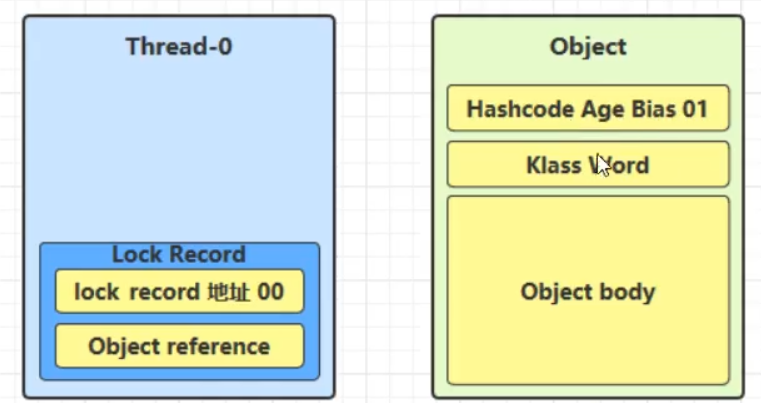
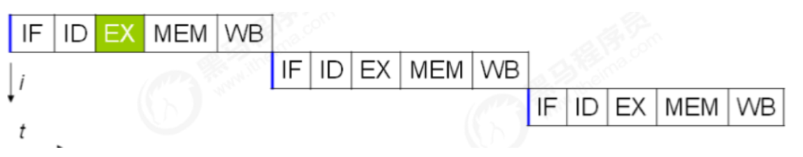

 


# [**:house:**](../../README.html)

[TOC]


# 一、一些概念

## 1.1 并发和并行的区别
- 并发：同一时间段，多个任务都在执行(单位时间内不一定同时执行)，如单核的cpu下，多个线程是并发执行的。
- 并行：单位时间内，多个任务同时执行，比如多核CPU，多个cpu同时执行多个线程。

## 1.2 使用多线程的意义和带来的问题
- 可以大大提高系统整体的并发能力以及性能。
- 提高CPU的利用率。
- 带来内存泄漏，死锁，线程不安全等问题。
## 1.3 线程的生命周期
**从操作系统层面来描述：**

- 【初始状态】仅是在语言层面创建了线程对象，还未与操作系统线程关联（例如线程调用了start方法）
- 【可运行状态】（就绪状态）指该线程已经被创建（与操作系统线程关联），可以由 CPU 调度执行
- 【运行状态】指获取了 CPU 时间片运行中的状态
  - 当 CPU 时间片用完，会从【运行状态】转换至【可运行状态】，会导致线程的上下文切换
- 【阻塞状态】
  - 如果调用了阻塞 API，如 BIO 读写文件，这时该线程实际不会用到 CPU，会导致线程上下文切换，进入 【阻塞状态】
  - 等 BIO 操作完毕，会由操作系统唤醒阻塞的线程，转换至【可运行状态】
  - 与【可运行状态】的区别是，对【阻塞状态】的线程来说只要它们一直不唤醒，调度器就一直不会考虑调度它们
- 【终止状态】表示线程已经执行完毕，生命周期已经结束，不会再转换为其它状态

**从 Java API 层面来描述:**

- **NEW** 线程刚被创建，但是还没有调用 start() 方法
- **RUNNABLE** 当调用了 start() 方法之后，注意，Java API 层面的 RUNNABLE 状态涵盖了**操作系统层面**的 【可运行状态】、【运行状态】和【阻塞状态】（由于 BIO 导致的线程阻塞，在 Java 里无法区分，仍然认为 是可运行）
- **BLOCKED ， WAITING ， TIMED_WAITING** 都是 **Java API 层面**对【阻塞状态】的细分，如sleep处于TIMED_WAITING， join为WAITING状态，加锁对应于**BLOCKED**。
- **terminated** 当线程代码运行结束
## 1.4 三种使用线程的方法
- 实现 `Runnable` 接口。

```java
public class MyRunnable implements Runnable {
    @Override
    public void run() {
        // ...
    }
}
public static void main(String[] args) {
    MyRunnable instance = new MyRunnable();
    Thread thread = new Thread(instance);
    thread.start();
}
```

- 实现 `Callable` 接口。

```java
public class MyCallable implements Callable<Integer> {
    public Integer call() {
        return 123;
    }
}
public static void main(String[] args) throws ExecutionException, InterruptedException {
    MyCallable mc = new MyCallable();
    FutureTask<Integer> ft = new FutureTask<>(mc);
    Thread thread = new Thread(ft);
    thread.start();
    System.out.println(ft.get());
}
```

- 继承 `Thread` 类。

```java
public class MyThread extends Thread {
    public void run() {
        // ...
    }
}
public static void main(String[] args) {
    MyThread mt = new MyThread();
    mt.start();
}
```


## 1.5 什么是线程死锁？如何避免死锁？
### 线程死锁的四个条件
>多个线程同时被阻塞，他们中的一个或者全部在等待某个资源被释放，由于线程无限期的阻塞，因此程序不可能正常终止。
- **互斥条件**：互斥条件是指多个线程不能同时使⽤同⼀个资源。
- **持有并等待条件**：持有并等待条件是指，当线程 A 已经持有了资源 1，⼜想申请资源 2，⽽资源 2 已经被线程 C 持有了，所 以线程 A 就会处于等待状态，但是线程 A 在等待资源 2 的同时并不会释放⾃⼰已经持有的资源 1。
- **不可剥夺条件**：不可剥夺条件是指，当线程已经持有了资源 ，在⾃⼰使⽤完之前不能被其他线程获取，线程 B 如果也想使 ⽤此资源，则只能在线程 A 使⽤完并释放后才能获取。
- **环路等待条件**：环路等待条件指都是，在死锁发⽣的时候，两个线程获取资源的顺序构成了环形链。⽐如，线程 A 已经持有资源 2，⽽想请求资源 1， 线程 B 已经获取了资源 1，⽽想请求资源 2，这就形成 资源请求等待的环形图。

### 如何避免死锁？
- **破坏互斥条件**：这个没有办法实现；
- **破坏请求与保持条件**：一次性申请所有资源；
- **破坏不剥夺条件**：占用部分资源的线程进一步申请其他资源时，如果申请不到，可以主动释放它占有的资源。
- **破坏循环等待条件**：按序申请资源,释放资源则反序释放。

## 1.6 常用方法

### start() 与 run()

被创建的Thread对象直接调用重写的run方法时， run方法是在**主线程**中被执行的，而不是在我们所创建的线程中执行。所以如果想要在所创建的线程中执行run方法，**需要使用Thread对象的start方法**。

### sleep()与wait()

- 二者都可以暂停线程的执行
- `sleep()`通常被用于暂停执行，不会释放锁。`wait()`方法通常用于线程间通信，会释放锁。
- `wait()` 方法被调用后，线程不会自动苏醒，需要别的线程调用同一个对象上的 `notify()` 或者 `notifyAll()` 方法。`sleep()` 方法执行完成后，线程会自动苏醒。或者可以使用 `wait(long timeout)`超时后线程会自动苏醒。

### join()

**在线程中调用另一个线程的 join() 方法，会将当前线程挂起，而不是忙等待，直到目标线程结束。**

对于以下代码，虽然 b 线程先启动，但是因为在 b 线程中调用了 a 线程的 join() 方法，b 线程会等待 a 线程结束才继续执行，因此最后能够保证 a 线程的输出先于 b 线程的输出。

```java
public class JoinExample {

    private class A extends Thread {
        @Override
        public void run() {
            System.out.println("A");
        }
    }

    private class B extends Thread {

        private A a;
        B(A a) {
            this.a = a;
        }
        @Override
        public void run() {
            try {
                a.join();
            } catch (InterruptedException e) {
                e.printStackTrace();
            }
            System.out.println("B");
        }
    }

    public void test() {
        A a = new A();
        B b = new B(a);
        b.start();
        a.start();
    }
}
public static void main(String[] args) {
    JoinExample example = new JoinExample();
    example.test();
}
```

### 守护线程Daemon

**守护线程是程序运行时在后台提供服务的线程，不属于程序中不可或缺的部分。**

**当所有非守护线程结束时，程序也就终止，同时会杀死所有守护线程。**

main() 属于非守护线程。

在线程启动之前使用 setDaemon() 方法可以将一个线程设置为守护线程。

```java
public static void main(String[] args) {
    Thread thread = new Thread(new MyRunnable());
    thread.setDaemon(true);
}
```

### yield （让出当前线程）

调用 yield 会让当前线程从 **Running 进入 Runnable 就绪状态**（仍然有可能被执行），然后调度执行其它线程。

## 1.7 线程安全的三要素

1. **原子性：** 一个的操作或者多次操作，要么所有的操作都得到执行，要么都不执行。
2. **可见性:** 当一个变量对共享变量进行了修改，那么另外的线程都是立即可以看到修改后的最新值。
3. **有序性:** 代码执行的顺序是编写代码的顺序。

# 二、synchronized 关键字

## 2.1 是什么？
- 用于解决多个线程之间访问资源的同步性，可以保证被它修饰的方法或者代码块在任意一个时刻只有一个线程执行。
- 在JDK的早期版本，symchronized是重量级锁，效率低下。

>**为什么效率低下？怎么解决？**
>
>- 因为监视器锁是依赖于底层的操作系统的`Mutex Lock`实现的，java的线程是映射到操作系统原生线程之上的。如果要挂起或者唤醒一个线程，都需要操作系统帮忙完成，而操作系统实现线程间的切换时需要从用户态到系统态，这个状态之间的转换需要比较长的时间，时间成本相对比较高。
>
>- 为了在一定程度上减少获得锁和释放锁带来的性能消耗，在JDK6 之后引入了“偏向锁”和“轻量级锁”，所以总共有4种锁状态，级别由低到高依次为：无锁状态、偏向锁状态、轻量级锁状态、重量级锁状态。这几个状态会随着竞争情况逐渐升级。
## 2.2 怎么使用？
1. 修饰实例方法:作用于当前对象实例加锁，进入同步代码前要获得当前对象实例的锁.
2. 修饰静态方法：也就是给当前类加锁，会作用于类的所有对象实例，进入同步代码前要获得当前class的锁。
3. 修饰代码块：指定加锁对象，对给定对象/加锁。

>  因为构造方法本身就属于线程安全的。所以不能用synchronized修饰

## 2.3 底层原理

**原理之Monitor**


- 当线程执行到临界区代码时，如果使用了synchronized，会先查询synchronized中所指定的对象(obj)**是否绑定了Monitor**。
  - 如果**没有绑定**，则会先去与Monitor绑定，也就是将对象头中的**Mark Word**置为Monitor指针，并且将Owner设为当前线程。
  - 如果**已经绑定**，则会去查询该Monitor是否已经有了Owner.
    - 如果没有，则Owner与将当前线程绑定
    - 如果有，则放入EntryList，进入阻塞状态(blocked)
- 当Monitor的Owner将临界区中代码执行完毕后，Owner便会被清空，此时EntryList中处于**阻塞**状态的线程会被**叫醒并竞争**，此时的竞争是**非公平的**.

> - 每个对象都会绑定一个**唯一的Monitor**，如果synchronized中所指定的对象(obj)**不同**，则会绑定**不同**的Monitor

**同步代码块**

- **`Synchronzed`同步语句块的实现使用的是**`monitorenter`**和**`monitorexit`**指令，其中`monitorenter`指令指向同步代码块开始位置，`monitorexit`指令指明同步代码块的结束位置。**
- 当执行`monitorenter`指令时，线程试图获取锁也就是获取对象监视器`monitor`的持有权。
- 在执行`monitorenter`时，会尝试获取对象的锁，如果锁的计数器为0表示锁可以被获取，获取后将锁计数器设为1也就是加1.
- 在执行`monitorexit`指令后，将锁计数器设为0，表示锁被释放，如果获取对象锁失败，那当前线程就要阻塞等待，直到锁被另外一个线程释放为止。

**修饰方法**

`synchronized`修饰方法并没有用`monitorenter`和`monitorexit`指令，**取而代之的是`ACC_SYNCHRONIZED`标识，该标识指明了该方法是一个同步方法。**JVM通过该`ACC_SYNCHRONIZED`访问标识来辨别一个方法是否声明为同步方法，从而执行相应的调用。

**总结**

二者有所不同，但是二者的本质都是对对象监视器`monitor`的获取。

## 2.5 实现重入

每个锁关联一个线程持有者和一个计数器，当计数器为0 时表示该锁没有被任何线程持有，那么任何线程都可以获得该锁而调用相应方法。当一个线程请求成功后，JVM会几下持有锁的线程，并将计数器计为1。此时其他线程请求该锁，则必须等待，而持有该所的线程如果再次请求这个锁，就可以再次拿到这个锁，同时计数器会递增。当线程退出一个synchronized方法时，计数器会递减，如果计数器为0则释放该锁。

## 2.6 锁升级过程

无锁——>偏向锁——>轻量级锁——>重量级锁

### java对象的布局


- 对象头：当一个线程尝试访问sychronzied修饰的代码块时，它首先要获得锁，这个锁时存在锁的对象头中。
- 实例数据：类中定义的成员变量。
- 对齐填充：不是必须的，仅仅起着占位符的作用。

64位虚拟机的mark word:


### 偏向锁

> 在大多数情况下，锁不仅不存在多线程竞争，而且总是由同一线程多次获得和释放，为了让线程获取锁的代价更低，引进偏向锁。

- 这个锁会偏向于第一个获得它的线程，会在对象头存储锁偏向的线程ID,以后线程进入和退出同步块时只需要检查是否为偏向锁，锁标志位以及ThreadID即可。
- 一旦出现多个线程竞争时必须撤销偏向锁，所以撤销偏向锁的性能必须小于之前节省下来的CAS原子操作的性能消耗，不然就得不偿失了。

**原理**

当线程第一次访问同步块并获取锁时，偏向锁处理流程如下：

- 虚拟机会把对象头中的标志位设置为’01‘；
- 同时使用CAS操作把获取到这个锁的线程ID记录到对象的Mark Word中，如果CAS操作成功，持有偏向锁的线程以后每次进入这个锁相关的同步块时，虚拟机都可以不再进行任何操作，偏向锁的效率高。

**偏向锁的撤销**

1. 撤销动作必须等待全局安全点(所有线程都会停下来)。
2. 暂停拥有偏向锁的线程，判断锁对象是否处于被锁定状态。
3. 撤销偏向锁，恢复到无锁(标志位为01)或者轻量级锁(标志位为00)的状态。

**偏向锁的好处**

- 偏向锁时在只有一个线程执行同步块时进一步提高性能，适合用于一个线程反复获得同一个锁的情况，偏向锁可以提高带有同步但是无竞争的程序性能。
- 但是它不一定是对程序运行有利，如果程序中的大多数锁总是被多个不同的线程访问，比如线程池，那偏向锁模式是多余的。

### 轻量级锁

> 引入轻量级锁的目的：在**多线程交替执行同步块**的情况下，尽量避免重量级锁引起的性能的消耗，但是如果多个线程在同一时刻进入临界区，会导致轻量级锁膨胀升级为重量级锁，所以轻量级锁的出现并不是为了替代重量级锁。

**原理**

> 将对象的Mark Word复制到栈帧中的Lock Record中，Mark Word更新为指向Lock Record的指针。

当关闭偏向锁功能或者多个线程竞争偏向锁导致偏向锁升级为轻量级锁，则会尝试获取轻量级锁，步骤如下：

- 判断当前对象是否处于无锁状态(hashcode,0,01)，如果是，创建**锁记录**（Lock Record）对象，每个线程的栈帧都会包含一个锁记录对象，内部可以存储锁定对象的mark word（不再一开始就使用Monitor）。



- 让锁记录中的Object reference指向锁对象（Object），并尝试用cas去替换Object中的mark word，将此mark word放入lock record中保存.


- 如果cas替换成功，则将Object的对象头替换为**锁记录的地址**和**状态 00（轻量级锁状态）**，并由该线程给对象加锁.


- 如果失败则判断当前对象的Mark Word是否指向当前线程的栈帧.
  - 如果是则表示当前线程已经持有当前对象的锁，则进入sychronized锁重入，再加一条Lock Record作为重入的计数，但是此刻锁记录是null. 
  - 如果不是只能说明该锁对象已经被其他线程抢占了，这时候轻量级锁需要膨胀为重量级锁，锁标志位变为10，后面等待的线程将会进入阻塞状态。
- 当退出sychronized时，判断锁记录是否为null:
  - 如果锁记录为null，这时重置锁记录，表示重入计数减一。
  - 如果不为null,使用CAS将mark word恢复给对象头。
    - 如果CAS失败，这时会进入重量级锁流程，即按照monitor地址找到monitor对象，设置Owner为null，唤醒EntryList中额线程。

**轻量级锁的好处**

- 在多线程交替执行同步块的情况下，可以避免重量级锁引起的性能的消耗。
- 对于轻量级锁，其性能提升的依据是”对于绝大部分的锁，在整个生命周期是不会存在竞争的“，如果打破这个依据则出来互斥的开销外，还有额外的CAS操作，因此在有多线程竞争的情况下，轻量级锁比重量级锁更慢。

### 重量级锁

如果尝试加轻量级锁的过程中CAS失败，就需要膨胀为重量级锁。

monitor实现锁的时候，会阻塞和唤醒线程，线程的阻塞和唤醒需要CPU从用户态转为内核态，频繁的阻塞和唤醒CPU来说是一件负担很重的工作，这些操作给操作系统的并发带来了很大的压力。

### 自旋锁

**自旋锁加锁失败后，会一直忙等待，直到获取到锁。** 在「用户态」完成加锁和解锁操作，不会主动产生线程上下文切换，所以相比互斥锁来说，会快一些，开销也小一些。**适合用于被锁住的代码运行时间很短的场景。**

**适应性自旋锁**

JDK6中引入，自适应意味着自旋的时间不再固定，而是由前一次在同一个锁上的自旋时间及锁的拥有者状态来决定。

### 锁消除

锁消除的主要判断依据是来源于逃逸分析的数据支持，如果判断一段代码中，堆上的所有数据都不会逃逸出去而被其他线程访问到，那么就可以把它们当作栈上的数据对待，认为它们是线程私有的，同步加锁就无需进行。

### 锁粗化

JVM会探测到一连串细小的操作都使用同一个对象加锁，将同步代码块的范围放大，放到这串操作的外面，这样只需要加一次锁就可以了。(如for循环里的操作都对同一个对象加锁，这时候只要在for循环外面加一次锁就可以了)

# 三、lock锁

## 3.1 是什么？

- lock锁是一个接口,JDK级别的锁
- 只可以锁代码块
- 轻量级锁，性能高，尤其使竞争资源非常激烈时。
- 需要主动释放锁
## 3.2 ReentrantLock
- 可重入锁，可以被单个线程多次获取。
  - 可重入是指同一个线程如果首次获得了这把锁，那么因为它是这把锁的拥有者，因此有权利再次获取这把锁
  - 如果是不可重入锁，那么第二次获得锁时，自己也会被锁挡住。
- 分为公平锁和非公平锁：在公平锁机制下，线程依次排队，而非公平锁在锁是可获取状态时，不管自己是不是在队列的开头都会获取锁。 
- 独占锁
- 锁超时
  - 使用**lock.tryLock**方法会返回获取锁是否成功。如果成功则返回true，反之则返回false。
  - 并且tryLock方法可以**指定等待时间**，参数为：tryLock(long timeout, TimeUnit unit), 其中timeout为最长等待时间，TimeUnit为时间单位。
- 用于解决死锁问题

## 3.3 ReadWriteLock锁
- `ReadWriteLock`是一个接口，`ReentrantReadWriteLock`是它的实现类;
- `WriteLock`(写锁)独占锁,`ReadLock`(读锁)共享锁。

## 3.4 synchronized VS ReentrantLock

1. 两者都是可重入锁。
2. `synhronized`依赖于`JVM`,而`ReentrantLock`依赖于`API`。
3. 等待可中断：`ReentrantLock`提供了一个能够中断等待锁的线程的机制。也就是说正在等待的线程可以选择放弃等待，改为处理其他事情。
4. 可实现公平锁：`ReentrantLock`可以指定是公平锁还是非公平锁，而`synchronized`只能是非公平锁。
5. 可实现选择性通知：`synchronized`关键字与`wait()`和`notify()/notifyAll()`方法相结合可以实现等待/通知机制。`ReentrantLock`类借助`Condition`接口与`newCondition()`方法有选择性的进行线程通知。

# 四、volatile关键字
>在当前的 Java 内存模型下，线程可以把变量保存本地内存（比如机器的寄存器）中，而不是直接在主存中进行读写。这就可能造成一个线程在主存中修改了一个变量的值，而另外一个线程还继续使用它在寄存器中的变量值的拷贝，造成数据的不一致。
>要解决这个问题，就需要把变量声明为**volatile**，这就指示 JVM，这个变量是共享且不稳定的，每次使用它都到主存中进行读取。
## 4.1 要点 
- 使用volatile修饰的变量，可以保证在多个线程之间的**可见性**，并且**避免指令重排。**
- **用来确保将变量的更新操作通知到其他线程。**
- **volatile+CAS可以实现线程安全。**

## 4.2 Java内存模型

>Java内存模型即Java Memory Model，简称JMM。JMM定义了一套多线程在读写共享数据时(成员变量，数组),对数据的可见性，有序性和原子性的规则和保障。JVM是整个计算机虚拟模型，所以JMM是隶属于JVM的。https://blog.csdn.net/suifeng3051/article/details/52611310


## 4.3 synchronize VS volatile
- volatile 关键字是线程同步的轻量级实现，性能比synchronized关键字要好。
- volatile 关键字只能用于变量而 synchronized关键字可以修饰方法以及代码块。
- volatile关键字主要用于解决变量在多个线程之间的可见性，而 synchronized 关键字解决的是多个线程之间访问资源的同步性。
- volatile 关键字能保证数据的可见性，但不能保证数据的原子性。synchronized 关键字两者都能保证。

##  4.4 volatile原理

### 有序性

JVM会再不影响正确性的前提下，可以调整语句执行的顺序。

```java
static int i;
static int j;
//在某个线程内执行如下赋值操作
i=...
j=...
```

可以看到，无论先执行i还是先执行j，对最终的结果都不会造成影响。这种特性称为指令重排，多线程下指令重排会影响正确性。

**指令重排序优化**

- 事实上，现代处理器会设计为一个时钟周期完成一条执行时间长的 CPU 指令。为什么这么做呢？可以想到指令还可以再划分成一个个更小的阶段，例如，每条指令都可以分为： **取指令 - 指令译码 - 执行指令 - 内存访问 - 数据写回** 这5 个阶段



- 在不改变程序结果的前提下，这些指令的各个阶段可以通过**重排序**和**组合**来实现**指令级并行**
- 指令重排的前提是，重排指令**不能影响结果**，例如

```java
// 可以重排的例子 
int a = 10; 
int b = 20; 
System.out.println( a + b );

// 不能重排的例子 
int a = 10;
int b = a - 5;
```

**支持流水线的处理器**

现代 CPU 支持多级**指令流水线**，例如支持**同时**执行 **取指令 - 指令译码 - 执行指令 - 内存访问 - 数据写回** 的处理器，就可以称之为五级指令流水线。这时 CPU 可以在一个时钟周期内，同时运行五条指令的不同阶段（相当于一 条执行时间长的复杂指令），IPC = 1，本质上，流水线技术并不能缩短单条指令的执行时间，但它变相地提高了指令地**吞吐率**。


**在多线程环境下，指令重排序可能导致出现意料之外的结果**

**解决办法**

**volatile** 修饰的变量，可以**禁用**指令重排

- 禁止的是加volatile关键字变量之前的代码被重排序

**内存屏障**

- 可见性
  - 写屏障：**volatile** 修饰的变量后面会有一个写屏障，保证在写屏障之前，对共享变量的改动，都同步到主存当中。
  - 读屏障：**volatile** 修饰的变量前面会有一个读屏障，保证在该屏障之后，对共享变量的读取，加载的是主存中最新数据。
- 有序性
  - 写屏障会确保指令重排序时，不会将写屏障之前的代码排在写屏障之后。
  - 读屏障会确保指令重排序时，不会将读屏障之后的代码排在读屏障之前。

```java
public void actor2(I_Result r){
    
    num = 2;
    ready = true;//ready是volatile赋值带写屏障
    //写屏障：ready num都会同步到主存中
}

public void actor1(I_Result r){
    //读屏障
    //ready是volatile读取值带屏障：在该屏障之后，对共享变量的读取，加载的是主存中最新数据
    if(ready){
        r.r1 = num + num;
    }else{
        
        r.r1 = 1;
    }
   
}
```

# 五、[ThreadLocal](https://snailclimb.gitee.io/javaguide/#/docs/java/multi-thread/%E4%B8%87%E5%AD%97%E8%AF%A6%E8%A7%A3ThreadLocal%E5%85%B3%E9%94%AE%E5%AD%97?id=%e5%89%8d%e8%a8%80)

- ThreadLocal类主要解决的就是让每个线程绑定自己的私有数据。
- 如果创建了一个ThreadLocal变量，那么访问这个变量的每个线程都会有这个变量的本地副本，当多线程操作这个变量时，实际操作的是自己本地内存里面的变量。

## 5.1 ThreadLocal与sychronized的对比

|        | sychronized                                                  | ThreadLocal                                                  |
| ------ | ------------------------------------------------------------ | ------------------------------------------------------------ |
| 原理   | 同步机制采用以时间换空间的方式，只提供一份变量让不同的线程排队访问 | 采用以空间换时间的方式，为每一个线程都提供一份变量的副本，从而实现同步访问而不相互干扰 |
| 侧重点 | 多个线程之间访问资源的同步                                   | 多个线程让每个线程之间的数据相互隔离                         |

## 5.2 数据结构


- Thread类有一个类型为ThreadLocal.ThreadLocalMap的实例变量threadLocals，也就是说每一个线程都有一个自己的ThreadLocalMap。
- ThreadLocal有自己独立的实现，其中key为ThreadLocal的一个弱引用，value为变量值。
- 每个线程在往`ThreadLocal`里放值的时候，都会往自己的`ThreadLocalMap`里存，读也是以`ThreadLocal`作为引用，在自己的`map`里找对应的`key`，从而实现了**线程隔离**。
- `ThreadLocalMap`有点类似`HashMap`的结构，只是`HashMap`是由**数组+链表**实现的，而`ThreadLocalMap`中并没有**链表**结构。
- 我们还要注意`Entry`， 它的`key`是`ThreadLocal<?> k` ，继承自`WeakReference`， 也就是我们常说的弱引用类型。

### 5.2.1 `ThreadLocal`的key的**弱引用**与内存泄漏


- 弱引用可能造成内存泄漏
  - 假设使用完threadLocal，threadLocal ref被回收了
  - 由于thredLocalMap只持有ThreadLocal的弱引用，所以threadLocal就可以被gc回收了，此时entry中的key=null
  - 由于没有手动删除entry数组以及currentThread依然运行，这样还存在强引用链currenthread ref----->tthread--->threadLocalMap---->entry--->value，value不会被回收，而这块value就永远不会被访问到就可能造成内存泄漏。
- 就算是强引用也会造成内存泄漏的，所以弱引用不是造成内存泄漏的根本原因。
  - 根本原因是threadLocalMap的生命周期和thread一样长，如果没有手动删除对应的key就会导致内存泄漏。

## 5.3 ThreadLocal的实现过程

- **每个thread线程内部都有一个ThreadLocalMap**
- **map里面存储ThreadLocal对象（key）和线程的变量副本(value)**
- **Thread内部的Map是由ThreadLocal维护的，由ThreadLocal负责向map获取和设置线程的变量值。**
- **对于不同的线程，每次获取副本值时，别的线程并不能获取到当前线程的副本值，形成了副本隔离，互不干扰。**

> 这样设置的好处
>
> - 当Thread销毁的时候，ThreadLocalMap也随之销毁，减少内存的使用。
> - 每个map存储的entry只与threadLocal数量有关，一般小于线程数。

## 5.4 ThreadLocal常用方法

| 方法声明                 | 描述                       |
| ------------------------ | -------------------------- |
| ThreadLocal()            | 创建ThreadLocal对象        |
| public void set(T value) | 设置当前线程绑定的局部变量 |
| public T get()           | 获取当前线程绑定的局部变量 |
| public void remove()     | 移除当前线程绑定的局部变量 |

### 5.4.1 set(value)方法


- 首先获取当前线程，并根据当前线程获取一个map
- 如果获取的map不为空，则将参数设置到map中(当前ThreadLocal的一个弱引用引用作为key)
- 如果map为空，则给该线程创建map,并设置初始值。

### 5.4.2 get()方法

- 首先获取当前线程，根据当前线程获取一个map
- 如果获取的map不为空，则在map中以ThreadLocal的引用作为key来在map中获取对应的Entry e,如果为空转到最后一步；
- 如果e不为null，则返回e.value,否则转到最后一步
- map为空或者e为空，则通过initialValue函数获取初始值value，然后用threadlocal的引用和value作为firstKey和firstValue创建一个新的map.

### 5.4.3 remove()方法

- 首先获取当前线程，并根据当前线程获取一个map
- 如果获取的map不为空，则移除当前threadlocal对象对应的entry

## 5.5 ThreadLocalMap

### 5.5.1 ThreadLocalMap Hash算法

- `ThreadLocalMap`中`hash`算法很简单，这里`i`就是当前key在散列表中对应的数组下标位置。

```java
int i = key.threadLocalHashCode & (len-1);
```

- 这里最关键的就是`threadLocalHashCode`值的计算，`ThreadLocal`中有一个属性为`HASH_INCREMENT = 0x61c88647`,每当创建一个`ThreadLocal`对象，这个`ThreadLocal.nextHashCode` 这个值就会增长 `0x61c88647` 。这个值很特殊，它是**斐波那契数** 也叫 **黄金分割数**。`hash`增量为 这个数字，带来的好处就是 `hash` **分布非常均匀**。

### 5.5.2 ThreadLocalMap Hash冲突

`HashMap`中解决冲突的方法是在数组上构造一个**链表**结构，冲突的数据挂载到链表上，如果链表长度超过一定数量则会转化成**红黑树**。

而`ThreadLocalMap`中并没有链表结构，所以这里不能适用`HashMap`解决冲突的方式了。

### 5.5.3 ThreadLocalMap.set()方法

- **第一种情况**： **通过`hash`计算后的槽位对应的`Entry`数据为空，这里直接将数据放到该槽位即可，然后返回。**
- **第二种情况：** **槽位数据不为空，`key`值与当前`ThreadLocal`通过`hash`计算获取的`key`值一致，这里直接更新该槽位的数据，然后返回。**
- **第三种情况：** 槽位数据不为空，往后遍历过程中，在找到`Entry`为`null`的槽位之前，遇到`key`过期的`Entry`，执行`replaceStaleEntry()`方法(核心方法)，然后返回。`replaceStaleEntry()`方法如下：
  - 以当前的`key`过期的下标`staleSlot`开始，向前迭代查找，如果没有过期的数据，`for`循环一直碰到`Entry`为`null`才会结束。如果向前找到了过期数据，更新探测清理过期数据的开始下标为i，即`slotToExpunge=i.`
  - 接着开始从`staleSlot`向后查找，也是碰到`Entry`为`null`的桶结束。 如果迭代过程中，**碰到k == key**，这说明这里是替换逻辑，替换新数据并且交换当前`staleSlot`位置。如果`slotToExpunge == staleSlot`，这说明`replaceStaleEntry()`一开始向前查找过期数据时并未找到过期的`Entry`数据，接着向后查找过程中也未发现过期数据，修改开始探测式清理过期数据的下标为当前循环的index，即`slotToExpunge = i`。最后调用`cleanSomeSlots(expungeStaleEntry(slotToExpunge), len);`进行启发式过期数据清理，之后返回。
  - **如果k != key**则会接着往下走，`k == null`说明当前遍历的`Entry`是一个过期数据，`slotToExpunge == staleSlot`说明，一开始的向前查找数据并未找到过期的`Entry`。如果条件成立，则更新`slotToExpunge` 为当前位置，这个前提是前驱节点扫描时未发现过期数据。
  - 往后迭代的过程中如果没有找到`k == key`的数据，且碰到`Entry`为`null`的数据，则结束当前的迭代操作。此时说明这里是一个添加的逻辑，将新的数据添加到`table[staleSlot]` 对应的`slot`中。
  - 最后判断除了`staleSlot`以外，还发现了其他过期的`slot`数据，就要开启清理数据。
- **第四种情况：**如果以上三种情况都没有执行，则说明槽位数据不为空，往后遍历过程中，在找到`Entry`为`null`的槽位之前，没有遇到`key`过期的`Entry`。
  -  遍历散列数组，线性往后查找，如果找到`Entry`为`null`的槽位，则在`Entry`为`null`的桶中创建一个新的`Entry`对象， 之后执行`++size`操作。或者往后遍历过程中，遇到了**key值相等**的数据，直接更新即可。
  -  调用`cleanSomeSlots()`做一次启发式清理工作，清理散列数组中`Entry`的`key`过期的数据。
  -  如果清理工作完成后，未清理到任何数据，且`size`超过了阈值(数组长度的2/3)，进行`rehash()`操作。
  -  `rehash()`中会先进行一轮探测式清理，清理过期`key`，清理完成后如果**size >= threshold - threshold / 4**，就会执行真正的扩容逻辑(扩容逻辑往后看)

### 5.5.4 ThreadLocalMap扩容机制

- 首先进行探测式清理工作，从`table`的起始位置往后清理。清理完成之后，`table`中可能有一些`key`为`null`的`Entry`数据被清理掉，所以此时通过判断`size >= threshold - threshold / 4` 也就是`size >= threshold* 3/4` 来决定是否扩容。
- 扩容后的`tab`的大小为`oldLen * 2`，然后遍历老的散列表，重新计算`hash`位置，然后放到新的`tab`数组中，如果出现`hash`冲突则往后寻找最近的`entry`为`null`的槽位，遍历完成之后，`oldTab`中所有的`entry`数据都已经放入到新的`tab`中了。重新计算`tab`下次扩容的**阈值**。

### 5.5.5 ThreadLocalMap.get()方法

- **第一种情况：** 通过查找`key`值计算出散列表中`slot`位置，然后该`slot`位置中的`Entry.key`和查找的`key`一致，则直接返回.
- **第二种情况：** `slot`位置中的`Entry.key`和要查找的`key`不一致,这时候需要继续往后进行迭代查找，如果查找过程中遇到key的null的情况，会触发一次探测式数据回收操作，此时继续往后迭代，直到找到key相等的value值.

### 5.5.6 ThreadLocalMap过期key的探测式清理流程

也就是`expungeStaleEntry`方法，遍历散列数组，从开始位置向后探测清理过期数据，将过期数据的`Entry`设置为`null`，沿途中碰到未过期的数据则将此数据`rehash`后重新在`table`数组中定位，如果定位的位置已经有了数据，则会将未过期的数据放到最靠近此位置的`Entry=null`的桶中，使`rehash`后的`Entry`数据距离正确的桶的位置更近一些。

### 5.5.7 ThreadLocalMap过期key的启发式清理流程

```java
private boolean cleanSomeSlots(int i, int n) {
    boolean removed = false;
    Entry[] tab = table;
    int len = tab.length;
    do {
        i = nextIndex(i, len);//i往后遍历
        Entry e = tab[i];
        if (e != null && e.get() == null) {//如果当前entry不为空但是key为空
            n = len;//重新设置n
            removed = true;
            i = expungeStaleEntry(i);//以当前位置开启探测式清理
        }
    } while ( (n >>>= 1) != 0);//n每次除以2,当为0的时候就退出循环
    return removed;
}

```

## 5.6 InheritableThreadLocal

我们使用`ThreadLocal`的时候，在异步场景下是无法给子线程共享父线程中创建的线程副本数据的。

为了解决这个问题，JDK中还有一个`InheritableThreadLocal`类，实现原理是子线程是通过在父线程中通过调用`new Thread()`方法来创建子线程，`Thread#init`方法在`Thread`的构造方法中被调用。在`init`方法中拷贝父线程数据到子线程中.

# 六、[线程池](https://snailclimb.gitee.io/javaguide/#/./docs/java/multi-thread/java%E7%BA%BF%E7%A8%8B%E6%B1%A0%E5%AD%A6%E4%B9%A0%E6%80%BB%E7%BB%93?id=%e4%b8%80-%e4%bd%bf%e7%94%a8%e7%ba%bf%e7%a8%8b%e6%b1%a0%e7%9a%84%e5%a5%bd%e5%a4%84)
## 为什么要用线程池

> JVM在hotSpot的线程模型下，java线程会一对一映射为内核线程，这意味着，在java每次创建以及回收线程都会去内核创建以及回收，这就有可能导致：创建和销毁线程锁花费的时间和资源可能处理的任务花费的时间和资源要更多，线程池的出现就是为了：

- **降低资源消耗**：通过重复利用已创建的线程降低线程创建和销毁造成的消耗；
- **提高响应速度**：当任务到达时，任务可以不需要等到线程创建就能立即执行。
- **提高线程的可管理性**。 线程是稀缺资源，如果无限制的创建，不仅会消耗系统资源，还会降低系统的稳定性，使用线程池可以进行统一的分配，调优和监控。

## 什么时候用线程池？

单个任务处理的时间很短而请求的数目却是巨大的。

## Executor框架（由三大部分组成）

Executor 框架是 Java5 之后引进的，在 Java 5 之后，通过 Executor 来启动线程比使用 Thread 的 start 方法更好，除了更易管理，效率更好（用线程池实现，节约开销）外，还有关键的一点：有助于避免 this 逃逸问题。

### 1）任务（Runnable/Callable）

执行任务需要实现的 **`Runnable` 接口** 或 **`Callable`接口**。**`Runnable` 接口**或  **`Callable` 接口** 实现类都可以被**`ThreadPoolExecutor`** 或 **`ScheduledThreadPoolExecutor`** 执行。

### 2) 任务的执行(`Executor`)

## 线程池的参数

```java
import java.util.Date;

/**
 * 这是一个简单的Runnable类，需要大约5秒钟来执行其任务。
 * @author shuang.kou
 */
public class MyRunnable implements Runnable {

    private String command;

    public MyRunnable(String s) {
        this.command = s;
    }

    @Override
    public void run() {
        System.out.println(Thread.currentThread().getName() + " Start. Time = " + new Date());
        processCommand();
        System.out.println(Thread.currentThread().getName() + " End. Time = " + new Date());
    }

    private void processCommand() {
        try {
            Thread.sleep(5000);
        } catch (InterruptedException e) {
            e.printStackTrace();
        }
    }

    @Override
    public String toString() {
        return this.command;
    }
}
```


```java
import java.util.concurrent.ArrayBlockingQueue;
import java.util.concurrent.ThreadPoolExecutor;
import java.util.concurrent.TimeUnit;

public class ThreadPoolExecutorDemo {

    private static final int CORE_POOL_SIZE = 5;
    private static final int MAX_POOL_SIZE = 10;
    private static final int QUEUE_CAPACITY = 100;
    private static final Long KEEP_ALIVE_TIME = 1L;
    public static void main(String[] args) {

        //使用阿里巴巴推荐的创建线程池的方式
        //通过ThreadPoolExecutor构造函数自定义参数创建
        ThreadPoolExecutor executor = new ThreadPoolExecutor(
                CORE_POOL_SIZE,
                MAX_POOL_SIZE,
                KEEP_ALIVE_TIME,
                TimeUnit.SECONDS,
                new ArrayBlockingQueue<>(QUEUE_CAPACITY),
                new ThreadPoolExecutor.CallerRunsPolicy());

        for (int i = 0; i < 10; i++) {
            //创建WorkerThread对象（WorkerThread类实现了Runnable 接口）
            Runnable worker = new MyRunnable("" + i);
            //执行Runnable
            executor.execute(worker);
        }
        //终止线程池
        executor.shutdown();
        while (!executor.isTerminated()) {
        }
        System.out.println("Finished all threads");
    }
}
```


使用ThreadPoolExecutor去创建线程池，最主要的目的是，使用ThreadPoolExecutor创建的线程可以更能了解线程运行的规则，避免资源耗尽的风险。

- **`corePoolSize` :** 核心线程数线程数定义了最小可以同时运行的线程数量。
- **`maximumPoolSize` :** 当队列中存放的任务达到队列容量的时候，当前可以同时运行的线程数量变为最大线程数。
- **`workQueue`:** 当新任务来的时候会先判断当前运行的线程数量是否达到核心线程数，如果达到的话，新任务就会被存放在队列中。
- **`keepAliveTime`**:当线程池中的线程数量大于 `corePoolSize` 的时候，如果这时没有新的任务提交，核心线程外的线程不会立即销毁，而是会等待，直到等待的时间超过了 `keepAliveTime`才会被回收销毁；
- **`unit`** : `keepAliveTime` 参数的时间单位。
- **`threadFactory`** :executor 创建新线程的时候会用到。
- **`handler`** :饱和策略。关于饱和策略下面单独介绍一下。

## 线程池原理分析

- 提交任务后，先判断核心线程池是否已满，如果没有满就创建线程。
- 如果核心线程池满了，就判断等待队列是否满了，如果没有满就加入队列。
- 如果等待队列满了，就判断最大线程池是否已满，如果没满就创建临时线程。
- 如果临时线程也满了，就按照策略进行处理。
- 拒绝策略有四种
  - **`ThreadPoolExecutor.AbortPolicy`**：抛出 `RejectedExecutionException`来拒绝新任务的处理。(默认的策略)
  - **`ThreadPoolExecutor.DiscardPolicy`：** 不处理新任务，直接丢弃掉。
  - **`ThreadPoolExecutor.DiscardOldestPolicy`：** 此策略将丢弃最早的未处理的任务请求。
  - **`ThreadPoolExecutor.CallerRunsPolicy`**：调用执行自己的线程运行任务，也就是直接在调用`execute`方法的线程中运行(`run`)被拒绝的任务，如果执行程序已关闭，则会丢弃该任务。因此这种策略会降低对于新任务提交速度，影响程序的整体性能。如果您的应用程序可以承受此延迟并且你要求任何一个任务请求都要被执行的话，你可以选择这个策略。

## 三种常见的线程池

### FixedThreadPool

- 可重用固定线程数的线程池。
- 执行流程：
  - 如果当前运行的线程数小于corePoolSize时，如果再来新任务的话，，就创建新的线程来执行任务；
  - 当前运行的线程数等于corePoolSize后，如果再来新的任务，会将任务加入`LinkedBlockingQueue`队列中；
  - 线程池中的线程执行完手头的任务后，会在循环中反复从`LinkedBlockingQueue` 中获取任务来执行；
- 为什么不推荐使用？
  - **`FixedThreadPool` 使用无界队列 `LinkedBlockingQueue`（队列的容量为 Intger.MAX_VALUE）作为线程池的工作队列**
  - 运行中的 `FixedThreadPool`（未执行 `shutdown()`或 `shutdownNow()`）不会拒绝任务，在任务比较多的时候会导致 OOM（内存溢出）。

### SingleThreadPool

- 只有一个线程的线程池
- 执行流程：
  - 如果当前运行的线程数少于 corePoolSize，则会创建一个新的线程执行任务；
  - 当前线程池中有一个运行的线程后，将任务加入LinkedBlockingQueue队列中。
  - 线程执行完当前的任务后，会在循环中反复从`LinkedBlockingQueue` 中获取任务来执行；
- 为什么不推荐使用？
  - `SingleThreadExecutor` 使用无界队列 `LinkedBlockingQueue` 作为线程池的工作队列（队列的容量为 Intger.MAX_VALUE）。
  - 运行中的 SingleThreadPool不会拒绝任务，在任务比较多的时候会导致 OOM（内存溢出）。

### CachedTreadPool

- 根据需要创建新线程的线程池
- 执行流程：
  - **有空闲线程就交给空闲线程处理：**首先执行 `SynchronousQueue.offer(Runnable task)` 提交任务到任务队列。如果当前 `maximumPool` 中有闲线程正在执行 `SynchronousQueue.poll(keepAliveTime,TimeUnit.NANOSECONDS)`，那么主线程执行 offer 操作与空闲线程执行的 `poll` 操作配对成功，主线程把任务交给空闲线程执行，`execute()`方法执行完成，否则执行下面的步骤 2；
  - **没有空闲线程就创建新线程：**当初始 `maximumPool` 为空，或者 `maximumPool` 中没有空闲线程时，将没有线程执行 `SynchronousQueue.poll(keepAliveTime,TimeUnit.NANOSECONDS)`。这种情况下，步骤 1 将失败，此时 `CachedThreadPool` 会创建新线程执行任务，execute 方法执行完成；
- 为什么不推荐使用？
  - `CachedThreadPool`允许创建的线程数量为 Integer.MAX_VALUE ，可能会创建大量线程，从而导致 OOM。

## 几种常见的对比

##### 1. Runnable和Callable

`Runnable` 接口**不会返回结果或抛出检查异常，但是**`Callable` 接口**可以。所以，如果任务不需要返回结果或抛出异常推荐使用 `Runnable` 接口**，这样代码看起来会更加简洁。

##### 2. execute()和submit()

- **`execute()`方法用于提交不需要返回值的任务，所以无法判断任务是否被线程池执行成功与否；**
- **`submit()`方法用于提交需要返回值的任务。线程池会返回一个 `Future` 类型的对象，通过这个 `Future` 对象可以判断任务是否执行成功** ，并且可以通过 `Future` 的 `get()`方法来获取返回值，`get()`方法会阻塞当前线程直到任务完成，而使用 `get（long timeout，TimeUnit unit）`方法则会阻塞当前线程一段时间后立即返回，这时候有可能任务没有执行完。

##### `shutdown()`和`shutdownNow()`

- **`shutdown（）`** :关闭线程池，线程池的状态变为 `SHUTDOWN`。线程池不再接受新任务了，但是队列里的任务得执行完毕。
- **`shutdownNow（）`** :关闭线程池，线程的状态变为 `STOP`。线程池会终止当前正在运行的任务，并停止处理排队的任务并返回正在等待执行的 List。

##### `isTerminated()` 和 `isShutdown()`

- **`isShutDown`** 当调用 `shutdown()` 方法后返回为 true。
- **`isTerminated`** 当调用 `shutdown()` 方法后，并且所有提交的任务完成后返回为 true。

# 八、CAS与原子类

## 8.1 CAS

CAS即Compare and Swap，它体现的是一个乐观锁的思想，比如说多个线程要对宇哥共享型的整形变量执行+1操作;

```java
//需要不断尝试
while(true){
    
    int 旧值=共享变量；
    int 结果=旧值+1；
    if(CompareandSwap(旧值，结果)){//将自己拿到的旧值和目前的共享变量进行比较判断是否相等
        
        //成功，退出循环
    }     
        
}
```

- 获取共享变量时，为了保证该变量的可见性，需要使用volatile修饰，结合CAS和volatile可以实现无锁并发，适合于竞争不激烈，多核CPU的场景下。
  - 因为没有使用sychronized，所以线程不会陷入阻塞，这是效率提高的因素之一
  - 但是如果竞争激烈，重试必然频繁发生，反而效率会受到影响。

## 8.2 原子类

根据操作的数据类型，可以将JUC包中的原子类分为4类。

### 原子整数

- AtomicInteger：整型原子类
- AtomicLong：长整型原子类
- AtomicBoolean ：布尔型原子类

```java
public final int get() //获取当前的值
public final int getAndSet(int newValue)//获取当前的值，并设置新的值
public final int getAndIncrement()//获取当前的值，并自增
public final int getAndDecrement() //获取当前的值，并自减
public final int getAndAdd(int delta) //获取当前的值，并加上预期的值
boolean compareAndSet(int expect, int update) //如果输入的数值等于预期值，则以原子方式将该值设置为输入值（update）
public final void lazySet(int newValue)//最终设置为newValue,使用 lazySet 设置之后可能导致其他线程在之后的一小段时间内还是可以读到旧的值。
```

AtomicInteger 类主要利用 CAS (compare and swap) + volatile 和 native 方法来保证原子操作，从而避免 synchronized 的高开销，执行效率大为提升。

常用方法

```java
AtomicInteger i = new AtomicInteger(0);
 
// 获取并自增（i = 0, 结果 i = 1, 返回 0），类似于 i++ 
System.out.println(i.getAndIncrement());
 
// 自增并获取（i = 1, 结果 i = 2, 返回 2），类似于 ++i 
System.out.println(i.incrementAndGet());
 
// 自减并获取（i = 2, 结果 i = 1, 返回 1），类似于 --i 
System.out.println(i.decrementAndGet());
 
// 获取并自减（i = 1, 结果 i = 0, 返回 1），类似于 i--
System.out.println(i.getAndDecrement());
 
// 获取并加值（i = 0, 结果 i = 5, 返回 0） 
System.out.println(i.getAndAdd(5));
 
// 加值并获取（i = 5, 结果 i = 0, 返回 0） 
System.out.println(i.addAndGet(-5));
 
// 获取并更新（i = 0, p 为 i 的当前值, 结果 i = -2, 返回 0） 
// 其中函数中的操作能保证原子，但函数需要无副作用 
System.out.println(i.getAndUpdate(p -> p - 2));
 
// 更新并获取（i = -2, p 为 i 的当前值, 结果 i = 0, 返回 0）
// 其中函数中的操作能保证原子，但函数需要无副作用 
System.out.println(i.updateAndGet(p -> p + 2));
 
// 获取并计算（i = 0, p 为 i 的当前值, x 为参数1, 结果 i = 10, 返回 0） 
// 其中函数中的操作能保证原子，但函数需要无副作用 // getAndUpdate 如果在 lambda 中引用了外部的局部变量，要保证该局部变量是 final 的 
// getAndAccumulate 可以通过 参数1 来引用外部的局部变量，但因为其不在 lambda 中因此不必是 
final System.out.println(i.getAndAccumulate(10, (p, x) -> p + x));
 
// 计算并获取（i = 10, p 为 i 的当前值, x 为参数1, 结果 i = 0, 返回 0） 
// 其中函数中的操作能保证原子，但函数需要无副作用
System.out.println(i.accumulateAndGet(-10, (p, x) -> p + x));
```

### 原子数组

- AtomicIntegerArray
- AtomicLongArray
- AtomicReferenceArray

```java
public final int get(int i) //获取 index=i 位置元素的值
public final int getAndSet(int i, int newValue)//返回 index=i 位置的当前的值，并将其设置为新值：newValue
public final int getAndIncrement(int i)//获取 index=i 位置元素的值，并让该位置的元素自增
public final int getAndDecrement(int i) //获取 index=i 位置元素的值，并让该位置的元素自减
public final int getAndAdd(int i, int delta) //获取 index=i 位置元素的值，并加上预期的值
boolean compareAndSet(int i, int expect, int update) //如果输入的数值等于预期值，则以原子方式将 index=i 位置的元素值设置为输入值（update）
public final void lazySet(int i, int newValue)//最终 将index=i 位置的元素设置为newValue,使用 lazySet 设置之后可能导致其他线程在之后的一小段时间内还是可以读到旧的值。
```

```java
import java.util.concurrent.atomic.AtomicIntegerArray;

public class AtomicIntegerArrayTest {

    public static void main(String[] args) {
        // TODO Auto-generated method stub
        int temvalue = 0;
        int[] nums = { 1, 2, 3, 4, 5, 6 };
        AtomicIntegerArray i = new AtomicIntegerArray(nums);
        for (int j = 0; j < nums.length; j++) {
            System.out.println(i.get(j));
        }
        temvalue = i.getAndSet(0, 2);
        System.out.println("temvalue:" + temvalue + ";  i:" + i);
        temvalue = i.getAndIncrement(0);
        System.out.println("temvalue:" + temvalue + ";  i:" + i);
        temvalue = i.getAndAdd(0, 5);
        System.out.println("temvalue:" + temvalue + ";  i:" + i);
    }

}
```

### 原子引用

要保护的不一定是基本数据类型，所以使用原子引用可以保护一些非基本数据类型。

- AtomicReference：引用类型原子类
- AtomicStampedReference：原子更新带有版本号的引用类型。该类将整数值与引用关联起来，可用于解决原子的更新数据和数据的版本号，可以解决使用 CAS 进行原子更新时可能出现的 ABA 问题。
- AtomicMarkableReference ：原子更新带有标记的引用类型。该类将 boolean 标记与引用关联起来。并不关心变量改了几次，但是可以知道变量有没有改。

> ABA问题，当Thread1线程拿到A数据去修改,这时Thread2线程把A数据修改为B,之后Thread3把B数据修改为A，当线程1修改完后，只看到A的数据一样，但是其实中间已经被修改过了。

### 原子更新器

如果需要原子更新某个类里的某个属性时，需要用到对象的属性修改类型原子类。

- AtomicIntegerFieldUpdater:原子更新整形字段的更新器
- AtomicLongFieldUpdater：原子更新长整形字段的更新器
- AtomicReferenceFieldUpdater ：原子更新引用类型里的字段的更新器

```java
import java.util.concurrent.atomic.AtomicIntegerFieldUpdater;

public class AtomicIntegerFieldUpdaterTest {
    public static void main(String[] args) {
        AtomicIntegerFieldUpdater<User> a = AtomicIntegerFieldUpdater.newUpdater(User.class, "age");
        //对user类中
        User user = new User("Java", 22);
        System.out.println(a.getAndIncrement(user));// 22
        System.out.println(a.get(user));// 23
    }
}

class User {
    private String name;
    public volatile int age;

    public User(String name, int age) {
        super();
        this.name = name;
        this.age = age;
    }

    public String getName() {
        return name;
    }

    public void setName(String name) {
        this.name = name;
    }

    public int getAge() {
        return age;
    }

    public void setAge(int age) {
        this.age = age;
    }

}
```


# 九、AQS

AQS 是一个用来构建锁和同步器的框架，使用 AQS 能简单且高效地构造出应用广泛的大量的同步器，比如我们提到的 `ReentrantLock`，`Semaphore`，其他的诸如 `ReentrantReadWriteLock`，`SynchronousQueue`，`FutureTask`(jdk1.7) 等等皆是基于 AQS 的。当然，我们自己也能利用 AQS 非常轻松容易地构造出符合我们自己需求的同步器。

## 9.1 AQS原理

**AQS 核心思想是，如果被请求的共享资源空闲，则将当前请求资源的线程设置为有效的工作线程，并且将共享资源设置为锁定状态。如果被请求的共享资源被占用，那么就需要一套线程阻塞等待以及被唤醒时锁分配的机制，这个机制 AQS 是用 CLH 队列锁实现的，即将暂时获取不到锁的线程加入到队列中。**

> CLH(Craig,Landin,and Hagersten)队列是一个虚拟的双向队列（虚拟的双向队列即不存在队列实例，仅存在结点之间的关联关系）。AQS 是将每条请求共享资源的线程封装成一个 CLH 锁队列的一个结点（Node）来实现锁的分配。


AQS 使用一个 int 成员变量来表示同步状态，通过内置的 FIFO 队列来完成获取资源线程的排队工作。AQS 使用 CAS 对该同步状态进行原子操作实现对其值的修改。

```java
private volatile int state;//共享变量，使用volatile修饰保证线程可见性
```

状态信息通过 protected 类型的`getState`，`setState`，`compareAndSetState`进行操作

```java
//返回同步状态的当前值
protected final int getState() {
        return state;
}
 // 设置同步状态的值
protected final void setState(int newState) {
        state = newState;
}
//原子地（CAS操作）将同步状态值设置为给定值update如果当前同步状态的值等于expect（期望值）
protected final boolean compareAndSetState(int expect, int update) {
        return unsafe.compareAndSwapInt(this, stateOffset, expect, update);
}
```

### AQS对资源的共享方式

**1)Exclusive**（独占）

只有一个线程能执行，如 `ReentrantLock`。又可分为公平锁和非公平锁，`ReentrantLock` 同时支持两种锁,下面以 `ReentrantLock` 对这两种锁的定义做介绍：

- 公平锁：按照线程在队列中的排队顺序，先到者先拿到锁
- 非公平锁：当线程要获取锁时，先通过两次 CAS 操作去抢锁，如果没抢到，当前线程再加入到队列中等待唤醒。

总结：公平锁和非公平锁只有两处不同：

1. 非公平锁在调用 lock 后，首先就会调用 CAS 进行一次抢锁，如果这个时候恰巧锁没有被占用，那么直接就获取到锁返回了。
2. 非公平锁在 CAS 失败后，和公平锁一样都会进入到 `tryAcquire` 方法，在 `tryAcquire` 方法中，如果发现锁这个时候被释放了（state == 0），非公平锁会直接 CAS 抢锁，但是公平锁会判断等待队列是否有线程处于等待状态，如果有则不去抢锁，乖乖排到后面。

公平锁和非公平锁就这两点区别，如果这两次 CAS 都不成功，那么后面非公平锁和公平锁是一样的，都要进入到阻塞队列等待唤醒。

相对来说，非公平锁会有更好的性能，因为它的吞吐量比较大。当然，非公平锁让获取锁的时间变得更加不确定，可能会导致在阻塞队列中的线程长期处于饥饿状态。

**2)Share**（共享）

多个线程可同时执行，如 `Semaphore/CountDownLatch`。`Semaphore`、`CountDownLatCh`、 `CyclicBarrier`、`ReadWriteLock` 我们都会在后面讲到。

`ReentrantReadWriteLock` 可以看成是组合式，因为 `ReentrantReadWriteLock` 也就是读写锁允许多个线程同时对某一资源进行读。

## 9.2 Semaphore

**`Semaphore`(信号量)可以指定多个线程同时访问某个资源。**

```java
public class SemaphoreExample {

    public static void main(String[] args) {
        final int clientCount = 3;
        final int totalRequestCount = 10;
        Semaphore semaphore = new Semaphore(clientCount);//一次同时执行三个线程
        ExecutorService executorService = Executors.newCachedThreadPool();
        for (int i = 0; i < totalRequestCount; i++) {
            executorService.execute(()->{
                try {
                    semaphore.acquire();
                    System.out.print(semaphore.availablePermits() + " ");
                } catch (InterruptedException e) {
                    e.printStackTrace();
                } finally {
                    semaphore.release();
                }
            });
        }
        executorService.shutdown();
    }
}
```

## 9.3 CountDownLatch （倒计时器）

`CountDownLatch` 允许 `count` 个线程阻塞在一个地方，直至所有线程的任务都执行完毕。

`CountDownLatch` 是共享锁的一种实现,它默认构造 AQS 的 `state` 值为 `count`。当线程使用 `countDown()` 方法时,其实使用了`tryReleaseShared`方法以 CAS 的操作来减少 `state`,直至 `state` 为 0 。当调用 `await()` 方法的时候，如果 `state` 不为 0，那就证明任务还没有执行完毕，`await()` 方法就会一直阻塞，也就是说 `await()` 方法之后的语句不会被执行。然后，`CountDownLatch` 会自旋 CAS 判断 `state == 0`，如果 `state == 0` 的话，就会释放所有等待的线程，`await()` 方法之后的语句得到执行。

```java
public class CountdownLatchExample {

    public static void main(String[] args) throws InterruptedException {
        final int totalThread = 10;
        CountDownLatch countDownLatch = new CountDownLatch(totalThread);
        ExecutorService executorService = Executors.newCachedThreadPool();
        for (int i = 0; i < totalThread; i++) {
            executorService.execute(() -> {
                System.out.print("run..");
                countDownLatch.countDown();
            });
        }
        countDownLatch.await();//主线程会在这一直等，等10个线程执行完了，再执行接下来的
        System.out.println("end");
        executorService.shutdown();
    }
}
```

**两种用法**

1. 某一线程在开始运行前等待 n 个线程执行完毕。将 `CountDownLatch` 的计数器初始化为 n ：`new CountDownLatch(n)`，每当一个任务线程执行完毕，就将计数器减 1 `countdownlatch.countDown()`，当计数器的值变为 0 时，在`CountDownLatch上 await()` 的线程就会被唤醒。一个典型应用场景就是启动一个服务时，主线程需要等待多个组件加载完毕，之后再继续执行。
2. 实现多个线程开始执行任务的最大并行性。注意是并行性，不是并发，强调的是多个线程在某一时刻同时开始执行。类似于赛跑，将多个线程放到起点，等待发令枪响，然后同时开跑。做法是初始化一个共享的 `CountDownLatch` 对象，将其计数器初始化为 1 ：`new CountDownLatch(1)`，多个线程在开始执行任务前首先 `coundownlatch.await()`，当主线程调用 `countDown()` 时，计数器变为 0，多个线程同时被唤醒。

**不足**

`CountDownLatch` 是一次性的，计数器的值只能在构造方法中初始化一次，之后没有任何机制再次对其设置值，当 `CountDownLatch` 使用完毕后，它不能再次被使用。

## 9.3 CyclicBarrier(循环栅栏)

**用来控制多个线程互相等待，只有当多个线程都到达时，这些线程才会继续执行。**

和 CountdownLatch 相似，都是通过维护计数器来实现的。线程执行 await() 方法之后计数器会减 1，并进行等待，直到计数器为 0，所有调用 await() 方法而在等待的线程才能继续执行。

CyclicBarrier 和 CountdownLatch 的一个区别是，CyclicBarrier 的计数器通过调用 reset() 方法可以循环使用，所以它才叫做循环屏障。

CyclicBarrier 有两个构造函数，其中 parties 指示计数器的初始值，barrierAction 在所有线程都到达屏障的时候会执行一次。

```java
public CyclicBarrier(int parties, Runnable barrierAction) {
    if (parties <= 0) throw new IllegalArgumentException();
    this.parties = parties;
    this.count = parties;
    this.barrierCommand = barrierAction;
}

public CyclicBarrier(int parties) {
    this(parties, null);
}
```

```java
public class CyclicBarrierExample {

    public static void main(String[] args) {
        final int totalThread = 10;
        CyclicBarrier cyclicBarrier = new CyclicBarrier(totalThread);
        ExecutorService executorService = Executors.newCachedThreadPool();
        for (int i = 0; i < totalThread; i++) {
            executorService.execute(() -> {
                System.out.print("before..");
                try {
                    cyclicBarrier.await();//每来一个线程就在这等着
                } catch (InterruptedException | BrokenBarrierException e) {
                    e.printStackTrace();
                }
                System.out.print("after..");
            });
        }
        executorService.shutdown();
    }
}
```

```java
before..before..before..before..before..before..before..before..before..before..after..after..after..after..after..after..after..after..after..after..
```


## 9.4 CyclicBarrier 和 CountDownLatch 的区别

对于 `CountDownLatch` 来说，重点是“一个线程（多个线程）等待”，而其他的 N 个线程在完成“某件事情”之后，可以终止，也可以等待。而对于 `CyclicBarrier`，重点是多个线程，在任意一个线程没有完成，所有的线程都必须等待。

`CountDownLatch` 是计数器，线程完成一个记录一个，只不过计数不是递增而是递减，而 `CyclicBarrier` 更像是一个阀门，需要所有线程都到达，阀门才能打开，然后继续执行。

# 十、线程之间的协作


