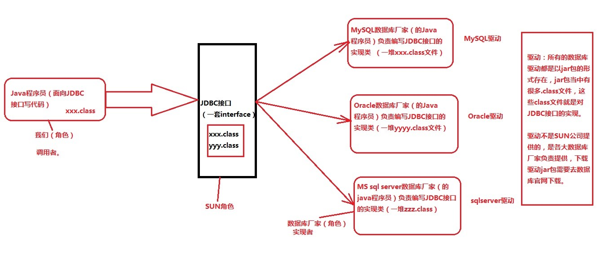

# JDBC 概述

Java DataBase Connectivity（Java语言连接数据库）

## JDBC的本质

JDBC是SUN公司制定的一套接口（interface）,本质是一套接口。
java.sql.*; (这个软件包下有很多接口。)

```java
/*接口都有调用者和实现者。
面向接口调用、面向接口写实现类，这都属于面向接口编程。

为什么要面向接口编程？
	解耦合：降低程序的耦合度，提高程序的扩展力。
	多态机制就是非常典型的：面向抽象编程。（不要面向具体编程）*/
//建议：
	Animal a = new Cat();
	Animal a = new Dog();
	// 喂养的方法
	public void feed(Animal a){ // 面向父类型编程。
			
	}
//不建议：
	Dog d = new Dog();
	Cat c = new Cat();
```



思考：为什么SUN制定一套JDBC接口呢？
		因为每一个数据库的底层实现原理都不一样。
		Oracle数据库有自己的原理。
		MySQL数据库也有自己的原理。
		MS SqlServer数据库也有自己的原理。
		....
		每一个数据库产品都有自己独特的实现原理。

# JDBC编程

第一步：注册驱动（作用：告诉Java程序，即将要连接的是哪个品牌的数据库）

第二步：获取连接（表示JVM的进程和数据库进程之间的通道打开了，这属于进程之间的通信，重量级的，使用完之后一定要关闭通道。）

第三步：获取数据库操作对象（专门执行sql语句的对象）

第四步：执行SQL语句（DQL DML....）

第五步：处理查询结果集（只有当第四步执行的是select语句的时候，才有这第五步处理查询结果集。）

第六步：释放资源（使用完资源之后一定要关闭资源。Java和数据库属于进程间的通信，开启之后一定要关闭。）

​	

​	