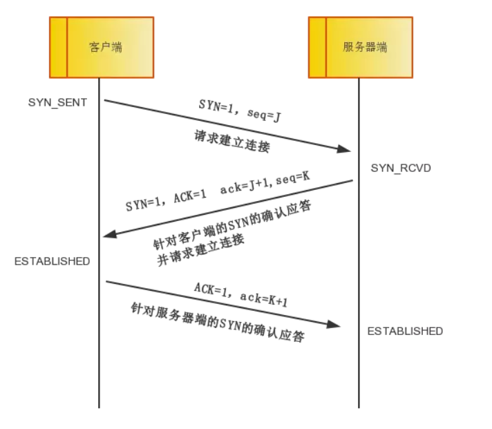
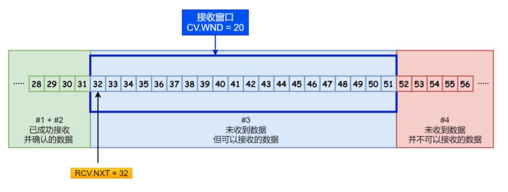
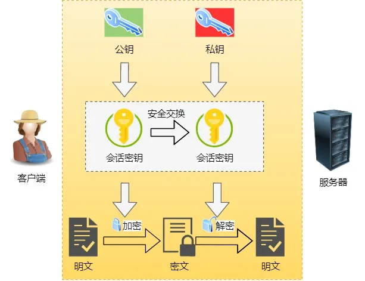

[TOC]


# [**:house:**](../../README.html)

## 一、OSI与TCP/IP各层的功能和结构，都有哪些协议？


### 1.1应用层
- **应用层的任务是通过进程间的交互来完成特定网络应用。** 应用层协议定义的是应用程序间通信和交互的规则，对于不同的网络应用需要不同的应用层协议。
- 互联网中应用层有很多，比如域名系统DNS，支持万维网应用的HTTP协议，支持电子邮件的SMTP协议。
- 应用层交互的数据单元称为**报文**。
- **协议:HTTP，SMTP, DNS**
>域名系统
>是因特网的一项核心服务，它是一个可以将域名与IP地址相互映射的分布式数据库，能够使人更方便的访问互联网，而不用记住能够被机器直接读取恶的IP数串。

>HTTP协议
>超文本传输协议是互联网上应用最为广泛的一种网络协议，所有的www文件都必须遵守这个标准，设置HTTP最初的目的是为了提供一种发布和接收HTML页面的方法。

### 1.2 运输层

- **主要任务是负责向两台主机进程之间的通信提供通用的数据传输服务。** 应用进程利用该服务传输应用层报文。

**运输层主要使用以下两种协议：**

1. **传输控制协议(TCP)**：提供面向连接的，可靠的数据传输服务。
2. **用户数据协议(UDP):**提供无连接的，尽最大努力的数据传输服务(不保证数据传输的可靠性。)


### 1.3 网络层
- 网络层的任务是选择合适的网间路由和交换结点，确保数据及时传送。
- 在TCP/IP体系机构中，由于网络层使用IP协议，因此分组也叫IP数据报。
- **APR协议，IP协议**

### 1.4 数据链路层
- 解决分组在一个网络(或者一段链路)上传输的问题。
- 物理寻址，同时将原始比特流转变为逻辑传输线路。
- **MAC地址**

### 1.5 物理层
- 解决使用何种信号来传输比特流的问题。
- 物理层的作用是实现相邻计算机节点之间比特流透明传送，尽可能屏蔽掉具体传输介质和物理设备的差异。

## 二. TCP三次握手与四次挥手

### 2.1 TCP基本概念

1. **TCP头格式**
   - 序列号：在建⽴连接时由计算机⽣成的随机数作为其初始值，通过 SYN 包传给接收端主机，每发送⼀次数据，就 「累加」⼀次该「数据字节数」的⼤⼩。⽤来解决⽹络包乱序问题.
   - 确认应答号：指下⼀次「期望」收到的数据的序列号，发送端收到这个确认应答以后可以认为在这个序号以前的数据都已经被正常接收。⽤来解决不丢包的问题。
   - 控制位：
     - ACK：该位为 1 时，「确认应答」的字段变为有效，TCP 规定除了最初建⽴连接时的 SYN 包之外该位必 须设置为 1 。
     - RST：该位为 1 时，表示 TCP 连接中出现异常必须强制断开连接。
     - SYN：该位为 1 时，表示希望建⽴连接，并在其「序列号」的字段进⾏序列号初始值的设定。
     - FIN：该位为 1 时，表示今后不会再有数据发送，希望断开连接。当通信结束希望断开连接时，通信双⽅的 主机之间就可以相互交换 FIN 位为 1 的 TCP 段。


2. **为什么需要TCP？TCP工作在哪一层？**

   - IP 层是「不可靠」的，它不保证⽹络包的交付、不保证⽹络包的按序交付、也不保证⽹络包中的数据的完整性。
   - 如果需要保障⽹络数据包的可靠性，那么就需要由上层（传输层）的 TCP 协议来负责。
   - 因为 TCP 是⼀个⼯作在传输层的可靠数据传输的服务，它能确保接收端接收的⽹络包是⽆损坏、⽆间隔、⾮冗余 和按序的。

3. **什么是 TCP ？**

   - TCP 是⾯向连接的、可靠的、基于字节流的传输层通信协议。
     - ⾯向连接：⼀定是「⼀对⼀」才能连接，不能像 UDP 协议可以⼀个主机同时向多个主机发送消息，也就是⼀ 对多是⽆法做到的；
     - 可靠的：⽆论的⽹络链路中出现了怎样的链路变化，TCP 都可以保证⼀个报⽂⼀定能够到达接收端；
     - 字节流：消息是「没有边界」的，所以⽆论我们消息有多⼤都可以进⾏传输。并且消息是「有序的」，当 「前⼀个」消息没有收到的时候，即使它先收到了后⾯的字节，那么也不能扔给应⽤层去处理，同时对「重
       复」的报⽂会⾃动丢弃。

4. **什么是TCP连接？**

   简单来说就是，⽤于保证可靠性和流量控制维护的某些状态信息，这些信息的组合，包括Socket、序列号和窗⼝ ⼤⼩称为连接。所以我们可以知道，建⽴⼀个 TCP 连接是需要客户端与服务器端达成上述三个信息的共识。

   - **Socket**：由 IP 地址和端⼝号组成
   - **序列号**：⽤来解决乱序问题等
   - **窗⼝⼤⼩**：⽤来做流量控制

5. **如何唯⼀确定⼀个 TCP 连接呢？**

   - 源地址和⽬的地址的字段（32位）是在 IP 头部中，作⽤是通过 IP 协议发送报⽂给对⽅主机。
   - 源端⼝和⽬的端⼝的字段（16位）是在 TCP 头部中，作⽤是告诉 TCP 协议应该把报⽂发给哪个进程。

6. **有⼀个 IP 的服务器监听了⼀个端⼝，它的 TCP 的最⼤连接数是多少？**

   最大TCP连接数=客户端的IP数*客户端的端口数

   对 IPv4，客户端的 IP 数最多为 2 的 32 次⽅，客户端的端⼝数最多为 2 的 16 次⽅，也就是服务端单机最 ⼤ TCP 连接数，约为 2 的 48 次⽅。

### 2.1 三次握手

- 客户端发送带有SYN标志的数据包，同时含有客户端生成的随机初始化序号。

  > 客户端会随机初始化序号（ client_isn ），将此序号置于 TCP ⾸部的「序号」字段中，同时把 SYN 标志 位置为 1 ，表示 SYN 报⽂。接着把第⼀个 SYN 报⽂发送给服务端，表示向服务端发起连接，该报⽂不包含应⽤层数据，之后客户端处于 SYN-SENT 状态。

- 服务端发送带有SYN=1，ACK=1 标志的数据包。

  > 服务端收到客户端的 SYN 报⽂后，⾸先服务端也随机初始化⾃⼰的序号（ server_isn ），将此序号填⼊TCP ⾸部的「序号」字段中，其次把  client_isn + 1填⼊TCP ⾸部的「确认应答号」字段 , 接着把 SYN 和 ACK 标志位置为 1 。最后把该报⽂发给客户端，该报⽂也不包含应⽤层数据，之后服务端处于 SYN-RCVD 状态。

- 客户端发送带有ACK=1标志的数据包

  > 客户端收到服务端报⽂后，还要向服务端回应最后⼀个应答报⽂，⾸先该应答报⽂ TCP ⾸部 ACK 标志位 置为 1 ，其次「确认应答号」字段填⼊ server_isn + 1 ，最后把报⽂发送给服务端，这次报⽂可以携带客户到服务器的数据，之后客户端处于 ESTABLISHED 状态。

- 服务器收到客户端的应答报⽂后，也进⼊ ESTABLISHED 状态。



#### 2.1.1为什么是三次握⼿？不是两次、四次？
1. **原因⼀：为了防⽌旧的重复连接初始化造成混乱。**
   - 客户端连续发送多次 SYN 建⽴连接的报⽂，在⽹络拥堵情况下：
     - ⼀个「旧 SYN 报⽂」⽐「最新的 SYN 」 报⽂早到达了服务端；
     - 那么此时服务端就会回⼀个 SYN + ACK 报⽂给客户端；
     - 客户端收到后可以根据⾃身的上下⽂，判断这是⼀个历史连接（序列号过期或超时），那么客户端就会发送 RST 报⽂给服务端，表示中⽌这⼀次连接。
   - 如果是两次握⼿连接，就不能判断当前连接是否是历史连接。
     - 如果是历史连接（序列号过期或超时），则第三次握⼿发送的报⽂是 RST 报⽂，以此中⽌历史连接；
     - 如果不是历史连接，则第三次发送的报⽂是 ACK 报⽂，通信双⽅就会成功建⽴连接；

2. **原因⼆：同步双⽅初始序列号**
   - TCP 协议的通信双⽅， 都必须维护⼀个「序列号」， 序列号是可靠传输的⼀个关键因素。
   - ⽽两次握⼿只保证了⼀⽅的初始序列号能被对⽅成功接收，没办法保证双⽅的初始序列号都能被确认接收。
3. **原因三：避免资源浪费**
   - 如果只有「两次握⼿」，当客户端的 SYN 请求连接在⽹络中阻塞，客户端没有接收到 ACK 报⽂，就会重新发送 SYN ，由于没有第三次握⼿，服务器不清楚客户端是否收到了⾃⼰发送的建⽴连接的 ACK 确认信号，所以每收到⼀个 SYN 就只能先主动建⽴⼀个连接。
   - 如果客户端的 SYN 阻塞了，重复发送多次 SYN 报⽂，那么服务器在收到请求后就会建⽴多个冗余的⽆效链 接，造成不必要的资源浪费。


#### 2.1.2 如果已经建立了连接，但是客户端突然出现了故障怎么办？

TCP还设有一个保活计时器，显然，客户端如果出现故障，服务器不能一直等下去，白白浪费资源。**服务器每收到一次客户端的请求后都会重新复位这个计时器，时间通常是设置为2小时，若两小时还没有收到客户端的任何数据，服务器就会发送一个探测报文段，以后每隔75秒发送一次。若一连发送10个探测报文仍然没反应，服务器就认为客户端出了故障，接着就关闭连接。**

### 2.2 四次挥手
- 刚开始双方处于`established`状态。

- **客户端要断开了，向服务器发送`FIN`报文。** 发送完后客户端变成了`FIN-WAIT-1`状态。同时也变成了`half-close`(半关闭)状态，即无法向服务端发送报文，只能接收。

- **服务端接收后向客户端发送`ACK`**，变成`CLOSED-WAIT`状态。

- 客户端接收到服务端的确认，进入`FIN-WAIT2`状态。

- **服务端向客户端发送`FIN`**,自己进入`LAST-ACK`状态。

- 客户端收到服务器端发来的`FIN`后，**发送`ACK`给服务端**，自己变成了`TIME-WAIT`状态。

- 客户端在经过 2MSL ⼀段时间后，⾃动进⼊ CLOSED 状态，⾄此客户端也完成连接的关闭。这个时候，客户端需要等待足够长的时间，具体来说是2MSL(报文最大存活时间)，在这段时间内如果客户端没有收到服务端的重发请求，那么表示ACK成功到达,挥手结束，否则客户端重发ACK。

  

- 
#### 2.2.1 TIME—WAIT等待2MSL的意义。
- **保证客户端发送的最后一个ACK报文能够到达服务器**，因为这个ACK有可能会丢失。站在服务器的角度看来，我已经发送了FIN+ACK报文请求断开了，客户端还没有给我回应，应该是我发送的请求断开报文它没有收到，于是服务器又会重新发送一次，而客户端就能在这个2MSL时间段内收到这个重传的报文，接着给出回应报文，并且会重启2MSL计时器。

- **防止已经失效的连接请求报文段出现在本连接中。** 如果关闭了连接，又立马新建了一个连接，则上一个连接传输较慢的数据包可能会被新连接接收，破坏新连接。

  >  TIME_WAIT 等待 2 倍的 MSL，⽐较合理的解释是： ⽹络中可能存在来⾃发送⽅的数据包，当这些发送⽅的数据包 被接收⽅处理后⼜会向对⽅发送响应，所以⼀来⼀回需要等待 2 倍的时间。
  >
  > 2MSL 的时间是从客户端接收到 FIN 后发送 ACK 开始计时的。如果在 TIME-WAIT 时间内，因为客户端的 ACK 没有传输到服务端，客户端⼜接收到了服务端重发的 FIN 报⽂，那么 2MSL 时间将重新计时。

#### 2.2.2 为什么要四次挥手？

- 因为服务端在接收到FIN,往往不会立即返回FIN，必须等到服务端所有的报文都发送完毕了，才能发FIN，因此先发一个ACK表示已经收到了客户端的FIN，延迟一段时间才发FIN，这就造成了四次挥手。
- 如果是三次挥手就等于说服务端将ACK和FIN的发送合并为1次，这个时候长时间的延迟可能会导致客户端误以为FIN没有到达服务端，从而让客户端不断的重发FIN.

#### 2.2.3 存在TIME-WAIT一定能保证正常关闭?

## 三. UDP和TCP区别

### 3.1  UDP基本概念

UDP 不提供复杂的控制机制，利⽤ IP 提供⾯向「⽆连接」的通信服务。

UDP 协议真的⾮常简，头部只有 8 个字节（ 64 位），UDP 的头部格式如下：

- ⽬标端口和源端⼝：主要是告诉 UDP 协议应该把报⽂发给哪个进程。
- 包⻓度：该字段保存了 UDP ⾸部的⻓度跟数据的⻓度之和。
- 校验和：校验和是为了提供可靠的 UDP ⾸部和数据⽽设计。
- 数据

### 3.2 TCP和UDP的区别


1. **连接**
   - TCP 是⾯向连接的传输层协议，传输数据前先要建⽴连接。
   - UDP 是不需要连接，即刻传输数据。
2. **服务对象**
   - TCP 是⼀对⼀的两点服务，即⼀条连接只有两个端点。
   - UDP ⽀持⼀对⼀、⼀对多、多对多的交互通信.
3. **可靠性**
   - TCP 是可靠交付数据的，数据可以⽆差错、不丢失、不重复、按需到达。
   - UDP 是尽最⼤努⼒交付，不保证可靠交付数据。
4. **拥塞控制、流量控制**
   - TCP 有拥塞控制和流量控制机制，保证数据传输的安全性。
   - UDP 则没有，即使⽹络⾮常拥堵了，也不会影响 UDP 的发送速率。
5. **首部开销**
   - TCP ⾸部⻓度较⻓，会有⼀定的开销，⾸部在没有使⽤「选项」字段时是 20 个字节，如果使⽤了「选项」 字段则会变⻓的。
   - UDP ⾸部只有 8 个字节，并且是固定不变的，开销较⼩。
6. **传输⽅式**
   - TCP 是流式传输，没有边界，但保证顺序和可靠。
   - UDP 是⼀个包⼀个包的发送，是有边界的，但可能会丢包和乱序。

7. **应⽤场景**
   - 由于 TCP 是⾯向连接，能保证数据的可靠性交付，因此经常⽤于：
     - FTP ⽂件传输,
     - HTTP / HTTPS.
   - 由于 UDP ⾯向⽆连接，它可以随时发送数据，再加上UDP本身的处理既简单⼜⾼效，因此经常⽤于：
     - 包总量较少的通信，如 DNS 、 SNMP 等
     - 视频、⾳频等多媒体通信
     - ⼴播通信

### 3.3 UDP如何实现可靠传输？

传输层无法保证数据的可靠传输，只能通过应用层来实现了。实现的方式可以参照tcp可靠性传输的方式，只是实现不在传输层，实现转移到了应用层。

最简单的方式是在应用层模仿传输层TCP的可靠性传输。下面不考虑拥塞处理，可靠UDP的简单设计。

- 1、添加seq/ack机制，确保数据发送到对端
- 2、添加发送和接收缓冲区，主要是用户超时重传。
- 3、添加超时重传机制。

详细说明：送端发送数据时，生成一个随机seq=x，然后每一片按照数据大小分配seq。数据到达接收端后接收端放入缓存，并发送一个ack=x的包，表示对方已经收到了数据。发送端收到了ack包后，删除缓冲区对应的数据。时间到后，定时任务检查是否需要重传数据。

目前有如下开源程序利用udp实现了可靠的数据传输。分别为**RUDP、RTP、UDT**。

## 四. TCP协议时如何保证可靠传输的。

- 应用数据被分割成TCP认为最适合发送的数据块。
- TCP给发送的每个包进行编号，接收方对数据包进行排序，把有序数据传送给应用层。
- **校验和**：TCP将保证手部和数据的校验和，目的是检测数据在传输过程中的任何变化，如果收到端的检验和有差错，TCP将丢弃这个报文段和不确认收到此报文段。
- TCP的接收端会丢弃重复的数据。
- **流量控制:** 使用**滑动窗口**实现流量控制，接收方发送的确认报文中的窗口字段可以用来控制发送方窗口大小，从而影响发送方的发送速率。将窗口字段设置为 0，则发送方不能发送数据。
- **拥塞控制：** 当网络拥塞时，减少数据的发送。
- **ARQ协议(自动重传请求)：** 每发完一个分组就停止发送，等待对方确认，在收到确认后再发下一个分组。
- **超时重传：** 当 TCP 发出一个段后，它启动一个定时器，等待目的端确认收到这个报文段。如果不能及时收到一个确认，将重发这个报文段。
### 4.1 ARQ协议
**停止等待ARQ协议**
- 基本原理就是每发完一个分组就停止发送，等待对方确认（回复ACK）。如果过了一段时间（超时时间后），还是没有收到 ACK 确认，说明没有发送成功，需要重新发送，直到收到确认后再发下一个分组。
- 优点： **简单**
- 缺点： **信道利用率低，等待时间长**

**连续ARQ协议**
- 发送方维持一个发送窗口，凡是位于发送窗口内的分组可以连续发送出去，而不用等待对方确认。接收方一般采用累计确认，对按序到达的最后一个分组发送确认，表示这个分组为止的所有分组已经正确收到了。
- 优点：**信号利用率高，容易实现**。
- 缺点：**不能向发送方反应出接收方已经正确收到的所有分组的信息**。比如：发送方发送了5条消息，中间第三条丢失(3号)，这是接收方只能对前两个发送确认，发送方无法直到后三个分组的下落，只能把后三个全部重传一次。

### 4.2 滑动窗口
>  TCP 是每发送⼀个数据，都要进⾏⼀次确认应答。当上⼀个数据包收到了应答了， 再发送下⼀个。所以，这样的传输⽅式有⼀个缺点：数据包的往返时间越⻓，通信的效率就越低。为解决这个问题，TCP 引⼊了窗⼝这个概念。即使在往返时间较⻓的情况下，它也不会降低⽹络通信的效率。

1. **指定窗口的大小，也就是指⽆需等待确认应答，⽽可以继续发送数据的最⼤值。**

2. **通常窗⼝的⼤⼩是由接收⽅的窗⼝⼤⼩来决定的。**TCP 头⾥有⼀个字段叫 Window ，也就是窗⼝⼤⼩。 这个字段是接收端告诉发送端⾃⼰还有多少缓冲区可以接收数据。于是发送端就可以根据这个接收端的处理能⼒来发送数据，⽽不会导致接收端处理不过来。

3. **发送方的滑动窗口**

   - 已发送并收到 ACK确认的数据：1~31 字节

   - 已发送但未收到 ACK确认的数据：32~45 字节

   - 未发送但总⼤⼩在接收⽅处理范围内（接收⽅还有空间）：46~51字节

   - 未发送但总⼤⼩超过接收⽅处理范围（接收⽅没有空间）：52字节以后

     **三个接收部分的指针**

   - SND.WND ：表示发送窗⼝的⼤⼩（⼤⼩是由接收⽅指定的）；
   - SND.UNA ：是⼀个绝对指针，它指向的是已发送但未收到确认的第⼀个字节的序列号，也就是 #2 的第⼀ 个字节。
   - SND.NXT ：也是⼀个绝对指针，它指向未发送但可发送范围的第⼀个字节的序列号，也就是 #3 的第⼀个 字节。
   - 指向 #4 的第⼀个字节是个相对指针，它需要 SND.UNA 指针加上 SND.WND ⼤⼩的偏移量，就可以指向 #4 的第⼀个字节了。


- 在下图，当发送⽅把数据「全部」都⼀下发送出去后，可⽤窗⼝的⼤⼩就为 0 了，表明可⽤窗⼝耗尽，在没收到 ACK 确认之前是⽆法继续发送数据了。


- 在下图，当收到之前发送的数据 32~36 字节的 ACK 确认应答后，如果发送窗⼝的⼤⼩没有变化，则滑动窗⼝往 右边移动 5 个字节，因为有 5 个字节的数据被应答确认，接下来 52~56 字节⼜变成了可⽤窗⼝，那么后续也就可以发送 52~56 这 5 个字节的数据了。


4. **接收⽅的滑动窗⼝**

- 分为三部分：
  - #1 + #2 是已成功接收并确认的数据（等待应⽤进程读取）；
  - #3 是未收到数据但可以接收的数据；
  - #4 未收到数据并不可以接收的数据；
- 两个接收部分的指针
  - RCV.WND ：表示接收窗⼝的⼤⼩，它会通告给发送⽅。
  - RCV.NXT ：是⼀个指针，它指向期望从发送⽅发送来的下⼀个数据字节的序列号，也就是 #3 的第⼀个字 节。
  - 指向 #4 的第⼀个字节是个相对指针，它需要 RCV.NXT 指针加上 RCV.WND ⼤⼩的偏移量，就可以指向 #4 的第⼀个字节了。




### 4.3 流量控制

**TCP 利用滑动窗口实现流量控制。流量控制是为了控制发送方发送速率，保证接收方来得及接收。** 接收方发送的确认报文中的窗口字段可以用来控制发送方窗口大小，从而影响发送方的发送速率。将窗口字段设置为 0，则发送方不能发送数据。

### 4.4 拥塞控制

>拥塞控制就是为了防止过多的数据注入到网络中，这样就可以使网络中的路由器或链路不致过载。

拥塞控制的四种算法
- **慢开始**：刚开始发送数据的时候，拥塞窗口的大小为1，之后每经过一次轮回传播，拥塞窗口变为原来的2倍。
- **拥塞避免**：当拥塞窗口的大小到达某个阈值的时候，拥塞窗口的大小每次在之前的基础上加1
- **快重传**：发送方只要一连收到三个重复确认就应当立即重传对方尚未收到的报文段；
- **快恢复**：当发送方收到三个重复确认时，将阈值设为原来的一般，之后将拥塞窗口的大小设置为阈值的大小，接着执行拥塞避免算法。

### 4.5 重传机制

1. 为什么有重传机制?   传输过程中存在数据丢失的问题。所以 TCP 针对数据包丢失的情况，会⽤重传机制解决。

**超时重传**

- 就是在发送数据时，设定⼀个定时器，当超过指定的时间后，没有收到对⽅的 ACK 确认应答报⽂，就会重发该数据，也就是我们常说的超时重传。

- TCP 会在以下两种情况发⽣超时重传：
  - 数据包丢失
  - 确认应答丢失

- 超时时间的设置
  - RTT 就是数据从⽹络⼀端传送到另⼀端所需的时间，也就是包的往返时间。
  - 超时重传时间是以 RTO （Retransmission Timeout 超时重传时间）表示。
  - 假设在重传的情况下，超时时间 RTO 「较⻓或较短」时，会发⽣什么事情呢？
    - 当超时时间 RTO 较⼤时，重发就慢，丢了⽼半天才重发，没有效率，性能差；
    - 当超时时间 RTO 较⼩时，会导致可能并没有丢就重发，于是重发的就快，会增加⽹络拥塞，导致更多的超 时，更多的超时导致更多的重发。
  - 如何估算超时时间 RTO？
    - 需要 TCP 通过采样 RTT 的时间，然后进⾏加权平均，算出⼀个平滑 RTT 的值，⽽且这个值还是要不断变化 的，因为⽹络状况不断地变化。
    - 除了采样 RTT，还要采样 RTT 的波动范围，这样就避免如果 RTT 有⼀个⼤的波动的话，很难被发现的情况。

**快速重传**

所以，快速重传的⼯作⽅式是当收到三个相同的 ACK 报⽂时，会在定时器过期之前，重传丢失的报⽂段。

快速重传机制只解决了⼀个问题，就是超时时间的问题，但是它依然⾯临着另外⼀个问题。就是重传的时候，是重 传之前的⼀个，还是重传所有的问题。

**SACK ⽅法**

这种⽅式需要在 TCP 头部「选项」字段⾥加⼀个 SACK 的东⻄，它可以将缓存的地图发送给发送⽅，这样发送 ⽅就可以知道哪些数据收到了，哪些数据没收到，知道了这些信息，就可以只重传丢失的数据。

**Duplicate SACK**

Duplicate SACK ⼜称 **D-SACK** ，其主要使⽤了 SACK 来告诉「发送⽅」有哪些数据被重复接收了。


## 五. [TCP粘包拆包](https://blog.csdn.net/ailunlee/article/details/95944377)

### 5.1粘包拆包

TCP是面向连接的，面向流的，提供高可靠服务。

由于TCP无消息保护边界，一个完整的包可能会被TCP拆分成多个包发送，也有可能将多个包封装成一个大的数据包发送，这就是所谓的TCP粘包和拆包问题。

- 服务端分两次读取到了两个独立的数据包，分别是D1和D2，没有粘包和拆包；
- 服务端一次接收到了两个数据包，D1包和D2包粘在一起，被称为TCP粘包。
- 服务端分两次读到了两个数据包，第一次读到了完整的D1包和D2包的部分内容，第二次读取到了D2包的剩余内容，这被称为TCP拆包。
- 服务端分两次读取到了两个数据包，第一次读取到了D1包的部分内容D1_1，第二次读取到了D1包的剩余内容D1_2和D2包的整包。
- 如果此时服务端TCP接收滑窗非常小，而数据包D1和D2比较大，很有可能会发生第五种可能，即服务端分多次才能将D1和D2包接收完全，期间发生多次拆包。

### 5.2 粘包拆包原因

- 要发送的数据小于TCP发送缓冲区的大小，TCP多次写入缓冲区的数据一次发送出去，将会发生粘包。
- 接收数据端的应用层没有及时读取接收缓冲区中的数据，将会发生粘包。
- 要发送的数据大于TCP发送缓冲区剩余空间大小，将会产生拆包。
- 待发送数据大于MSS（最大报文长度），TCP在传输前将进行拆包。

### 5.3 粘包拆包解决方法

由于底层的TCP无法理解上层的业务数据，所以在底层是无法保证数据包不被拆分和重组的，这个问题只能通过上层的应用协议栈设计来解决：

- 消息定长：发送端把每个数据包封装成固定长度（不够的可以补零填充）。这样接收端每次接收缓冲区中读取固定长度的数据就可以把每个数据包拆分开来；
- 设置消息边界：服务端从网络流中按照消息边界分离出消息内容。
- 把消息分为消息头和消息体，消息头中包含表示消息总长度的字段。

## 六、[HTTP](https://wardseptember.github.io/notes/#/docs/%E8%AE%A1%E7%AE%97%E6%9C%BA%E7%BD%91%E7%BB%9C/HTTP?id=%e5%85%ad%e3%80%81https)

> 特点
>
> - 无状态：协议对客户端没有状态存储，对事务处理没有记忆能力，比如访问一个网站需要反复登陆操作
> - 无连接：HTTP1.1之前，由于无状态的特点，每次请求都需要通过TCP三次握手四次挥手，和服务器重新建立连接，比如某个客户机再短时间多次请求同一个资源，服务器并不能区分是否已经响应过用户的请求，所以每次需要重新响应请求，需要耗费不必要的时间和流量。
> -  基于请求和响应：基本的特性，由客户端发起，服务端响应
> - 简单快速灵活
> - 通信使用明文，请求和响应不会对通信方进行确认，无法保护数据的完整性。


### 6.1 基础概念

#### 6.1.1 请求和响应报文

客户端发送一个请求报文给服务器，服务器根据请求报文中的信息进行处理，并将处理结果放入响应报文中返回给客户端。

请求报文结构：

- **请求行**：第一行是包含了请求方法、URL、协议版本；
- **首部行**：接下来的多行都是请求首部 Header，每个首部都有一个首部名称，以及对应的值。
- **一个空行用来分隔首部和内容主体 Body**
- 最后是请求的内容主体。(通常不用)

```
GET http://www.example.com/ HTTP/1.1
Accept: text/html,application/xhtml+xml,application/xml;q=0.9,image/webp,image/apng,*/*;q=0.8,application/signed-exchange;v=b3;q=0.9
Accept-Encoding: gzip, deflate
Accept-Language: zh-CN,zh;q=0.9,en;q=0.8
Cache-Control: max-age=0
Host: www.example.com
If-Modified-Since: Thu, 17 Oct 2019 07:18:26 GMT
If-None-Match: "3147526947+gzip"
Proxy-Connection: keep-alive
Upgrade-Insecure-Requests: 1
User-Agent: Mozilla/5.0 xxx

param1=1&param2=2
```

响应报文结构：

- **状态行 **：第一行包含协议版本、状态码以及描述，最常见的是 200 OK 表示请求成功了
- **首部行**：接下来多行也是首部内容
- **一个空行分隔首部和内容主体**
- **最后是响应的内容主体**

```
HTTP/1.1 200 OK
Age: 529651
Cache-Control: max-age=604800
Connection: keep-alive
Content-Encoding: gzip
Content-Length: 648
Content-Type: text/html; charset=UTF-8
Date: Mon, 02 Nov 2020 17:53:39 GMT
Etag: "3147526947+ident+gzip"
Expires: Mon, 09 Nov 2020 17:53:39 GMT
Keep-Alive: timeout=4
Last-Modified: Thu, 17 Oct 2019 07:18:26 GMT
Proxy-Connection: keep-alive
Server: ECS (sjc/16DF)
Vary: Accept-Encoding
X-Cache: HIT

<!doctype html>
<html>
<head>
    <title>Example Domain</title>
	// 省略... 
</body>
</html>
```

#### 6.1.2 URL与URI

- URI(Uniform Resource Identifier) 是统一资源标志符，可以唯一标识一个资源。
- URL(Uniform Resource Location) 是统一资源定位符，可以提供该资源的路径。它是一种具体的 URI，即 URL 可以用来标识一个资源，而且还指明了如何 locate 这个资源。

### 6.2 HTTP方法

客户端发送的请求报文第一行为请求行，包含了方法字段。

**GET**

- 获取资源
- 当前网络请求中，绝大部分使用的是 GET 方法。

**HEAD**

- 获取报文首部
- 和 GET 方法类似，但是不返回报文实体主体部分。
- 主要用于确认 URL 的有效性以及资源更新的日期时间等。

**POST**

- 传输实体主体
- POST 主要用来传输数据，而 GET 主要用来获取资源。

**PUT**

- 上传文件
- 由于自身不带验证机制，任何人都可以上传文件，因此存在安全性问题，一般不使用该方法。

```
PUT /new.html HTTP/1.1
Host: example.com
Content-type: text/html
Content-length: 16

<p>New File</p>
```

**PATCH**

- 对资源进行部分修改
- PUT 也可以用于修改资源，但是只能完全替代原始资源，PATCH 允许部分修改。

```
PATCH /file.txt HTTP/1.1
Host: www.example.com
Content-Type: application/example
If-Match: "e0023aa4e"
Content-Length: 100

[description of changes]
```

**DELETE**

- 删除文件
- 与 PUT 功能相反，并且同样不带验证机制。

```
DELETE /file.html HTTP/1.1
```

**OPTIONS**

- 查询支持的方法
- 查询指定的 URL 能够支持的方法。
- 会返回 `Allow: GET, POST, HEAD, OPTIONS` 这样的内容。

**CONNECT**

- 要求在与代理服务器通信时建立隧道

**TRACE**

- 追踪路径

- 服务器会将通信路径返回给客户端。

- 发送请求时，在 Max-Forwards 首部字段中填入数值，每经过一个服务器就会减 1，当数值为 0 时就停止传输。

  通常不会使用 TRACE，并且它容易受到 XST 攻击（Cross-Site Tracing，跨站追踪）。

### 6.3 HTTP状态码

服务器返回的 **响应报文** 中第一行为状态行，包含了状态码以及原因短语，用来告知客户端请求的结果。

- 1XX

  - 表示接收的请求正在处理，属于信息型状态码(Informational)。
  - **100 Continue** ：表明到目前为止都很正常，客户端可以继续发送请求或者忽略这个响应。

- 2XX

  - 成功状态码，表示请求正常处理完毕
  - **200 OK**
  - **204 No Content** ：请求已经成功处理，但是返回的响应报文不包含实体的主体部分。一般在只需要从客户端往服务器发送信息，而不需要返回数据时使用。
  - **206 Partial Content** ：表示客户端进行了范围请求，响应报文包含由 Content-Range 指定范围的实体内容。

- 3XX

  - 重定向状态码：需要进行附加操作以完成请求

  > URL 重定向，也称为 URL 转发，是一种当实际资源，如单个页面、表单或者整个 Web 应用被迁移到新的 URL 下的时候，保持（原有）链接可用的技术。HTTP 协议提供了一种特殊形式的响应—— HTTP 重定向（HTTP redirects）来执行此类操作。

  - **301 Moved Permanently** ：永久性重定向。这种重定向操作是永久性的。它表示原 URL 不应再被使用，而应该优先选用新的 URL。
  - **302 Found** ：临时性重定向.
  - **303 See Other** ：和 302 有着相同的功能，但是 303 明确要求客户端应该采用 GET 方法获取资源。

- 4XX

  - 客户端错误状态码, 服务器无法处理请求
  - **400 Bad Request** ：请求报文中存在语法错误。
  - **01 Unauthorized** ：该状态码表示发送的请求需要有认证信息（BASIC 认证、DIGEST 认证）。如果之前已进行过一次请求，则表示用户认证失败。
  - **403 Forbidden** ：请求被拒绝。
  - **404 Not Found**
  - **304 Not Modified** ：如果请求报文首部包含一些条件，例如：If-Match，If-Modified-Since，If-None-Match，If-Range，If-Unmodified-Since，如果不满足条件，则服务器会返回 304 状态码。
  - **07 Temporary Redirect** ：临时重定向，与 302 的含义类似，但是 307 要求浏览器不会把重定向请求的 POST 方法改成 GET 方法。

- 5XX

  - 服务器错误状态码，服务器处理请求出错。
  - **500 Internal Server Error** ：服务器正在执行请求时发生错误。
  - **503 Service Unavailable** ：服务器暂时处于超负载或正在进行停机维护，现在无法处理请求。

### 6.4 HTTP首部

**通用首部字段**

|    首部字段名     |                    说明                    |
| :---------------: | :----------------------------------------: |
|   Cache-Control   |               控制缓存的行为               |
|    Connection     | 控制不再转发给代理的首部字段、管理持久连接 |
|       Date        |             创建报文的日期时间             |
|      Pragma       |                  报文指令                  |
|      Trailer      |             报文末端的首部一览             |
| Transfer-Encoding |         指定报文主体的传输编码方式         |
|      Upgrade      |               升级为其他协议               |
|        Via        |            代理服务器的相关信息            |
|      Warning      |                  错误通知                  |

**请求首部字段**

|     首部字段名      |                      说明                       |
| :-----------------: | :---------------------------------------------: |
|       Accept        |            用户代理可处理的媒体类型             |
|   Accept-Charset    |                  优先的字符集                   |
|   Accept-Encoding   |                 优先的内容编码                  |
|   Accept-Language   |             优先的语言（自然语言）              |
|    Authorization    |                  Web 认证信息                   |
|       Expect        |              期待服务器的特定行为               |
|        From         |               用户的电子邮箱地址                |
|        Host         |               请求资源所在服务器                |
|      If-Match       |              比较实体标记（ETag）               |
|  If-Modified-Since  |               比较资源的更新时间                |
|    If-None-Match    |        比较实体标记（与 If-Match 相反）         |
|      If-Range       |      资源未更新时发送实体 Byte 的范围请求       |
| If-Unmodified-Since | 比较资源的更新时间（与 If-Modified-Since 相反） |
|    Max-Forwards     |                 最大传输逐跳数                  |
| Proxy-Authorization |         代理服务器要求客户端的认证信息          |
|        Range        |               实体的字节范围请求                |
|       Referer       |            对请求中 URI 的原始获取方            |
|         TE          |                传输编码的优先级                 |
|     User-Agent      |              HTTP 客户端程序的信息              |

**响应首部字段**

|     首部字段名     |             说明             |
| :----------------: | :--------------------------: |
|   Accept-Ranges    |     是否接受字节范围请求     |
|        Age         |     推算资源创建经过时间     |
|        ETag        |        资源的匹配信息        |
|      Location      |   令客户端重定向至指定 URI   |
| Proxy-Authenticate | 代理服务器对客户端的认证信息 |
|    Retry-After     |   对再次发起请求的时机要求   |
|       Server       |    HTTP 服务器的安装信息     |
|        Vary        |   代理服务器缓存的管理信息   |
|  WWW-Authenticate  |   服务器对客户端的认证信息   |

**实体首部字段**

|    首部字段名    |          说明          |
| :--------------: | :--------------------: |
|      Allow       | 资源可支持的 HTTP 方法 |
| Content-Encoding | 实体主体适用的编码方式 |
| Content-Language |   实体主体的自然语言   |
|  Content-Length  |     实体主体的大小     |
| Content-Location |   替代对应资源的 URI   |
|   Content-MD5    |   实体主体的报文摘要   |
|  Content-Range   |   实体主体的位置范围   |
|   Content-Type   |   实体主体的媒体类型   |
|     Expires      | 实体主体过期的日期时间 |
|  Last-Modified   | 资源的最后修改日期时间 |

### 6.5 http长连接与短连接

>https://www.cnblogs.com/gotodsp/p/6366163.html
- **在http/1.0中默认使用短连接**，也就是说，**客户端和服务器端每进行一次HTTP操作就建立一次连接，任务结束就中断连接。**当客户端浏览器访问的某个HTML或者其他类型的web页中包含有其他的web资源(如JavaScript文件，图像文件，CSS文件等)，每遇到这样一个web资源，浏览器就会重新建立一个http会话。
- **从http/1.1起，默认使用长连接**。 当一个网页打开完成后，**客户端和服务器端用于传输HTTP数据的TCP连接不会关闭，** 客户端再次访问这个服务器时，会继续使用这一条已经建立的连接，`keep-alive`不会永久保持连接，他有一个保持时间，可以在不同的服务器软件设定这个时间。
- **长连接用于操作频繁，点对点的通信，而且连接数不能太多的情况**。
- **短连接适合用于并发量大，每个用户无需频繁的操作。**

### 6.6 HTTP如何保存用户状态
- HTTP时一种不保持状态，即无状态协议。
- HTTP 协议是无状态的，主要是为了让 HTTP 协议尽可能简单，使得它能够处理大量事务。HTTP/1.1 引入 Cookie 来保存状态信息。

### 6.7 Cookie与Session

**1. Cookie**

- HTTP 协议是无状态的，主要是为了让 HTTP 协议尽可能简单，使得它能够处理大量事务。HTTP/1.1 引入 Cookie 来保存状态信息。

- Cookie 是服务器发送到用户浏览器并保存在本地的一小块数据，它会在浏览器之后向同一服务器再次发起请求时被携带上，用于告知服务端两个请求是否来自同一浏览器。由于之后每次请求都会需要携带 Cookie 数据，因此会带来额外的性能开销（尤其是在移动环境下）。
- Cookie 曾一度用于客户端数据的存储，因为当时并没有其它合适的存储办法而作为唯一的存储手段，但现在随着现代浏览器开始支持各种各样的存储方式，Cookie 渐渐被淘汰。新的浏览器 API 已经允许开发者直接将数据存储到本地，如使用 Web storage API（本地存储和会话存储）或 IndexedDB。

**2.Cookie 的作用**

- 会话状态管理（如用户登录状态、购物车、游戏分数或其它需要记录的信息
- 个性化设置（如用户自定义设置、主题等）
- 浏览器行为跟踪（如跟踪分析用户行为等）

**3. 创建过程**

服务器发送的响应报文包含 Set-Cookie 首部字段，客户端得到响应报文后把 Cookie 内容保存到浏览器中。

```
HTTP/1.0 200 OK
Content-type: text/html
Set-Cookie: yummy_cookie=choco
Set-Cookie: tasty_cookie=strawberry

[page content]
```

客户端之后对同一个服务器发送请求时，会从浏览器中取出 Cookie 信息并通过 Cookie 请求首部字段发送给服务器。

```
GET /sample_page.html HTTP/1.1
Host: www.example.org
Cookie: yummy_cookie=choco; tasty_cookie=strawberry
```

**4. 分类**

- 会话期 Cookie：浏览器关闭之后它会被自动删除，也就是说它仅在会话期内有效。
- 持久性 Cookie：指定过期时间（Expires）或有效期（max-age）之后就成为了持久性的 Cookie。

```
Set-Cookie: id=a3fWa; Expires=Wed, 21 Oct 2015 07:28:00 GMT;
```

**5. 作用域**

Domain 标识指定了哪些主机可以接受 Cookie。如果不指定，默认为当前文档的主机（不包含子域名）。如果指定了 Domain，则一般包含子域名。例如，如果设置 Domain=mozilla.org，则 Cookie 也包含在子域名中（如 developer.mozilla.org）。

Path 标识指定了主机下的哪些路径可以接受 Cookie（该 URL 路径必须存在于请求 URL 中）。以字符 %x2F ("/") 作为路径分隔符，子路径也会被匹配。例如，设置 Path=/docs，则以下地址都会匹配：

- /docs
- /docs/Web/
- /docs/Web/HTTP

**6. HttpOnly**

标记为 HttpOnly 的 Cookie 不能被 JavaScript 脚本调用。跨站脚本攻击 (XSS) 常常使用 JavaScript 的 `document.cookie` API 窃取用户的 Cookie 信息，因此使用 HttpOnly 标记可以在一定程度上避免 XSS 攻击。

```
Set-Cookie: id=a3fWa; Expires=Wed, 21 Oct 2015 07:28:00 GMT; Secure; HttpOnly
```

**7. Secure**

标记为 Secure 的 Cookie 只能通过被 HTTPS 协议加密过的请求发送给服务端。但即便设置了 Secure 标记，敏感信息也不应该通过 Cookie 传输，因为 Cookie 有其固有的不安全性，Secure 标记也无法提供确实的安全保障.

**8. Session**

除了可以将用户信息通过 Cookie 存储在用户浏览器中，也可以利用 Session 存储在服务器端，存储在服务器端的信息更加安全。

Session 可以存储在服务器上的文件、数据库或者内存中。也可以将 Session 存储在 Redis 这种内存型数据库中，效率会更高。

使用 Session 维护用户登录状态的过程如下：

- 用户进行登录时，用户提交包含用户名和密码的表单，放入 HTTP 请求报文中；
- 服务器验证该用户名和密码，如果正确则把用户信息存储到 Redis 中，它在 Redis 中的 Key 称为 Session ID；
- 服务器返回的响应报文的 Set-Cookie 首部字段包含了这个 Session ID，客户端收到响应报文之后将该 Cookie 值存入浏览器中；
- 客户端之后对同一个服务器进行请求时会包含该 Cookie 值，服务器收到之后提取出 Session ID，从 Redis 中取出用户信息，继续之前的业务操作。

应该注意 Session ID 的安全性问题，不能让它被恶意攻击者轻易获取，那么就不能产生一个容易被猜到的 Session ID 值。此外，还需要经常重新生成 Session ID。在对安全性要求极高的场景下，例如转账等操作，除了使用 Session 管理用户状态之外，还需要对用户进行重新验证，比如重新输入密码，或者使用短信验证码等方式。

**9.浏览器禁用 Cookie**

此时无法使用 Cookie 来保存用户信息，只能使用 Session。除此之外，不能再将 Session ID 存放到 Cookie 中，而是使用 URL 重写技术，将 Session ID 作为 URL 的参数进行传递。

**10.Cookie 与 Session 选择**

- Cookie 只能存储 ASCII 码字符串，而 Session 则可以存储任何类型的数据，因此在考虑数据复杂性时首选 Session；
- Cookie 存储在浏览器中，容易被恶意查看。如果非要将一些隐私数据存在 Cookie 中，可以将 Cookie 值进行加密，然后在服务器进行解密；
- 对于大型网站，如果用户所有的信息都存储在 Session 中，那么开销是非常大的，因此不建议将所有的用户信息都存储到 Session 中。

### 6.8 HTTP1.0和HTTP1.1,HTTP 2,HTTP3的区别

**HTTP1.0和HTTP1.1的区别**

1. **长连接和短连接:** http1.0默认使用短连接，那就是每发起一个请求，都要新建一次 TCP 连接（三次握手），而且是串行请求，做了无谓的 TCP 连接建立和断开，增加了通信开销。http1.1默认使用长连接。也就是只要任意一端没有明确提出断开连接，则保持 TCP 连接状态。这种方式的好处在于减少了 TCP 连接的重复建立和断开所造成的额外开销，减轻了服务器端的负载。
4. **管道（pipeline）网络传输**：HTTP1.1采用管道网络传输的方式，只要第一个请求发出去了，不必等其回来，就可以发第二个请求出去，可以减少整体的响应时间。

**HTTP1.1存在的问题**

- 请求 / 响应头部（Header）未经压缩就发送，首部信息越多延迟越大。只能压缩 `Body` 的部分；
- 发送冗长的首部。每次互相发送相同的首部造成的浪费较多；
- 服务器是按请求的顺序响应的，如果服务器响应慢，会招致客户端一直请求不到数据，也就是队头阻塞；
- 没有请求优先级控制；
- 请求只能从客户端开始，服务器只能被动响应。

**HTTP2.0对HTTP1.0的优化**

1. **头部压缩：** 如果同时发出多个请求，头部是一样的或者是相似的。
2. **二进制格式** 
- HTTP/2 不再像 HTTP/1.1 里的纯文本形式的报文，而是全面采用了二进制格式。
- 头信息和数据体都是二进制，并且统称为帧（frame）：头信息帧和数据帧。
- 那么收到报文后，无需再将明文的报文转成二进制，而是直接解析二进制报文，这增加了数据传输的效率。
3. **数据流**
- HTTP/2 的数据包不是按顺序发送的，同一个连接里面连续的数据包，可能属于不同的回应。因此，必须要对数据包做标记，指出它属于哪个回应。

- 每个请求或回应的所有数据包，称为一个数据流（Stream）。

- 每个数据流都标记着一个独一无二的编号，其中规定客户端发出的数据流编号为奇数， 服务器发出的数据流编号为偶数

- 客户端还可以指定数据流的优先级。优先级高的请求，服务器就先响应该请求。


4. **多路复用**
- HTTP/2 是可以在一个连接中并发多个请求或回应，而不用按照顺序一一对应。

- 移除了 HTTP/1.1 中的串行请求，不需要排队等待，也就不会再出现「队头阻塞」问题，降低了延迟，大幅度提高了连接的利用率。

- 举例来说，在一个 TCP 连接里，服务器收到了客户端 A 和 B 的两个请求，如果发现 A 处理过程非常耗时，于是就回应 A 请求已经处理好的部分，接着回应 B 请求，完成后，再回应 A 请求剩下的部分。

5. **服务器推送**
- HTTP/2 还在一定程度上改善了传统的「请求 - 应答」工作模式，服务不再是被动地响应，也可以主动向客户端发送消息。

- 举例来说，在浏览器刚请求 HTML 的时候，就提前把可能会用到的 JS、CSS 文件等静态资源主动发给客户端，减少延时的等待，也就是服务器推送（Server Push，也叫 Cache Push）。
### 6.9 GET与POST比较

1. **作用**
   - GET ⽅法的含义是请求从服务器获取资源，这个资源可以是静态的⽂本、⻚⾯、图⽚视频等。⽽ POST ⽅法则是相反操作，它向 URI 指定的资源提交数据，数据就放在报⽂的 body ⾥。
2. **参数**
3. **安全**
   - 安全的 HTTP 方法不会改变服务器状态，也就是说它只是可读的。
   - **GET 方法是安全的**，而 **POST 却不是安全的**，因为 POST 的目的是传送实体主体内容，这个内容可能是用户上传的表单数据，上传成功之后，服务器可能把这个数据存储到数据库中，因此状态也就发生了改变。
   - 安全的方法除了 GET 之外还有：HEAD、OPTIONS。
   - 不安全的方法除了 POST 之外还有 PUT、DELETE。
4. **幂等性**
   - 幂等的 HTTP 方法，同样的请求被执行一次与连续执行多次的效果是一样的，服务器的状态也是一样的。换句话说就是，幂等方法不应该具有副作用（统计用途除外）。
   - 所有的安全方法也都是幂等的。**GET 方法幂等的**，而 **POST 却不是幂等的**
   - 在正确实现的条件下，GET，HEAD，PUT 和 DELETE 等方法都是幂等的，而 POST 方法不是。
   - GET /pageX HTTP/1.1 是幂等的，连续调用多次，客户端接收到的结果都是一样的：
   - POST /add_row HTTP/1.1 不是幂等的，如果调用多次，就会增加多行记录：
   - DELETE /idX/delete HTTP/1.1 是幂等的，即使不同的请求接收到的状态码不一样：
5. **可缓存**
6. **MLHttpRequest**

## 七、HTTPS

### 7.1 HTTPS和HTTP的区别

>https://wardseptember.github.io/notes/#/docs/%E8%AE%A1%E7%AE%97%E6%9C%BA%E7%BD%91%E7%BB%9C/HTTP?id=get
1. **安全问题：** HTTP是超文本传输协议，信息是明文传输，存在安全风险的问题。HTTPS解决了HTTP不安全的缺陷,在TCP和HTTP网络层之间加入了SSL/TLS安全协议，使得报文能够加密传输。
2. **建立连接的过程:** HTTP连接建立相对简单，TCP三次握手之后就可以进行HTTP的报文传输，而HTTPS在TCP三次握手之后，还需要SSL/TLS的握手过程，才可进入加密报文传输。
3. **端口号：** HTTP的端口号是80，HTTPS的端口号是443.
4. HTTPS协议需要向CA申请数字证书，来保证服务器的身份是可信的。
### 7.2 HTTPS解决了HTTP的哪些问题？
**HTTP**:
- **窃听风险**：使用明文进行通信，内容很可能被窃听；
- **篡改风险：** 无法证明报文的完整性,报文有可能遭篡改。
- **冒充风险：** 不验证通信方的身份，通信方的身份有可能遭遇伪装。

**HTTPS**:
- **信息加密：** **混合加密**的方式实现信息的机密性，解决了窃听的风险；
- **校验机制：** **摘要算法**实现完整性，能为数据生成独一无二的指纹，解决了窜改的风险；
- **身份证书：** 将服务器公钥放入到**数字证书**中，解决了冒充的风险。

### 7.3 HTTPS保证安全的三种方法。
1. 混合加密
通过混合加密的方式可以保证信息的机密性，解决了窃听的风险。


- [ ] 采用对称加密和非对称结合的**混合加密**的方式。

- **在通信建立前采用非对称加密的方式交换会话密钥，服务端有私钥和公钥，客户端获取公钥，同时生成随机密钥使用公钥加密发给服务端，服务端使用私钥进行解密获取对称加密中的密钥。后续就不再使用非对称加密。**

- 在通信过程中全部使用对称加密的会话密钥的方式加密明文数据。

- [ ] 采用混合加密方式的原因

- 对称加密：只有一个密钥，运算速度快，密钥必须保密，无法做到安全的密钥交换。

- 非对称加密: 使用两个密钥，公钥和私钥，公钥可以任意分发而私钥保密，解决了密钥交换问题但速度慢。

  > 对称加密：编解码使用相同的密钥。
  >
  > 非对称加密：有两个密钥，一个叫公钥，一个叫私钥，两个密钥是不同的，公钥可以公开给任何人使用，而私钥必须严格保密，非对称加密可以解决密钥交换问题。网站秘密保管私钥，在网上任意分发公钥，想要登陆网站只要用公钥加密就行。密文只能由私钥持有者才能解密。而黑客因为没有私钥，所以无法破解密文。非对称密钥加密系统通常需要大量的数据运算，比较慢。
  >
  > 
2. 摘要算法
- 用来实现**完整性**，能够为数据生成独一无二的指纹，用于校验数据的完整性， **解决了篡改的风险**。

- 客户端在发送明文之前会通过摘要算法算法出明文的摘要，发送的时候将摘要和明文一同加密成密文后，发送给服务器，服务器解密后，用相同的摘要算法算出发送过来的明文，通过比较客户端携带的摘要和当前算出来的摘要做比较，若指纹相同，则说明数据是完整的。

  >摘要算法能够将任意长度的数据压缩成固定长度，而且独一无二的摘要字符串，就好像是给这串数据生成了一个数字指纹，任意微小的数据差异，都可以生成完全不同的摘要，所以可以通过把明文信息的摘要和明文一起加密传输，数据传输到对方之后再进行解密，重新对数据进行摘要，再对比就能发现数据有没有被篡改，这样就保证了数据的完整性。
  >
  >

  
3. 数字证书

客户端先向服务器索要公钥，然后用公钥加密信息，服务器收到密文后，用自己的私钥解密，这样即存在问题，如何保证公钥不被篡改？
- 借助第三方权威机构CA,将服务器公钥放在数字证书中，只要证书是可信的，公钥就可信。

> 数字证书组成：CA信息，公钥用户信息，公钥，权威机构的签名，有效期。
>
> 作用 ：通过数字证书向浏览器证明身份。数字证书里面包含公钥。

### 7.4 HTTPS是如何建立连接的？
1. TCP三次握手
2. SSL/TLS 协议
- 客户端向服务器索要并验证服务器的公钥。(建立连接的过程)
- 双方协商生产会话密钥。(建立连接的过程)
- 双方采用会话密钥进行加密通信。

**建立连接的过程涉及四次通信**
- **ClientHello：** **由客户端向服务器发起加密通信请求**，也就是 ClientHello 请求。主要发送以下信息:

  - 客户端支持的SSL/TLS协议版本；
  - 客户端生产的**随机数**`Client Random`,后面用于生产会话密钥。
  - 客户端支持的**密码套件列表**，如RSA加密算法。

- **SeverHello：** **服务器收到客户端请求后，向客户端发出响应**，也就是 SeverHello。主要发送以下内容：

  - 确认SSL/TLS协议版本，如果浏览器不支持，则关闭加密通信。
  - 服务器生产的随机数(`Server Random`)，后面用于生产会话密钥。
  - 确认的密码套件列表，如RSA加密算法。
  - ）服务器的数字证书。

- **客户端回应：** **客户端收到服务器的回应之后，首先通过浏览器或者操作系统中的 CA 公钥，确认服务器的数字证书的真实性。如果证书没有问题，客户端会从数字证书中取出服务器的公钥，然后使用它加密报文**，向服务器发送如下信息:

  - 一个随机数(`pre-master key`),该随机数会被服务器公钥加密。
  - 加密通信算法改变通知，表示随后的信息都将用会话密钥加密通信。
  - 客户端握手结束通知，表示客户端的握手阶段已经结束，这一项同时把之前的内容的发生的数据做个摘要，用来供服务端校验。

  上面第一项的随机数是整个握手阶段的第三个随机数，这样服务器和客户端就同时有三个随机数了，接着就用双方协商的加密算法，各自生成本次的会话密钥。

- **服务器的最后回应：** **服务器收到客户端的第三个随机数（pre-master key）之后，通过协商的加密算法，使用客户端随机数+服务端随机数+pre-master key 三个随机数计算出本次通信的「会话秘钥」。**然后，向客户端发生最后的信息。

  - 加密通信算法改变通知，表示随后的信息都将会用会话密钥加密通信。
  - 服务器握手结束通知，表示服务器的握手阶段已经结束，这一项同时把之前所有内容的发生的数据做个摘要，用来供客户端校验。

  至此，整个SSL/TLS握手阶段全部结束。接下来，客户端与服务器端进入加密通信，就是完全使用普通的HTTP协议，只不过使用会话密钥加密内容。
## 八、[MAC地址，IP地址和ARP协议](https://www.bilibili.com/video/BV1c4411d7jb)

#### 8.1 MAC地址

- MAC地址是以太网的MAC子层所使用的地址，它位于数据链路层；
- 当多个主机连接在同一个广播信道上，要实现两个主机之间的通信，则每个主机必须有一个唯一的标识，也就是一个数据链路层地址。
- 在每个主机发送的帧中必须携带标识发送主机和接收主机的地址。由于这类地址是用于媒体接入控制MAC,因此这类地址被称为MAC地址。
- MAC地址是对网络上各接口的唯一标识，而不是对网络上各设备的唯一标识。

#### 8.2 IP地址

- IP地址是TCP/IP体系结构网际层所使用的地址。

- IP地址是因特网上的主机和路由器所使用的地址，用于标识两部分信息。
  - 网络编号：标识因特网上数以百计的网络(如192.168.1.2中的192.168.1.)
  - 主机编号：标识同一网络上不同主机(或路由器各接口，192.168.1.2中的2)
- MAC地址不具备区分不同不同网络的功能。
  - 如果只是一个单独的网络，不接入因特网，可以只使用MAC地址。
  - 如果主机所在的网络要接入因特网，则IP地址和MAC地址都需要。

#### 8.3 ARP协议

- 在封装MAC时，只知道IP地址，但是不知道MAC地址，通过地址解析协议，将IP地址解析为MAC地址。
- 具体流程：
  - 源主机在自己的ARP高速缓存表中查找目的主机的IP地址所对应的MAC地址，若找到了，则可以封装MAC帧进行发送，若找不到就发送ARP请求(封装在广播MAC帧中)。
  - 目的主机收到ARP请求后，将源主机的IP地址与MAC地址记录到自己的ARP高速缓存表中，然后给源主机发送ARP响应(封装在单播MAC帧中)，ARP响应中包含有目的主机的IP地址和MAC地址。
  - 源主机收到ARP响应后，将目的主机的IP地址与MAC地址记录到自己的ARP高速缓存表中，然后就可以封装之前想要发送的MAC帧并发送给目的主机。
- APR只能用于同一个链路中。

## 九、在浏览器输入url地址会怎么样？

>https://segmentfault.com/a/1190000006879700

- 浏览器向DNS请求解析出域名的IP地址
  - 浏览器搜索自己的DNS缓存
  - 若没有，则搜索操作系统中的缓存
  - 若没有，则搜索操作系统hosts文件
  - 若没有，则操作系统将域名发送至本地域名服务器（递归查询方式）查询自身的DNS
- 三次握手建立TCP连接
- 浏览器发送HTTP请求
- 服务器接受并解析HTTP请求，查找指定资源，返回http响应消息
- 浏览器解析渲染页面
- 关闭TCP连接

> 假设url为 http://www.server.com/dir1/file1.html

- 对URL进行解析，获取web服务器和文件名，根据这些信息生成HTTP请求
- **DNS解析**：查询服务器域名对应的 IP 地址
  - 客户端⾸先会发出⼀个 DNS 请求，问 www.server.com 的 IP 是啥，并发给本地 DNS 服务器（也就是客户端 的 TCP/IP 设置中填写的 DNS 服务器地址）。
  - **本地域名服务器**收到客户端的请求后，如果缓存⾥的表格能找到 www.server.com，则它直接返回 IP 地址。 如果没有，本地 DNS 会去问它的根域名服务器：“⽼⼤， 能告诉我 www.server.com 的 IP 地址吗？” 根域名服务器是最⾼层次的，它不直接⽤于域名解析，但能指明⼀条道路。
  - **根域名服务器**收到来⾃本地 DNS 的请求后，发现后置是 .com，说：“www.server.com 这个域名归 .com 区域管理”，我给你 .com 顶级域名服务器地址给你，你去问问它吧。”
  - **顶级域名服务器**     .com
  - **权威 DNS 服务器**  server.com
- 三次握手建立TCP连接
- 浏览器发送HTTP请求
- 服务器接受并解析HTTP请求，查找指定资源，返回http响应消息
- 浏览器解析渲染页面
- 关闭TCP连接


## 参考

1. http://www.cyc2018.xyz/%E8%AE%A1%E7%AE%97%E6%9C%BA%E5%9F%BA%E7%A1%80/HTTP/HTTP.html#%E4%B8%80-%E3%80%81%E5%9F%BA%E7%A1%80%E6%A6%82%E5%BF%B5
2. https://snailclimb.gitee.io/javaguide/#/docs/network/%E8%AE%A1%E7%AE%97%E6%9C%BA%E7%BD%91%E7%BB%9C
3. 图解网络-小林coding-v3.0

