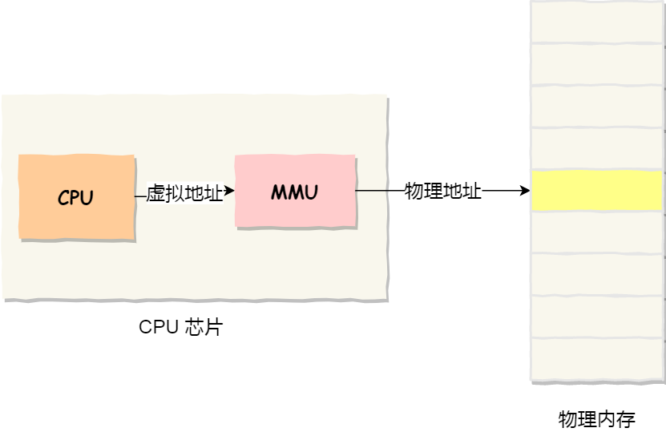

[TOC]

# [**:house:**](../../README.html)

## 操作系统基础
### 什么是操作系统？
1. **操作系统本质上是一个运行在计算机上的软件程序，用于管理计算机硬件和软件资源。是计算机的基石。** 举例：运行在电脑上的所有应用程序都是通过操作系统来调用系统内存以及磁盘等硬件。
2. **操作系统的存在屏蔽了硬件层的复杂性。** 操作系统就像硬件使用的负责人，统筹着各种相关事项。
3. **操作系统的内核（Kernel）是操作系统的核心部分，它负责系统的内存管理，硬件设备的管理，文件系统的管理以及应用程序的管理。** 内核是连接应用程序和硬件的桥梁，决定着系统的性能和稳定性。

### 什么是系统调用？
根据进程访问资源的特点，可以把进程在系统上的运行分为两个级别：

1.**用户态** ：当进程在执行用户自己的代码时，则称为其处于用户态，这时候CPU访问资源有限，运行在用户态的程序不能直接访问操作系统的内核数据结构和程序。
2.**系统态（内核态）:**  系统态运行的进程或者程序几乎可以访问计算机的任何资源，不受限制。

**一般运行的程序基本都是在用户态，当需要调用操作系统系统态级别的子功能时，就需要系统调用。** 也就是说在我们运行的用户程序中，凡是系统态级别的资源有关的操作（如文件管理，进程管理，内存管理等），都必须通过系统调用方式向操作系统提出服务请求，并由操作系统代为完成。

系统调用按功能可以分为以下几类：
- **设备管理。** 完成设备的请求或者释放，以及设备启动等功能。
- **文件管理。** 完成文件的读，写，创建及删除等功能。
- **进程管理。** 完成进程的创建，撤销，阻塞及唤醒等功能。
- **进程通信。** 完成进程之间的消息传递或者信号传递等功能。
- **内存管理。** 完成内存的分配，回收，以及获取作业占用内存区大小及地址等功能。

## 进程和线程
>https://mp.weixin.qq.com/s/YXl6WZVzRKCfxzerJWyfrg
### 进程和线程的区别
1. **进程时资源分配的最小单元，线程是CPU调度的最小单元。**
2. **线程依赖于进程而存在，一个线程只能属于一个进程，而一个进程可以有一个或者多个线程。**
3. **进程在执行过程中拥有独立的内存单元，而多个线程共享进程的内存。** 从JVM的角度来看，多个线程共享进程的堆和方法区（JDK1.8之后的元空间）资源，但是每个线程都有自己的程序计数器，虚拟机栈和本地方法栈。
4. **各进程是独立的，但是各线程则不一定，因为同一个进程中的线程极有可能相互影响。**
5. **线程执行开销小，但是不利于资源的管理和保护，但是进程正好相反。** 

Ⅰ 拥有资源

进程是资源分配的基本单位，但是线程不拥有资源，线程可以访问隶属进程的资源。

Ⅱ 调度

线程是独立调度的基本单位，在同一进程中，线程的切换不会引起进程切换，从一个进程中的线程切换到另一个进程中的线程时，会引起进程切换。

Ⅲ 系统开销

由于创建或撤销进程时，系统都要为之分配或回收资源，如内存空间、I/O 设备等，所付出的开销远大于创建或撤销线程时的开销。类似地，在进行进程切换时，涉及当前执行进程 CPU 环境的保存及新调度进程 CPU 环境的设置，而线程切换时只需保存和设置少量寄存器内容，开销很小。

Ⅳ 通信方面

线程间可以通过直接读写同一进程中的数据进行通信，但是进程通信需要借助 IPC。

### 进程有哪几种状态?
进程分为五种状态：
1. **创建状态：** 进程正在被创建，尚未到达就绪状态。
2. **就绪状态：** 进程已经处于准备运行状态，也就是进程已经获取到除了处理器以外的一切所需资源，一旦得到处理器资源（处理器分配的时间片）就可以运行。
3. **运行状态：** 进程正在处理器上运行。
4. **阻塞状态：** 进程正在等待某一件事件而暂停运行如等待某资源为可用或者等待IO操作完成，即使处理器空闲，该进程也不能运行。
5. **结束状态：** 进程正在从系统中消失。可能是进程正常结束或者因为其他原因中断退出运行。
### 进程间通信的方式

> **进程间通信的概念**
    每个进程各自有不同的用户地址空间，任何一个进程的全局变量在另一个进程中都看不到，所以进程之间要交换数据必须通过内核，在内核中开辟一块缓冲区，进程1把数据从用户空间拷贝到内核缓冲区，进程2再从内核缓冲区把数据读走，内核提供的这种机制就是**进程间通信**。

进程间通信有7种方式: https://blog.csdn.net/vicoqi/article/details/109487692

 **匿名管道** 
- **用于具有亲缘关系的父子进程间或者兄弟进程之间的通信。** 管道对于管道两端的进程而言，就是一个文件，但是他不属于某种文件系统，只存在于内存中。
- **无格式的字节流数据并且大小受限。** 这就要求管道的读出方和写入方事先约定好数据的格式。
- **通信方式是单向的。** 如果需要双向通信，就要建立两个管道。
- **匿名管道的生命周期随着进程创建而建立，随着进程终止而消失。**

**有名管道**：
- **可以在不相关的进程间通信。** 有名管道的名字存在文件系统中，内容存放在内存中。即使是不相关的进程，只要可以访问该路径就能够彼此通过有名管道相互通信。
- **严格遵守先进先出。**

 **消息队列** 
 - 管道的通信效率低下，因此不适合**进程间频繁的交换数据**，对于这个问题，消息队列的通信模式就可以解决；
 - **消息队列是保存在内核中的消息链表。** 在发送数据时，会分成一个一个独立的数据单元，也就是消息体（数据块），消息体是用户自定义的数据类型，消息的发送方和接收方要约定好消息体的数据类型，所以每个消息体都是固定大小的存储块，不像管道是无格式的字节流数据。如果进程从消息队列中读取了消息体，内核就会把这个消息体删除。
 - **消息队列的生命周期随内核。** 如果没有释放消息队列或者没有关闭操作系统，消息队列会一直存在。
 - **通信不及时。**
 - **不适合比较大数据的传输。** 因为内核中每个消息体都有一个最大的长度限制，同时所有队列所包含的全部消息体的总长度原始有上限的。
 - **存在用户态与内核态之间的数据拷贝开销** 因为进程写入数据到内核中的消息队列时，会发生从用户态拷贝数据到内核态的过程，同理另外一个进程读取内核的消息数据时，会发生从内核态拷贝数据到用户态的过程。

**共享内存**
- **克服了消息队列读写过程中存在用户态与内核态之间的数据拷贝开销问题。**
- **多个进程可以访问同一块内存空间，不同进程可以及时看到对方进程中堆共享内存中数据的更新。**
- **如果多个进程同时修改同一个共享内存，很容易造成冲突。**

**信号量**
- **信号量是一个计数器，用于实现进程间的同步。**

> 步骤：1. 首先测试控制该资源的信号量。2. 若此信号量的值为正，则进程可以使用该资源。进程将信号量值减1,表示一个资源被使用。3. 若此信号量的值为0，则进程进入休眠状态，直至信号量值大于0，进程被唤醒，从新进入第1步。4. 当进程不再使用由一个信号控制的共享资源时，该信号量值增1，如果有进程正在休眠等待该信号量，则会被唤醒。

**信号**
- **信号是进程间通信机制中唯一的异步通信机制。** 因为可以在任何时候发送信号给某一个进程，而无需知道该进程的状态。

**套接字**
- **不仅可以跨网络与不同主机的进程间通信，还可以在同主机上进程间通信。**
- 根据创建Socket类型的不同，分为三种常见的通信方式：**实现TCP字节流通信，** **实现UDP数据报通信，** **实现本地进程通信。** 

### 进程的调度算法
- **先到先服务调度算法:** 从就绪队列中选择一个最先入该队列的进程为之分配资源。
- **短作业优先的调度算法:** 从就绪队列中选取一个估计运行时间最短的进程为之分配资源。
- **时间片轮转调度算法:** 每个进程被分配一个时间片，也就是该进程允许运行的时间。
- **多级反馈队列调度算法：** 设计多个就绪队列，并为每个队列赋予不同的优先级，对于某个特定的队列，里面遵循时间片轮转调度算法，各个队列的时间片是随着优先级的增大而减小的。
- **优先级调度：** 为每个流程分配优先级，首先执行具有最高优先级的进程，依次类推。具有相同优先级的进程以先到先服务调度方法执行，可以根据内存要求，时间要求或者任何其他资源要求来确定优先级。

### 线程间同步的方法
- **互斥量：** 本质是一把锁，在访问公共资源前对互斥量进行加锁，在访问完成后释放互斥量上的锁。
- **信号量：** 信号量本质上是一个计数器，用于线程同步。
- **事件：** 通过通知操作的方式来保持多线程同步。
### 上下文切换
>CPU 上下文切换就是先把前一个任务的 CPU 上下文（CPU 寄存器和程序计数器）保存起来，然后加载新任务的上下文到这些寄存器和程序计数器，最后再跳转到程序计数器所指的新位置，运行新任务。
>CPU 上下文切换分成：进程上下文切换、线程上下文切换和中断上下文切换。

#### 进程的上下文切换
>各个进程之间是共享 CPU 资源的，在不同的时候进程之间需要切换，让不同的进程可以在 CPU 执行，那么这个一个进程切换到另一个进程运行，称为**进程的上下文切换。**
- 进程是由内核管理和调度的，所以进程的切换只能发生在内核态。
- 进程的上下文切换不仅包含了虚拟内存、栈、全局变量等用户空间的资源，还包括了内核堆栈、寄存器等内核空间的资源。
#### 线程的上下文切换
- 当两个线程不是属于同一个进程，则切换的过程就跟进程上下文切换一样；
- 当两个线程是属于同一个进程，因为虚拟内存是共享的，所以在切换时，虚拟内存这些资源就保持不动，只需要切换线程的私有数据、寄存器等不共享的数据。

## 操作系统的内存管理

> 操作系统的内存管理主要负责**内存的分配与回收**(申请内存，释放内存)，**地址转换**也就是将逻辑地址转换为相应的物理地址等功能也是操作系统内存管理要做的事情。

### 虚拟内存
操作系统为每个进程分配独立的一套虚拟内存，每个进程都不能访问物理地址，操作系统会提供一种机制，将不同进程的虚拟地址和不同内存的物理地址映射起来。

#### 为什么需要虚拟地址？

- 如果直接使用物理地址，用户可以访问任意内存，这样就很容易破坏操作系统。
- 给运行多个程序造成困难，如果第⼀个程序物理内存的某个地址写⼊⼀个新的值，将会擦掉第⼆个程序存放在相同位置上的所有内容，所以同时运⾏两个程序是根本⾏不通的，这两个程序会⽴刻崩溃。
- 程序可以使用一系列相邻的虚拟地址来访问物理内存中不相邻的大内存缓冲区。
- 不同进程使用的虚拟地址彼此隔离。

### 常见的几种内存管理机制 
[参考链接](https://mp.weixin.qq.com/s/HJB_ATQFNqG82YBCRr97CA)

#### 内存分段
- 程序是由若干个逻辑分段组成，如可由代码分段，数据分段，栈段和堆段组成，不同段是由不同的属性，所以可以使用分段的形式将这些段分离开来。
- 虚拟地址是通过段表与物理地址进行映射，解决了程序本身不需要关心具体的物理内存地址的问题。
- 两个不足：第一个是**外部内存碎片的问题**，第二个是**内存交换效率低** 的问题。
>**外部内存碎片**：也就是产生了多个不连续的小物理内存，导致新的程序无法装载; 解决方法是使用**内存交换**。
>**内部内存碎片**：程序所有的内存都被装在到了物理内存，但是这个程序有部分的内存可能并不是很常用，造成了内存的浪费。
>**为什么会内存交换效率低?** 因为硬盘的访问速度要慢的多，每一次内存交换，都需要把一大段连续的内存数据写到硬盘上。

#### 内存分页
- **解决段式管理产生的外部内存碎片和内存交换的效率低的问题。**
- **分页式是把整个虚拟和物理内存切成一段段固定尺寸的大小。** 
- **虚拟地址与物理地址之间通过页表来映射。** 因为操作系统是可以同时运行非常多的内存的，所以页表会占用大量的内存。

>分页是如何解决分段的内存碎片，内存交换率低的问题？
>采用分页时释放的内存都是以页为单位释放的，就不会产生无法给进程使用的小内存。
>如果内存不够，操作系统会把其他正在运行的进程中的最近没被使用的内存页面给释放掉，也就是暂时写在硬盘上。一旦需要的时候，再加载进来，所以一次性写入磁盘的也只有少数的一页或者几页，不会花太多时间，**内存交换的效率相对就比较高。**

##### 多级页表
- **解决简单分页带来的占用内存大的问题**。主要体现为两个方面：二级页表可以不存在,二级页表可以不存在主存，存在磁盘中。
- **空间换时间**。解决了内存问题，但是带来了时间上的开销。

##### 快表(TLB)
- 解决虚拟地址到物理地址的转换太慢的问题。
- 将最常访问的几个页表项存储到访问速度更快的硬件，在CPU寻址时，会先查快表。如果没有找到，才继续查常规的页表。

#### 段页式内存管理
- 先将程序划分为多个有逻辑意义的段，也就是前面提到的分段机制；
- 接着将每个段划分为多个页，也就是对分段划分出来的连续空间，再划分固定大小的页。
-段页式地址变换中要得到物理地址必须经过三次内存访问。

### 分页机制和分段机制的共同点和区别

1. **共同点**：
- **分页机制和分段机制都是为了提高内存的利用率，减少内存碎片。**
- **都是离散分配内存的方式。** 页和段都是离散存储的，但是每个页和段中的内存都是连续的。
2. **区别**：
- **页的大小是固定的**，由操作系统决定；**段的大小不固定**，取决于当前的程序。

## 互斥锁、自旋锁、读写锁、悲观锁、乐观锁
>解决多线程共同访问资源时，因为资源竞争造成的数据错乱的问题。
https://mp.weixin.qq.com/s/CqIXHowIDT1kxyBOO0x7TQ
### 互斥锁和自旋锁
- **互斥锁加锁失败之后，线程会释放CPU。** 使用线程切换来应对，当加锁失败的线程再次加锁成功时，会有两次上下文切换的成本，性能损耗较大。
- **自旋锁加锁失败后，会一直忙等待，直到获取到锁。** 在「用户态」完成加锁和解锁操作，不会主动产生线程上下文切换，所以相比互斥锁来说，会快一些，开销也小一些。**适合用于被锁住的代码运行时间很短的场景。**
- **互斥锁和自旋锁都是最基本的锁，** 更高级的锁都会选择其中一个来实现。

### 读写锁
- **写锁是独占锁**，因为任何一个时刻只有一个线程持有写锁。**读锁是共享锁**，因为读锁可以被多个线程同时持有。
- 可以分为**读优先锁**和**写优先锁**以及**公平读写锁**：读优先锁优先服务读线程，写优先锁优先服务写线程。公平读写锁用队列将获取锁的线程排队，按照先入先出的原则加锁。
- **适合用于能明确区分读操作和写操作的场景。** 读写锁在读多写少的场景中能发挥优势。

### 乐观锁与悲观锁
- **悲观锁** 认为多线程同时修改共享资源的概率比较高，于是很容易出现冲突，所以访问资源前需要先加锁。互斥锁，自旋锁和读写锁都属于悲观锁。**适合用于发生冲突概率非常高的情况。**
- **乐观锁** 在访问公共资源时，先不加锁，修改完共享资源时，再验证这段时间内有没有发生冲突，如果没有再修改资源，如果有则放弃本次操作。**适合用于发生冲突概率非常低的情况。**

